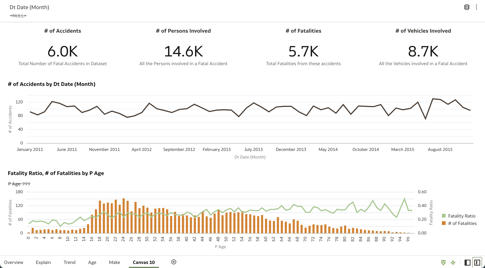
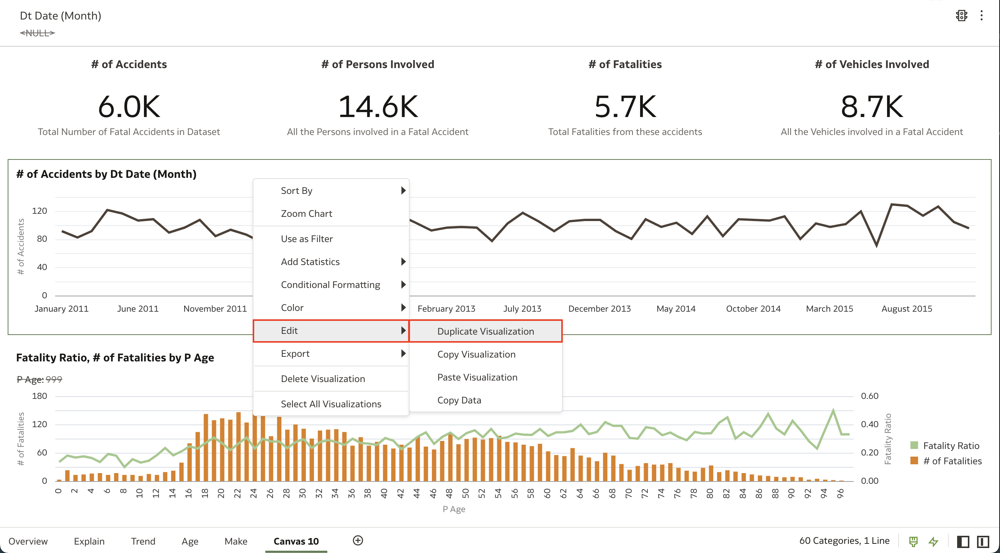
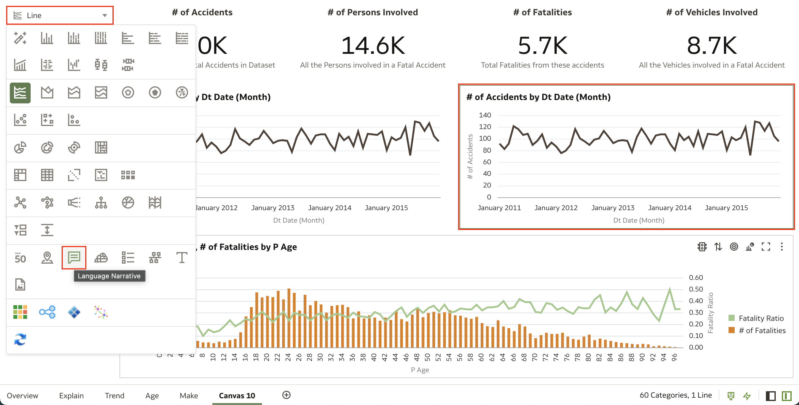
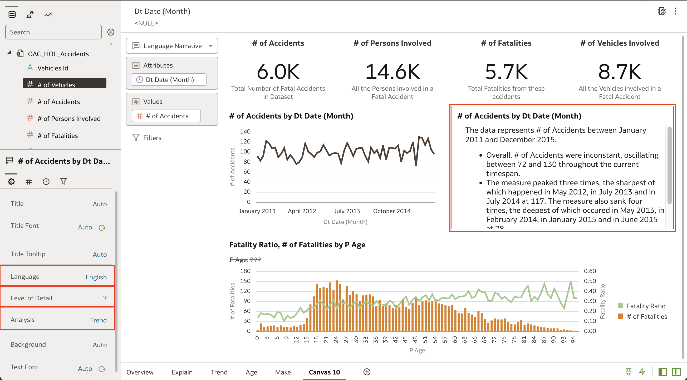
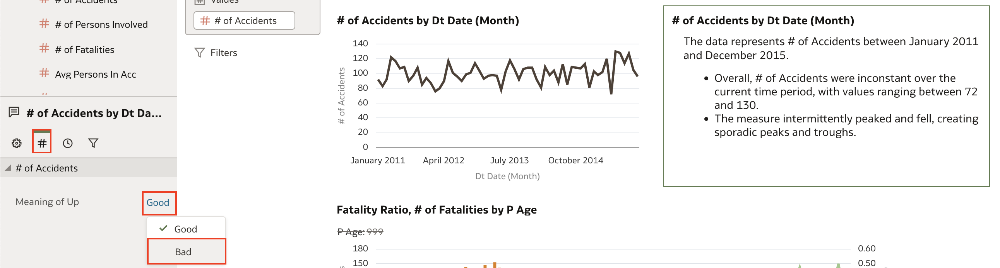

# Como criar uma language narrative das minhas visualizaçõpes em Oracle Analytics Cloud (OAC)?

Duração: 1 minuto

O Oracle Analytics Cloud possui recursos avançados de análise de dados. Por exemplo, com  Natural Language Generation, o algoritmo de aprendizado de máquina pode fornecer uma explicação em linguagem natural de suas visualizações com o clique de um botão.

### Situação
Digamos que você acabou de criar um dashboard com várias visualizações interessantes mas você está passando por dificuldades em demonstrar o significado daqueles dados. Você está em um momento crucial e não consegue processar o que os dados significam ou quer uma explicação por escrito, mas não quer escrevê-la você mesmo.

Essa Sprint irá te mostrar a capacidade de geração de linguagem natural do Oracle Analytics Cloud (OAC) e te guiar para criar sua própria narrativa.

## Criando narrativas em linguagem natural

>**Nota:** Você deve ter o cargo **DV Content Author** para executar os próximos passos.

1. Abra um workbook na sua instância OAC e identifique a visualização que você quer gerar um resumo em linguagem natural. **Clique com botão direito do mouse** em visualização e selecione **Edit** então selecione **Duplicate Visualization**. Nós queremos fazer isso para referenciar a visualização que a narrativa explica

    

2. Selecione a visualização duplicada e clique em **Grammar Pane**. Encontre e selecione a visualização **Language Narrative** representado pela caixa de texto. Isso irá criar a narrativa que acabamos de duplicar.

    >**Nota:** A visualização de narrativa de linguagem natural só funciona em visualizações que tem **dois atributos e uma medida** ou **um atributo e duas medidas**. [Clique aqui](https://docs.oracle.com/en/cloud/paas/analytics-cloud/acubi/add-language-narrative-visualization.html#GUID-237A860A-22E9-4F5A-B6A5-22DE3EA7CCAA) para aprender mais sobre visualização de narrativas de linguagem natural.

    

3. Como você pode ver, é uma ferramenta muito poderosa. No botão **Data Panel** no canto esquerdo da página fazer mudanças nos atributos das narrativas. Por exemplo, é possível selecionar Inglês ou Francês como **Linguagem** utilizada na narrativa, e é possível alterar o **Detalhamento** de 1 a 7 dependendo de quão detalhado você deseja que seja a narrativa. Ainda, é possível mudar a **Análise** da narrativa.

    

4. Outro atributo interessante de alterar é o **Meaning of Up**. Por padrão, o meaning of up aponta para bom. Neste exemplo, número de acidentes indo para cima não é uma coisa agradável então é interessante mudar o parâmetro para ruim.

    

Parabéns! Você acabou de aprender a criar uma narrativa em linguagem natural das suas visualizaçõpes utilizando Natural Language Generation no Oracle Analytics Cloud!

## Saiba mais
* [Add a Language Narrative Visualization](https://docs.oracle.com/en/cloud/paas/analytics-cloud/acubi/add-language-narrative-visualization.html#GUID-F25DA183-DFFB-4788-8581-B6D935A26EE9)

* [Add Augmented Analytics to Your Business Data Practices](https://blogs.oracle.com/analytics/post/add-augmented-analytics-to-your-business-data-practices)

## Acknowledgements
* **Author** - Nagwang Gyamtso, Product Manager, Product Strategy
* **Tradução** - Isabel Giannecchini, Cloud Engineer GenO, Brazil Data & AI Team
* **Última Atualização** - Isabel Giannecchini,  Outubro 2022