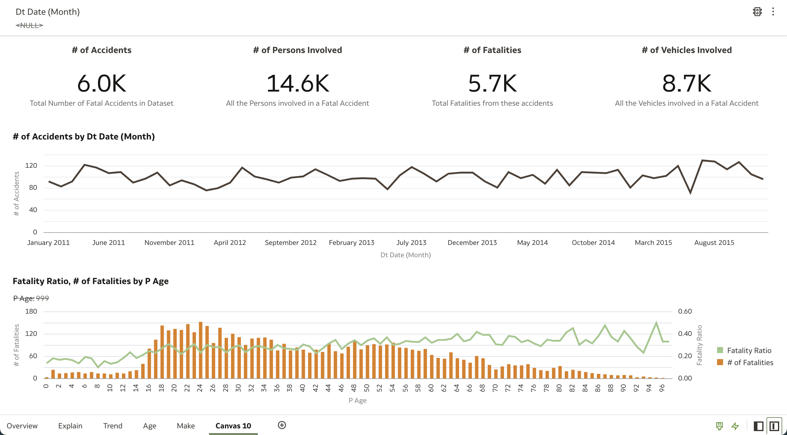
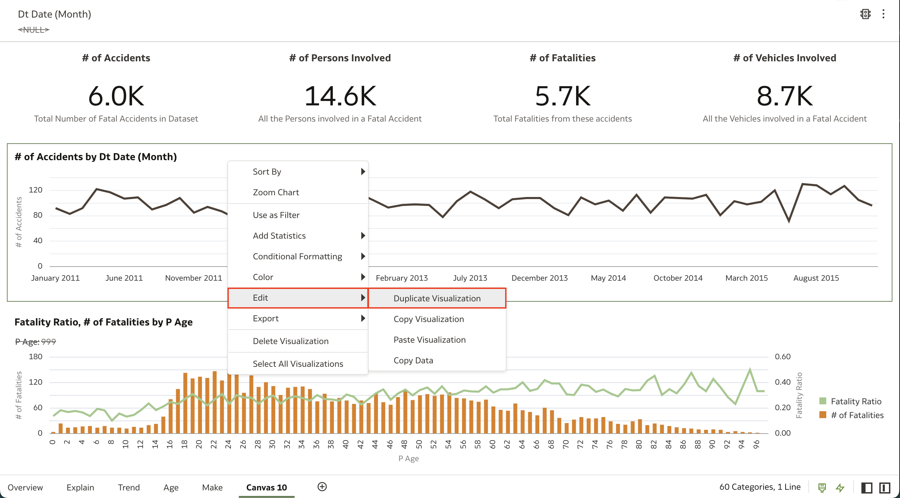
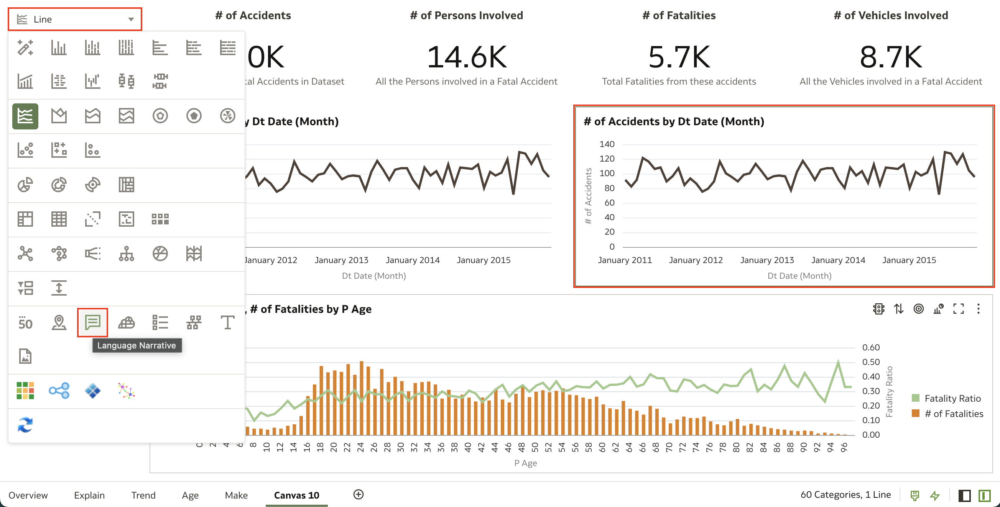
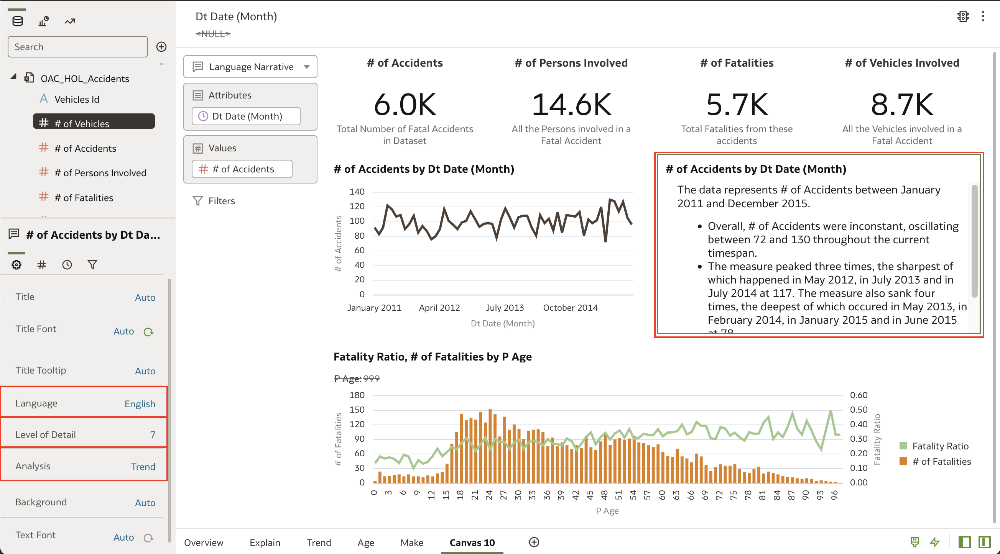
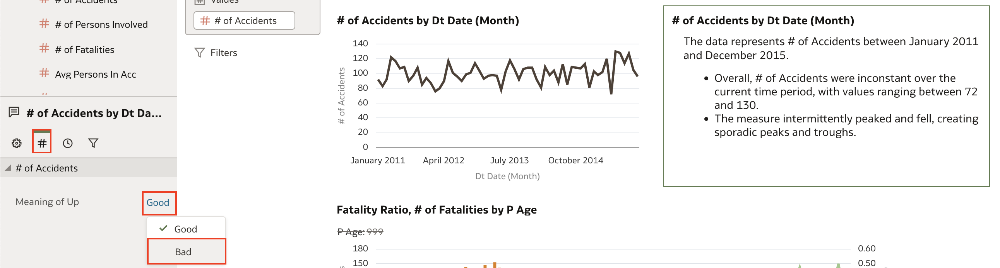

# How do I create a language narrative of my visualizations in Oracle Analytics Cloud (OAC)?

Last updated June 6, 2022

Duration: 1 minute

Oracle Analytics Cloud has powerful augmented analytics capabilities. For example, with Natural Language Generation, the underlying machine learning algorithm can give you a natural language explanation of your visualizations with just a click of a button.

### Situation
Let's say that you have just created a canvas with many interesting visualizations but you are having a hard time making sense of the data. You're in a time cruch and are unable to process what the data means or you want a written explanation but do not want to write it out yourself.

This Sprint will expose you to Oracle Analytics Cloud's Natural Language Generation capability and guide you through creating your own Language Narrative visualization.

## Create natural language narratives

You must have the **DV Content Author** application role to successfully execute the following steps.

1. Open a workbook in your OAC instance and identify a visualization that you want to generate a natural language summary of. **Right click** the visualization and select **Edit** and then select **Duplicate Visualization**. We want to do this so that we can refer to the visualization that the narrative explains.

    

2. Select the duplicated visualization and click the visualizations dropdown in the **Grammar Pane**. Find and select the **Language Narrative** visualization represented by the text box. This will create a language narrative of the visualization we just duplicated.

    >**Note:** The Language Narrative visualization only works with visualizations that have **two attributes and one measure** or **one attribute and two measures**. Click [here](https://docs.oracle.com/en/cloud/paas/analytics-cloud/acubi/add-language-narrative-visualization.html#GUID-237A860A-22E9-4F5A-B6A5-22DE3EA7CCAA) to learn more about the Language Narrative visualization.

    

3. As you can see, this is a pretty powerful tool. The **Data Panel** on the bottom left of your page will allow you to make changes to the attributes of the narrative. For example, you can choose English or French as the **Language** used in the narrative, you can change the **Level of Detail** from 1-7 depending on how detailed you want the narrative to be, and you have the option to change the narrative **Analysis** to explain a trend analysis or a breakdown of the visual.

    

4. One last interesting attribute that you can change is the **Meaning of Up**. As a default, the meaning of up is set to Good. In this example, # of Accidents going up is not a good thing so we can change this by selecting **Bad** for the Meaning of Up option.

    

Congratulations! You have just learned how to create a language narrative of your visualizations using Natural Language Generation in Oracle Analytics Cloud!

## Learn More
* [Add a Language Narrative Visualization](https://docs.oracle.com/en/cloud/paas/analytics-cloud/acubi/add-language-narrative-visualization.html#GUID-F25DA183-DFFB-4788-8581-B6D935A26EE9)

* [Add Augmented Analytics to Your Business Data Practices](https://blogs.oracle.com/analytics/post/add-augmented-analytics-to-your-business-data-practices)
