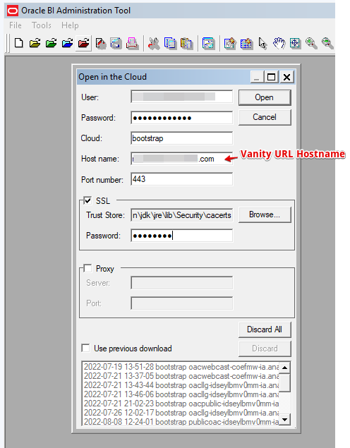
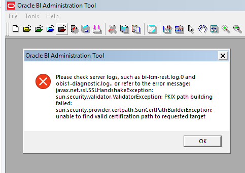
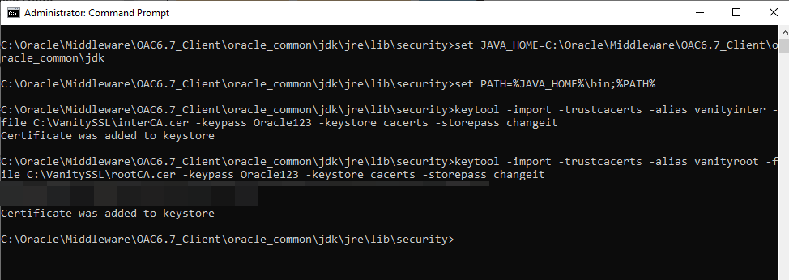
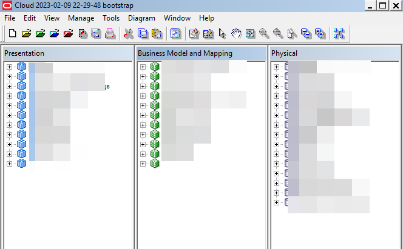

# How do I configure a vanity URL to open an RPD in Model Administration Tool in Oracle Analytics Cloud (OAC)?

Duration: 2 minutes

A vanity URL is a unique, customized web address that's branded for marketing purposes and helps users remember and find your web site. If you want to customize the user login experience for Oracle Analytics Cloud, you can use your own vanity URL instead of the default URL that Oracle provides.

Use this sprint to learn how to configure Model Administration Tool to allow developers to use a vanity URL to open an RPD in the Cloud.

## Configure a vanity URL for an RPD

>**Note:** You must have been an IDCS Native user to complete this Sprint.

1. In **Model Administration Tool** (RPD), Click  **File**, then **Cloud** then **Open**.

  When prompted, provide an IDCS native user, password, vanity URL hostname, and  trust store password. Click **Open**.

  

2. Because you've not yet configured the vanity URL hostname, Oracle Analytics returns an **SSLHandshakeException** error.

  

3. To resolve this error, import the Vanity URL root and intermediate CA certificates into the client tool JDK KeyStore.

  Open Command Prompt as Administrator and navigate to the Model Administration Tool trust store path C:\Oracle\Middleware\OAC6.7_Client\oracle_common\jdk\jre\lib\Security\cacerts

  Set the JAVA HOME path and import the immediate and root certs into the JDK KeyStore as follows:

  <code>C:\Oracle\Middleware\OAC6.7_Client\oracle_common\jdk\jre\lib\security>set JAVA_HOME=C:\Oracle\Middleware\OAC6.7_Client\oracle_common\jdk</code>

  <code>C:\Oracle\Middleware\OAC6.7_Client\oracle_common\jdk\jre\lib\security>set PATH=%JAVA_HOME%\bin;%PATH%</code>

  <code>keytool -import -trustcacerts -alias oacinter -file C:\VanitySSL\interCA.cer -keypass Oracle123 -keystore cacerts -storepass changeit</code>

  <code>keytool -import -trustcacerts -alias vanityroot -file C:\VanitySSL\rootCA.cer -keypass Oracle123 -keystore cacerts -storepass changeit</code>

  

4. Go back to Model Administration Tool and use the vanity URL to open the RPD as described in Step 1.

  

Congratulations, you've leaned how to configure a vanity URL to open an RPD in Model Administration Tool in OAC!
## Acknowledgements
* **Author** - Ravi Bhuma, CEAL
* **Last Updated By/Date** - Nagwang Gyamtso,  April 2023
