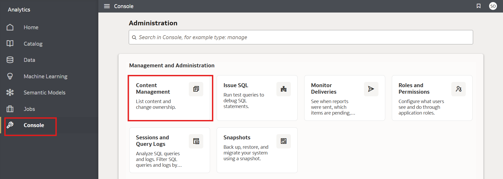
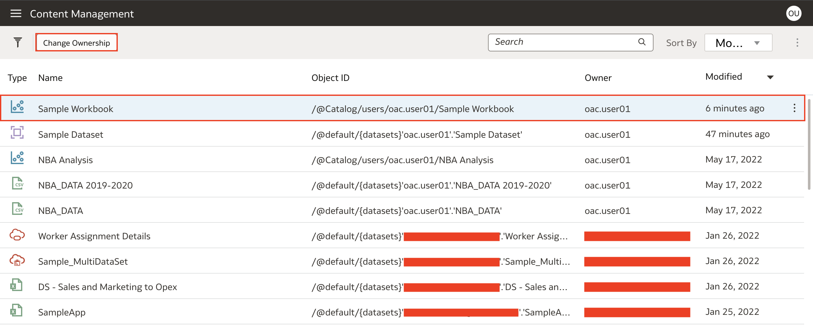
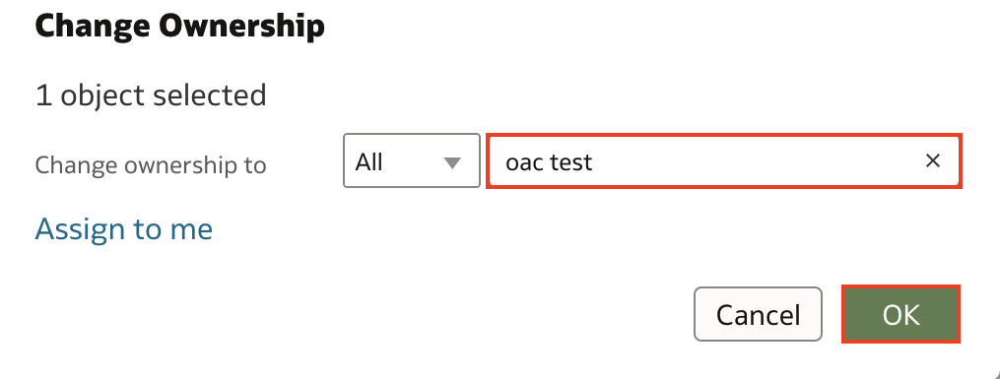

# Como trocar o proprietário de uma pasta de trabalho (workbook) no Oracle Analytics Cloud (OAC)?

Duração: 1 minuto

Como um administrador do OAC, um dos privilégios é passar o conteúdo para outros usuários. Por exemplo, quando alguém do time sai da organização, é possível passar todo o conteúdo criado por esse usuário para a propriedade de outra pessoa.

## Trocando a propriedade de um workbook
>**Nota:** Você deve ter o cargo **BI Service Administrator** para seguir os próximos passos.

1. Por meio do **Menu de navegação** (menu de hambúrguer) no canto superior esquerdo, clique em **Console**. Dentro de console, selecione **Content**. Isso irá te levar para a seção de gerenciamento de conteúdos.

    

2. Uma vez dentro do gerenciamento de conteúdo, selecione a pasta de trabalho (workbook) que deseja trocar a propriedade, então clique em **Change Ownership**.

    

3. Na janela alterar propriedade, procure e selecione o usuário que você deseja passar a propriedade do workbook. Uma vez selecionando **OK**, você deve ver que a propriedade daquele workbook foi alterada para o usuário selecionado.

    

Parabéns, você aprendeu a trocar a propriedade de um workbook em Oracle Analytics Cloud (OAC)!

## Saiba mais

* [Gerenciando conteúdo em Oracle Analytics](https://blogs.oracle.com/analytics/post/managing-content-in-oracle-analytics)

## Acknowledgements
* **Author** - Nagwang Gyamtso, Product Manager, Product Strategy
* **Tradução** - Isabel Giannecchini, Cloud Engineer GenO, Brazil Data & AI Team
* **Última Atualização** - Thais Henrique,  Março 2023