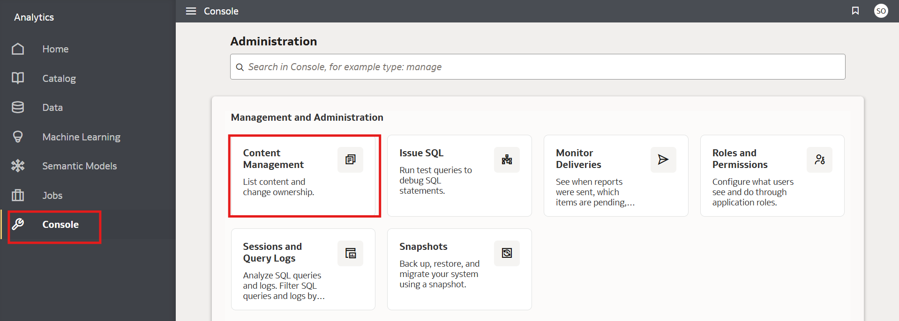
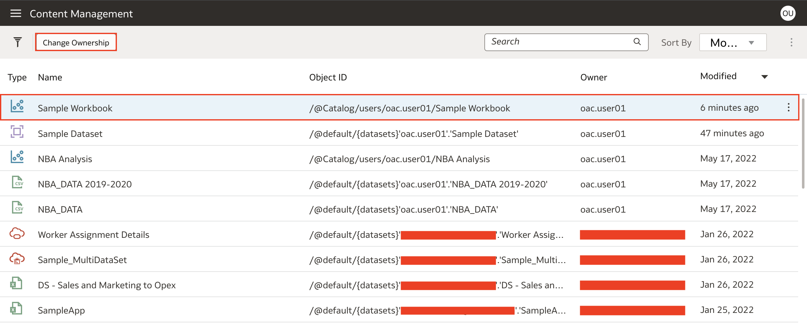
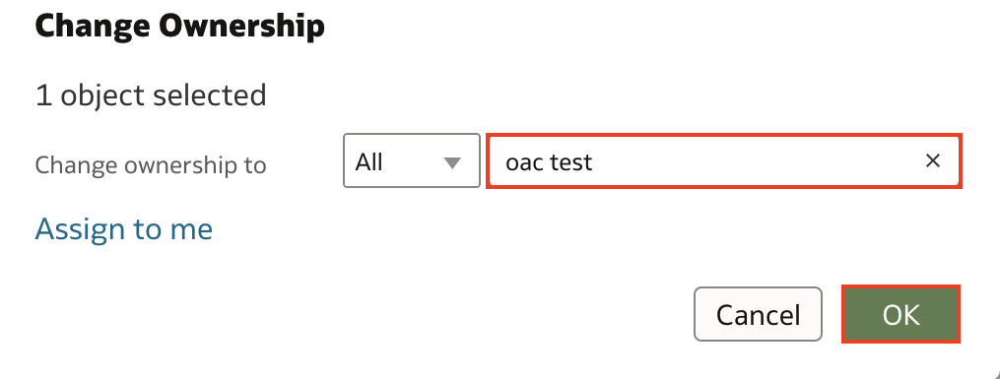

# How do I reassign ownership of a workbook?
Duration: 1 minute

As a BI Service Administrator in OAC, one of the privileges you have is the ability to reassign content to other users. For example, when someone in your team leaves the organization, you can reassign the ownership of the content owned by said user to another user or yourself within your team. 

## Reassign ownership of a workbook
>**Note:** You must have BI Service Administrator application role to execute the following steps. 

1. Using the **Navigation menu** on the top left, click on **Console**. Within the console, scroll down and select **Content**. This will navigate you to the Content Management section.

    

2. Once inside the Content Management section, select the workbook that you want to change the ownership of. Once the workbook is selected, click the **Change Ownership** button. 

    

3. In the change ownership window, search for the user that you want to assign the ownership to and select that user. Once you click **OK**, you should see the ownership of the workbook update to the user that you have selected. 

    

Congratulations, you have now learned how to reassign ownership of a workbook in Oracle Analytics Cloud (OAC)!

## Learn More

* [Managing Content in Oracle Analytics](https://blogs.oracle.com/analytics/post/managing-content-in-oracle-analytics)
