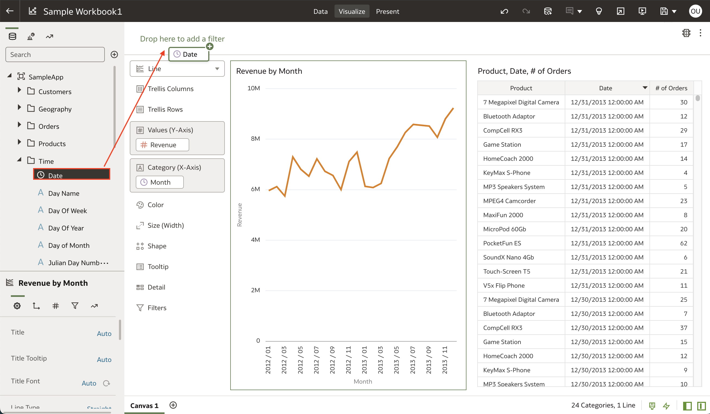
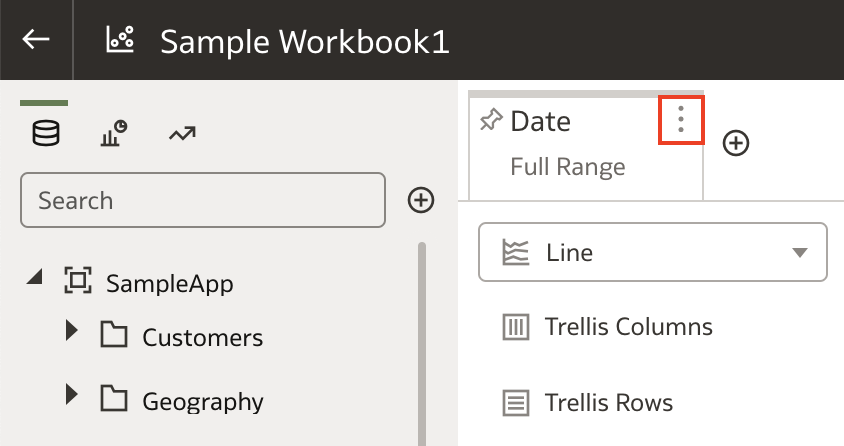
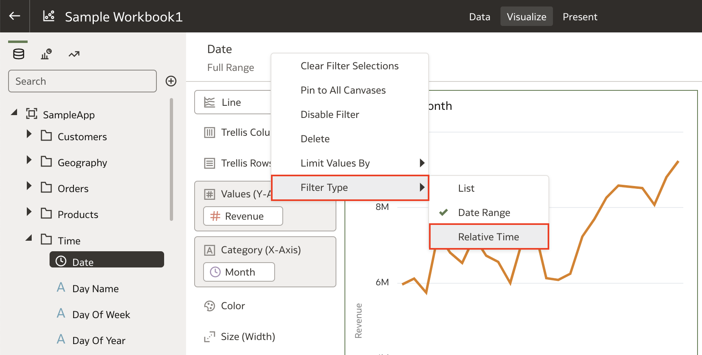
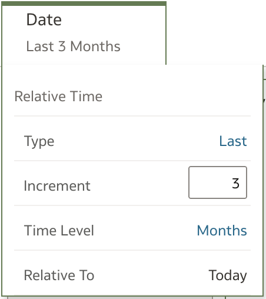

# Como criar filtros de tempo relativo em Oracle Analytics Cloud (OAC)?

Duração: 1 minuto

Trabalhando com colunas de data em seu conjunto de dados (dataset) no Oracle Analytics Cloud, você pode criar um filtro de tempo relativo para suas visualizações. O filtro de tempo relativo permite que você crie um filtro de data relativo à data de hoje, seja para dados do passado ou para uma projeção no futuro. As três configurações que você pode modificar são Type, Increment e Time Level. Para saber mais sobre como criar um filtro de data relativa e as opções associadas a ele, leia as instruções a seguir.

## Relative time filter
>**Nota:** Você deve ter o cargo **DV Content Author** para executar os próximos passos.

1. Em sua pasta de trabalho (workbook), encontre uma coluna do tipo **Data** e arraste para a barra "filtro" no topo do dashboard.

    

2. Selecione a opção **Menu** no filtro de **Date** clicando nos três pontinhos.

    

3. Selecione **Filter Type**, então Selecione **Relative Time**. Isso irá mostrar as configurações para o filtro de tempo relativo.

    

4. Aqui você pode mudar três configurações: Tipo (Type), Incremento (Increment), e Nível de Tempo (Time Level). O seguinte exemplo cria um filtro de tempo para os últimos 3 meses.

    

    **Tipo** Permite escolher uma das 3 opções:
    * Último (Last): Inclui dados dos últimos N incrementos de tempo contando de hoje
    * Próximo (Next): Inclui dados dos próximos N incrementos de tempo contando de hoje (funciona apenas se os dados constarem projeções futuras)
    * Data Final (To Date): Inclui dados desde o início dos registros até a data selecionada

    **Incremento** permite selecionar o número de incrementos que você deseja ver seu tipo de filtro.

    **Nível de Tempo** permite escolher a granularidade do tempo desde anos até segundos.

Parabéns, você aprendeu a criar filtros de tempo relativos em Oracle Analytics Cloud (OAC)!

## Saiba mais

* [Filtros de tempo relativos](https://www.wegobeyond.co.uk/oracle-analytics-cloud-105-2-new-feature-focus-relative-time-filters/)

## Acknowledgements
* **Author** - Nagwang Gyamtso, Product Manager, Product Strategy
* **Tradução** - Isabel Giannecchini, Cloud Engineer GenO, Brazil Data & AI Team
* **Última Atualização** - Thais Henrique,  Março 2023