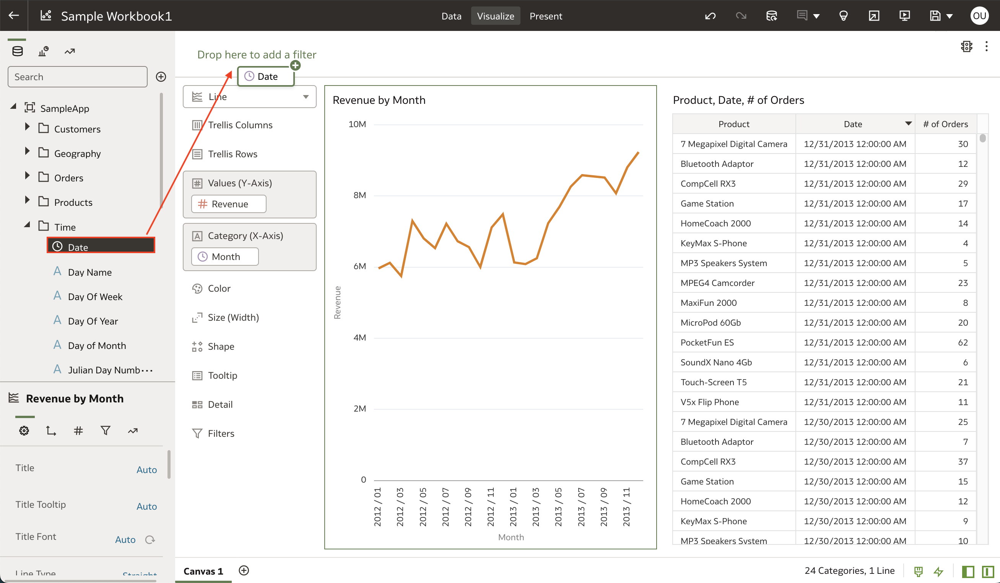
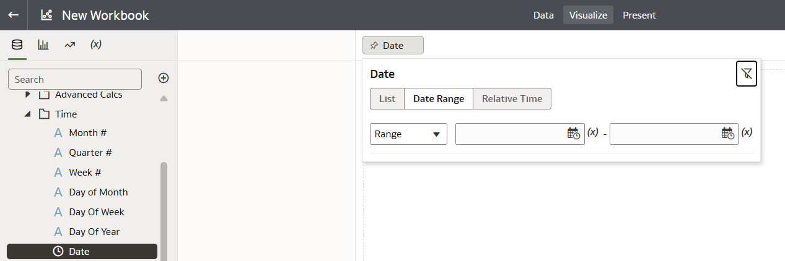
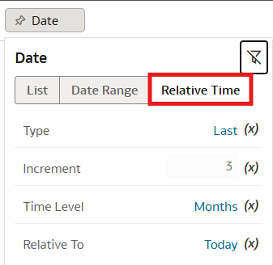
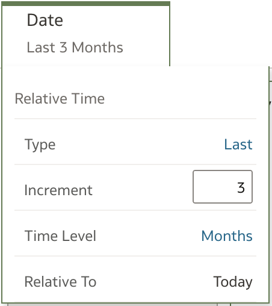

# How do I create a relative time filter in Oracle Analytics Cloud (OAC)?
Duration: 1 minute

When working with date columns in your dataset within Oracle Analytics Cloud, you have the ability to create a relative time filter for your visualizations. The relative time filter allows you to create a date filter relative to today's date whether that's looking at data from the past or looking at a projection into the future. The three settings you can modify are the Type, Increment, and Time Level. To learn more about how to create a relative date filter and the options associated with it, read the following instructions below.

## Relative time filter

1. In your workbook, find the **Date** column in the **Data Panel** and drag it onto the filter bar on top of the canvas. 

    

2. Select the **Menu** option on the **Date** filter by clicking on the three dots.

    

3. Select **Filter Type**, then select **Relative Time**. This will display the settings for your relative time filter.

    

4. Here, you have three settings that you can modify: Type, Increment, and Time Level. The following example creates a relative time filter for the last 3 months. 

    

    **Type** allows you to choose from three options which are:
    * Last: This includes data for the last N number of time increments relative to today
    * Next: This includes data for the next N number of time increments relative to today (This only works if you have projected data for the future)
    * To Date: This includes data from the beginning of the indicated incremental time to today

    **Increment** allows you to select the number of increments you want to view your filter type for.

    **Time Level** lets you choose the granularity of the time from years up to seconds.

Congratulations, you have learned how to create a relative time filter in Oracle Analytics Cloud (OAC)!

## Learn more

* [Relative Time Filters](https://www.wegobeyond.co.uk/oracle-analytics-cloud-105-2-new-feature-focus-relative-time-filters/)
