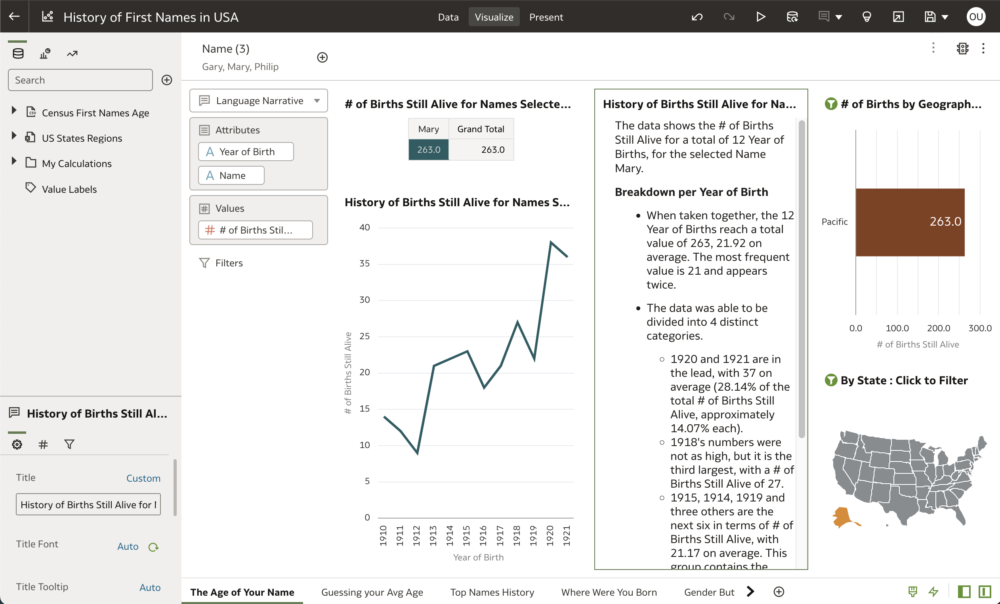
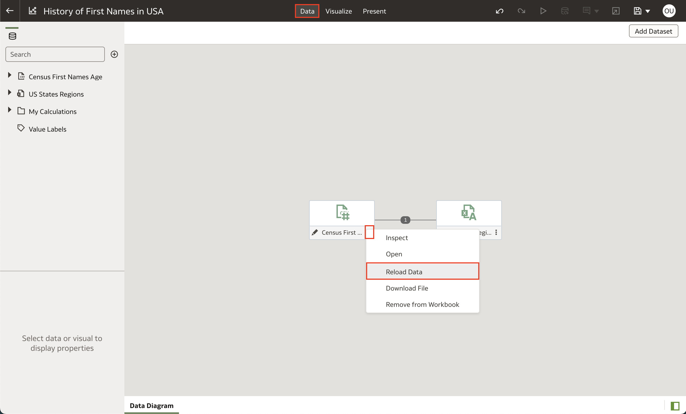
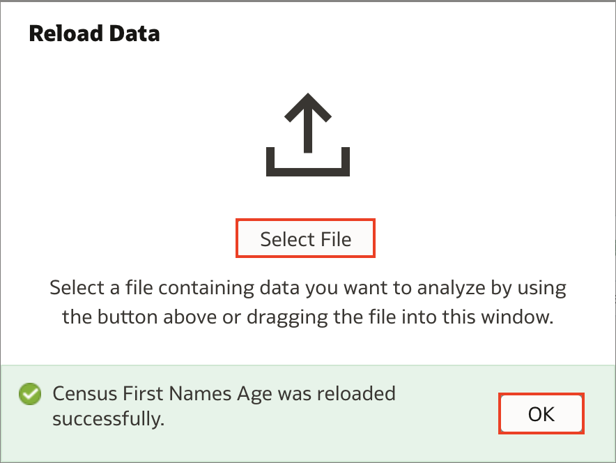
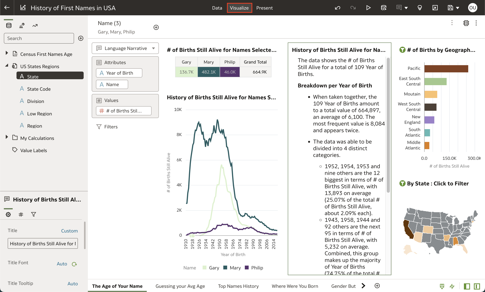
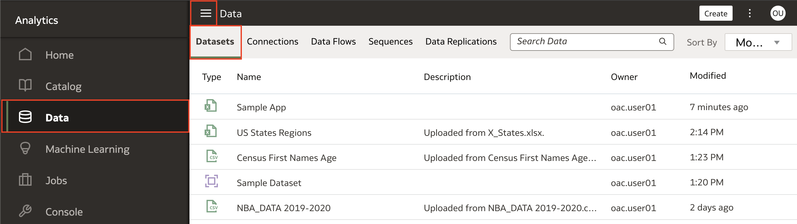
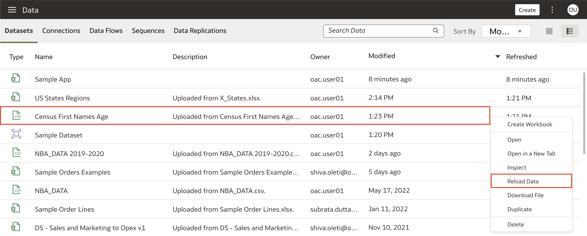
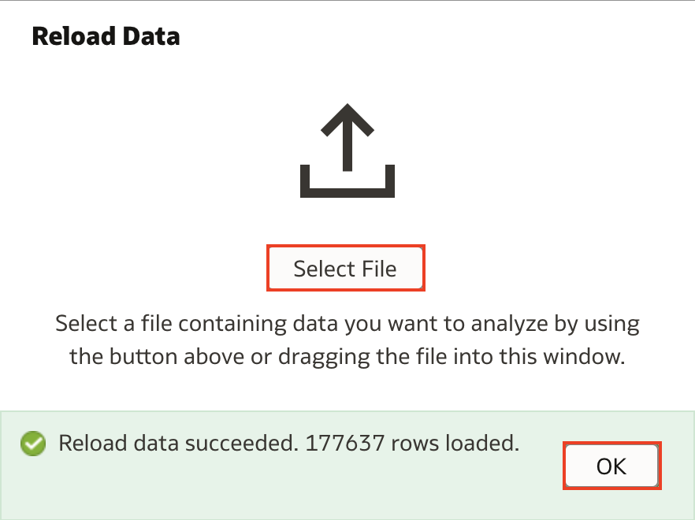

# Como atualizar datasets em Oracle Analytics Cloud (OAC)?

Duração: 1 minuto

### Situação
Você tem um workbook construido em cima de um dataset desatualizado. Após receber uma versão mais recente do mesmo dataset você não quer refazer seu trabalho todo do zero. O que você faz?

Esta sprint vai te ensinar duas maneiras de atualizar um arquivo em Oracle Analytics Cloud.

## Atualizando arquivos de dataset
>**Nota:** Você deve ter o cargo **DV Content Author** para executar os próximos passos.

### Atualizando datasets em um workbook

1. No seu workbook, clique em **Data** e então clique em **Actions Menu** representado pelos três pontinhos no dataset que quer atualizar. Então clique em **Reload Data**.

    

2. Clique em **Select File** e então abra o dataset atualizado. Uma vez que receber a mensagem que o arquivo foi atualizado com sucesso clique em **OK**.

    >**Nota:** Sua atualização irá falhar se o novo conjunto de dados tiver menos colunas que o original.

    

3. Clique em **Visualize** então seu dashboard irá atualizar automaticamente mostrando os novos dados.

    

### Atualizando datasets fora de um workbook

1. Da página inicial do OAC, vá até **Datasets** clicando em **Navigation menu** (menú de hambúrguer) e selecionando **Data**. Isso irá mostrar todos os seus datasets.

    

2. Encontre o dataset que deseja atualizar e, clique nele com o **botão direito** do mouse, e selecione **Reload Data**.

    

3. Clique em **Select File** e abra os dados atualizados. Uma vez que receber a mensagem que o arquivo foi atualizado com sucesso clique em **OK**. Seus dados agora devem incluir as novas linhas.

    >**Nota:** Sua atualização irá falhar se o novo conjunto de dados tiver menos colunas que o original.

    

Parabéns! Você acabou de atualizar seus dados no Oracle Analytics Cloud!

## Saiba Mais

* [Atualizando os dados de um Dataset](https://docs.oracle.com/en/cloud/paas/analytics-cloud/acubi/reload-datasets-data.html#GUID-2D68121F-6A50-4795-A3A9-95EB56141901)

## Acknowledgements
* **Author** - Nagwang Gyamtso, Product Manager, Product Strategy
* **Tradução** - Isabel Giannecchini, Cloud Engineer GenO, Brazil Data & AI Team
* **Última Atualização** - Isabel Giannecchini,  Outubro 2022