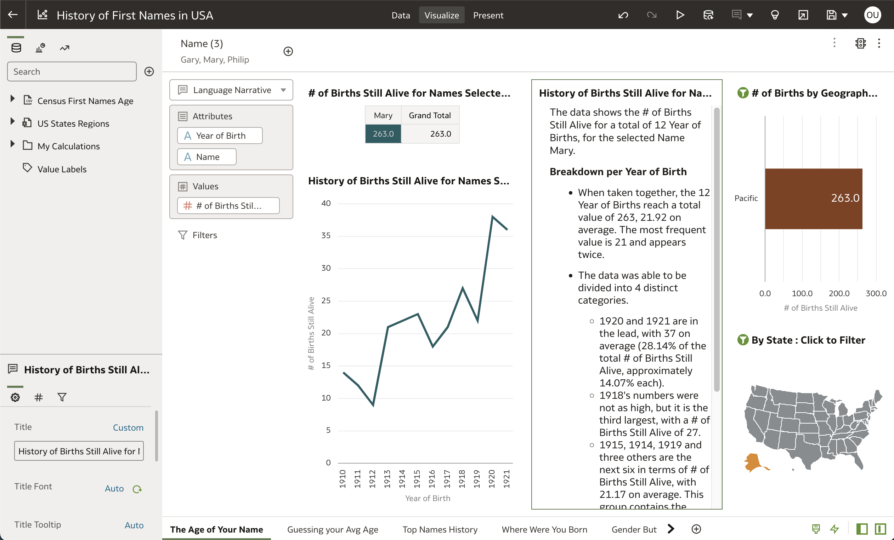
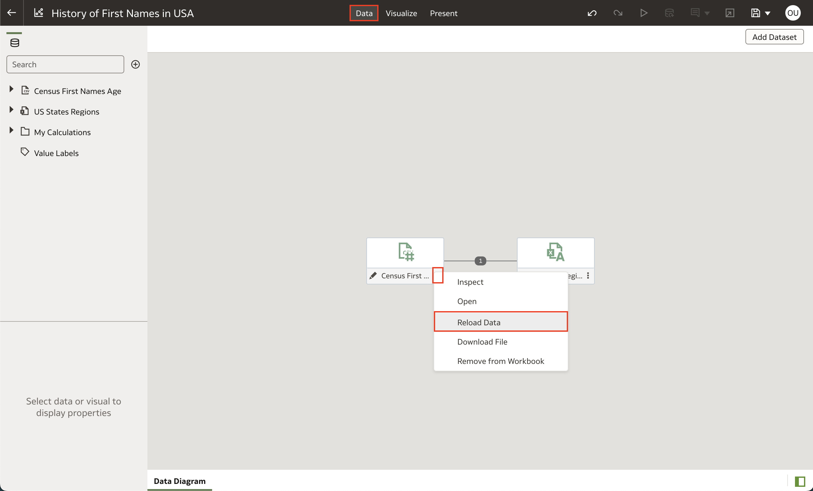
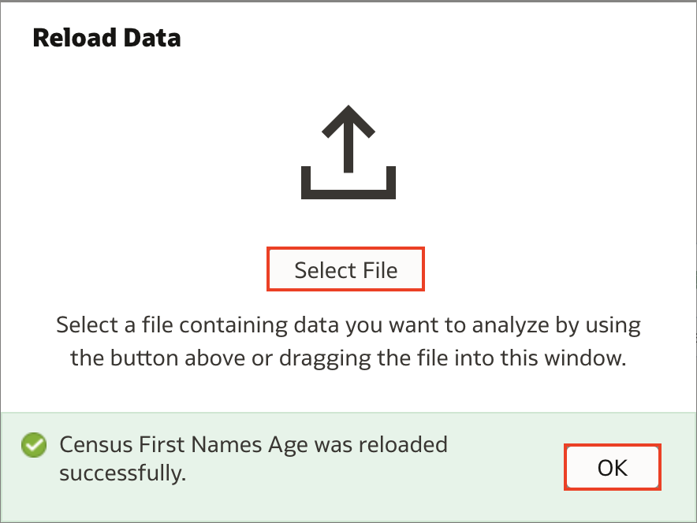
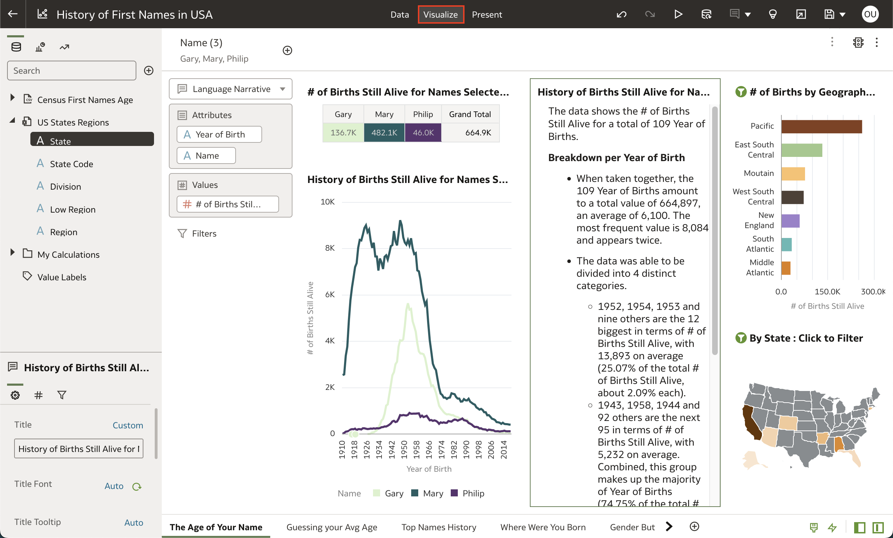
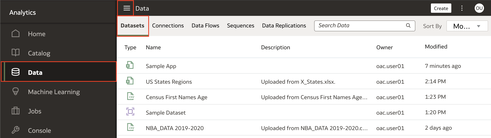
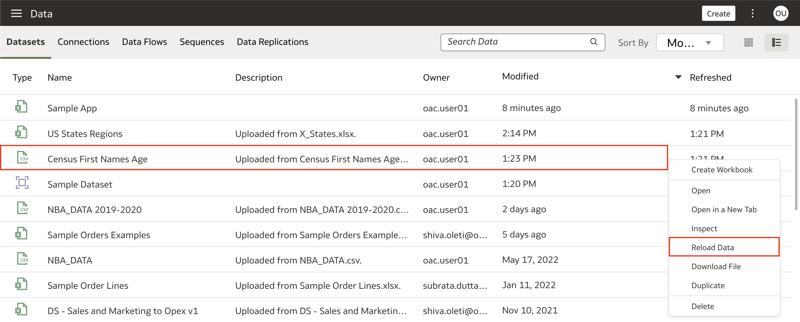
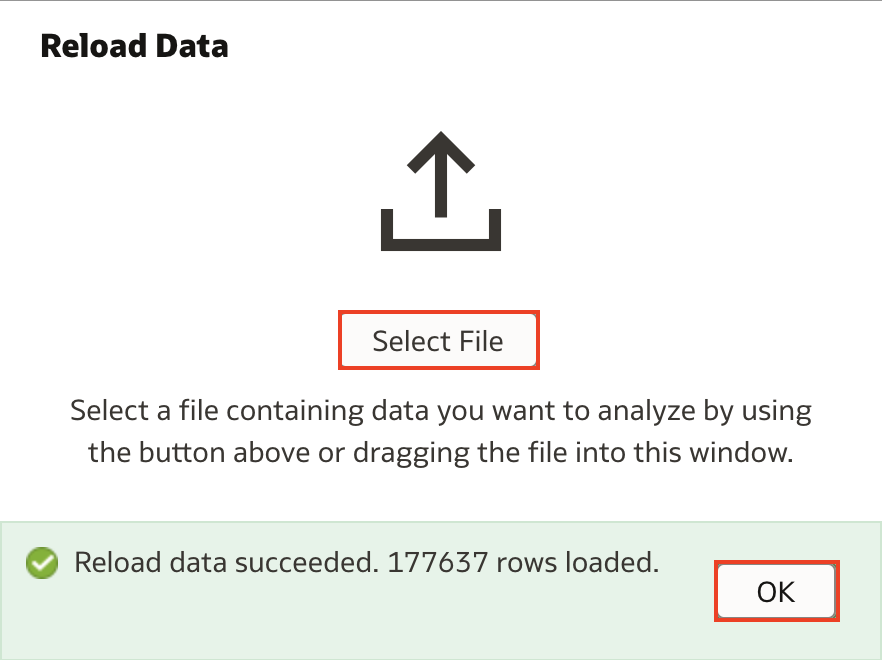

# How do I reload my dataset files in Oracle Analytics Cloud (OAC)?

Duration: 1 minute

### Situation
You have a workbook that you built with visualizations and multiple canvases based on an outdated dataset. You have received a newer version of the dataset with updated rows and you don't want to create a new workbook and build all the visualizations over again. What do you do? 

This Sprint will show you two methods of reloading a data file in Oracle Analytics Cloud.

## Reload dataset files
You must have the **DV Content Author** application role to successfully execute this Sprint.

### Reoload datasets within a workbook

1. Within your OAC workbook, click on **Data** and click the **Actions Menu** represented by the three dots for the dataset you want to reload. Click **Reload Data**. 

    

2. Click **Select File** and open the updated dataset. Once you receive the message that the data reload was successful, click **OK**. 

    >**Note:** Your reload will fail if the new data file is missing columns that are in the original dataset. 
    
    

3. Click on **Visualize** and your canvases will automatically update to reflect the updated dataset.

    

### Reload datasets outside of a workbook

1. From your OAC homepage, navigate to your **Datasets** by clicking on the **Navigation menu** and selecting **Data**. This will display all your datasets.

    

2. Find the dataset you want to reload with your updated data and **right click** and select **Reload Data**. 

    

3. Click **Select File** and open the updated file. When you receive a message that your reload was successful, click **OK**. Your dataset should now be updated with the new rows.
   
    >**Note:** Your reload will fail if the new data file is missing columns that are in the original dataset. 

    

Congratulations! You have just learned how to reload a dataset file in Oracle Analytics Cloud!

## Learn More

* [Reload a Dataset's Data](https://docs.oracle.com/en/cloud/paas/analytics-cloud/acubi/reload-datasets-data.html#GUID-2D68121F-6A50-4795-A3A9-95EB56141901)
