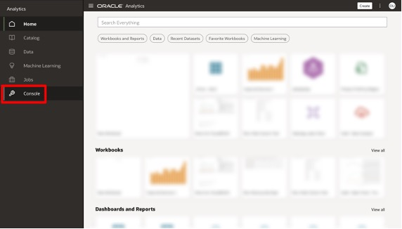
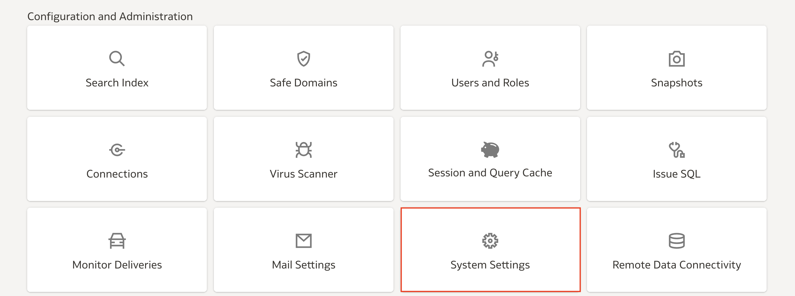
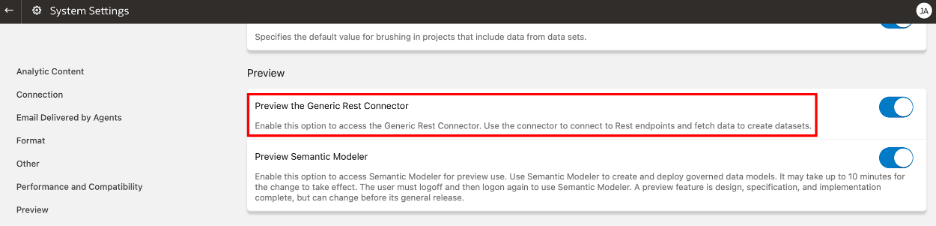
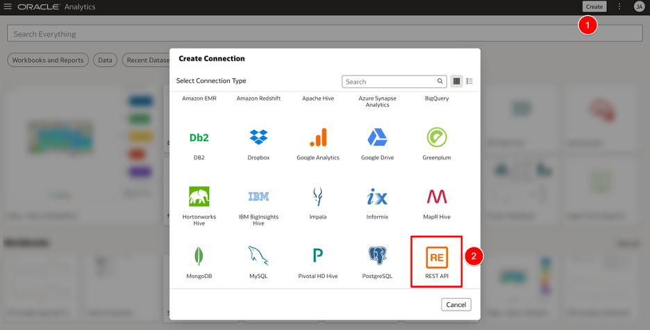
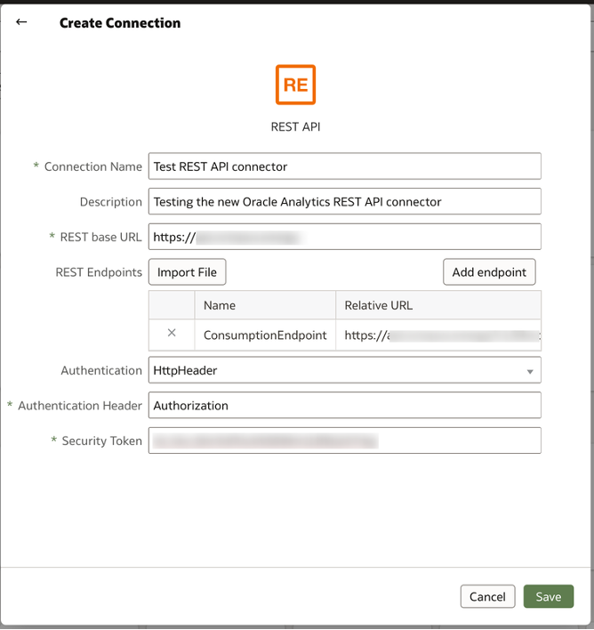
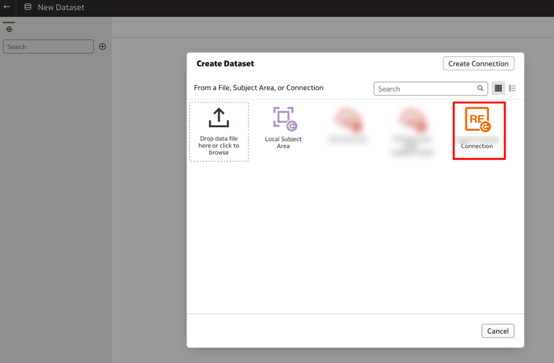
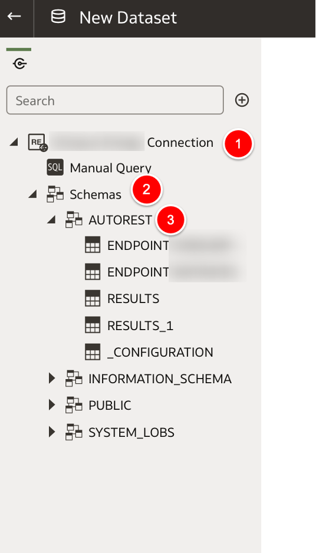

# How do I setup the REST API connector in Oracle Analytics Cloud (OAC)?

Duration: 3 minutes

Oracle Analytics allows you to create a connection to your data source using a REST API connector. This Sprint will guide you on how to set that up.

## Setup the REST API Connector

>**Note:** You must have the **DV Content Author** application role to execute the following steps.

1. In your Oracle Analytics instance, click the **Navigation menu** and select **Console**.

  

2. Under **Configuration and Administration**, select **System Settings**.

  

3. Scroll down to the **Preview** section and enable the **Preview the Generic Rest Connector** toggle.

  

4. You will need to sign out and sign back in to apply the change to your instance. From the homepage, click **Create** and select **Connections**. You should now see the REST API connector in the **Create Connections** menu. Select **REST API**.

  

5. In the next screen, enter the details of your REST API that you want to access and click **Save**. The basic information required for connecting are:

    * Base URL of the REST API
    * REST API endpoints
    * Authentication type
    * Authentication credentials

  

6. Once the connection has been created, you can create a dataset using the REST API connection in the normal fashion. On the homepage, click **Create** and select **Dataset**. Select the **REST API** connection we just created.

  

7. In the connection panel, expand the REST API connection to the **AUTOREST** schema to access the result sets of the endpoints. The RESULTS tables contain the data from the endpoints and the others contain metadata of the endpoints.

  

Congratulations! You have successfully learned how to setup the REST API connector in Oracle Analytics Cloud (OAC).

## Learn More

* [Connect to Data from REST Endpoints (Preview)](https://docs.oracle.com/en/cloud/paas/analytics-cloud/acsds/connect-data-rest-endpoints.html)
* [Create a Dataset from a Data Source with REST Endpoints](https://docs.oracle.com/en/cloud/paas/analytics-cloud/acubi/create-dataset-rest-connection.html)
* [Oracle Analytics REST API Connector](http://www.elffar.co.uk/blog/oracle-analytics-rest-api-connector)

## Acknowledgements

* **Author** - Joel Acha, Senior Business Solutions Architect, Qubix
* **Last Updated By/Date** - Nagwang Gyamtso, November 2022
