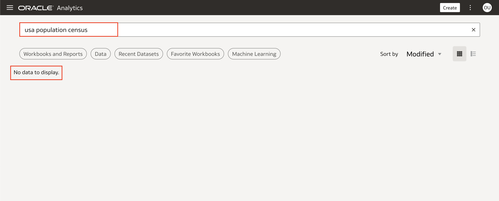
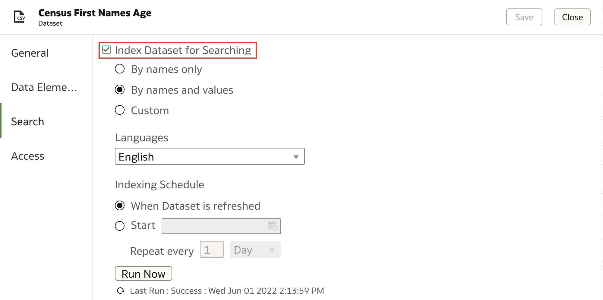
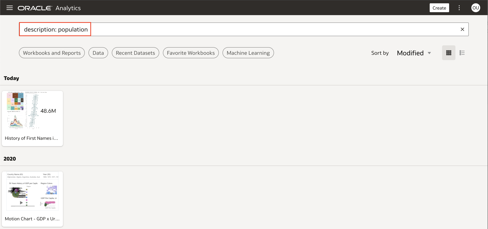
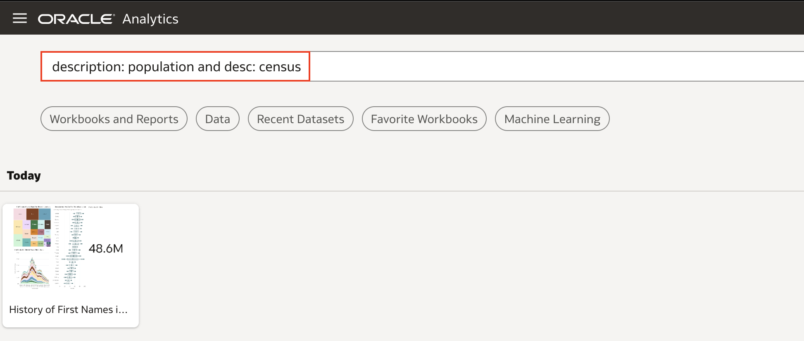

# Como pesquisar a descrição de um workbook em Oracle Analytics Cloud (OAC)?

Duração: 1 minuto

Buscas em Oracle Analytics permite encontrar conteúdos sejam eles workbooks, objetos salvos ou colunas de datasets diretamente da página inicial. If you want to narrow your search, searching for the description of a workbook is one way to find the exact workbook you are searching for. There are many advanced seach capabilities for finding the exact objects you want to find including searching for the name, owner, columns, or combining multiple search terms.

### Situação
You want to narrow your search using a description of a workbook but you are not seeing any results.

Essa sprint irá te guiar a utilizar buscas avançadas para buscar workbooks por sua descrição.

## Buscando workbooks pela descrição
>**Nota:** Você deve ter o cargo **BI Content Author** para executar os próximos passos.

1. Tenha certeza que os datasets usados em seu workbook foram indexados para buscas. Se isso não foi feito, confira a sprint **Como posso pesquisar meu conjunto de dados no Oracle Analytics Cloud (OAC)?** e habilite a indexação para os datasets utilizados no workbook que você deseja buscar.

    

2. Após seus dataset estar habilitado para indexação, volte para a página inicial do OAC e escreva *description:* na barra de busca, seguido do termo que você deseja procurar. Por exemplo, *description: population* resulta em todos os workbooks com a palavra "population" em sua descrição.

    

3. Recebendo multiplos resultados, você consegue refinar sua busca com mais termos, incluindo *and* entre dois termos. Por exemplo, se você quer buscar 'population census', o ideal é buscar '*description: population and description: census*'. Isso resultará em workbooks contendo as palavras population e census.

    >**Nota:** Você pode usar *description:* ou *desc:*. ambos irão buscar a descrição do workbook.

    

Parabéns! Você acaba de aprender a explorar as possibilidades das buscas avançadas para pesquisar a descrição de um workbook!

## Saiba mais

* [Encontre Dados, Workbooks, e Visualizações](https://docs.oracle.com/en/middleware/bi/analytics-desktop/bidvd/find-data-workbooks-and-visualizations.html#GUID-DA77E10C-0796-4578-9761-D2AFC75F7B8D)

## Acknowledgements
* **Author** - Nagwang Gyamtso, Product Manager, Product Strategy
* **Tradução** - Isabel Giannecchini, Cloud Engineer GenO, Brazil Data & AI Team
* **Última Atualização** - Isabel Giannecchini,  Outubro 2022