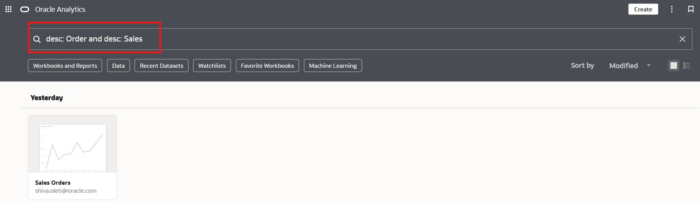

# How do I search for the description of a workbook in Oracle Analytics Cloud (OAC)?
Duration: 1 minute

Searching in Oracle Analytics allows you to find your contents whether they are workbooks, saved objects, or dataset columns directly in the homepage. If you want to narrow your search, searching for the description of a workbook is one way to find the exact workbook you are searching for. There are many advanced seach capabilities for finding the exact objects you want to find including searching for the name, owner, columns, or combining multiple search terms.

### Scenario
You want to narrow your search using a description of a workbook but you are not seeing any results. 
    

This Sprint will guide you on how to use advanced search capabilities to narrow your search by searching for the description of a workbook.

## Search for workbook description
You must have the **BI Content Author** application role to execute the following steps.

1. Make sure that datasets used in your workbook have been enabled to index for searching. If you have not done this, refer to the Sprint **How do I enable searching for my dataset in Oracle Analytics Cloud (OAC)?** and enable indexing for the datasets used in the workbook you want to search for.

    

2. After your datasets have been enabled for indexing, navigate back to your OAC homepage and in the search bar, type *description:* followed by the term to search for. For example, *description: population* will result in all the workbooks with the word population contained in the workbook description.
    
    

3. If you receive multiple results and you want to narrow your search even further using multiple terms, include *and* between the two terms to search for. For example, if you want to search for 'population census', you would type '*description: population and description: census*'. This will result in workbooks containing both the words population and census.

    >**Note:** You can use *description: or desc:*. Both will search for the description of a workbook.

    

Congratuations! You have just learned how to use advanced search capablities to narrow your search by searching for the description of a workbook. To learn about other advanced search capabilities, expand the section below.

## Learn More

* [Find Data, Workbooks, and Visualizations](https://docs.oracle.com/en/middleware/bi/analytics-desktop/bidvd/find-data-workbooks-and-visualizations.html#GUID-DA77E10C-0796-4578-9761-D2AFC75F7B8D)

