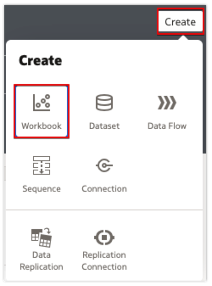
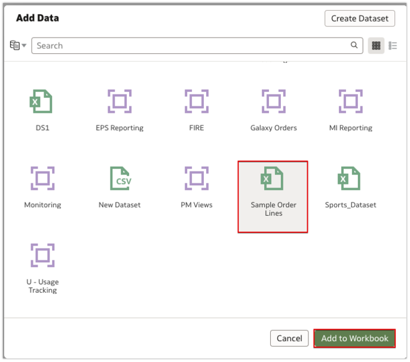
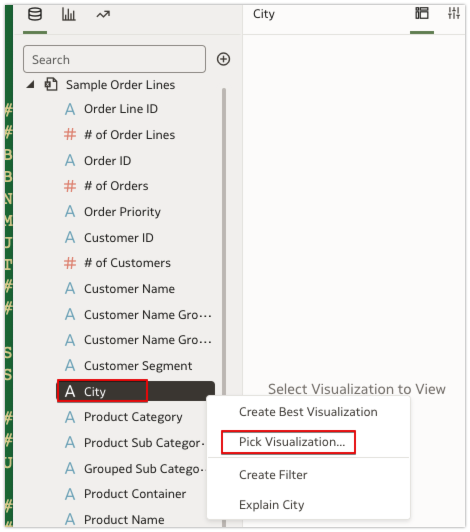
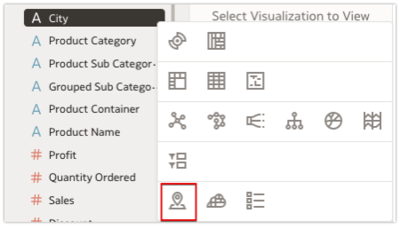
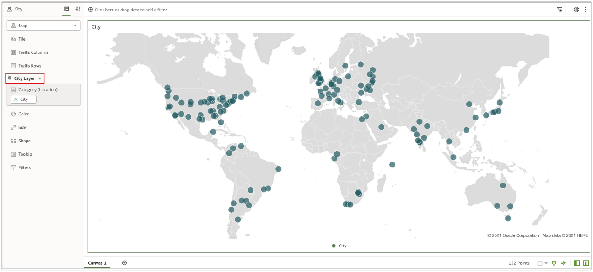
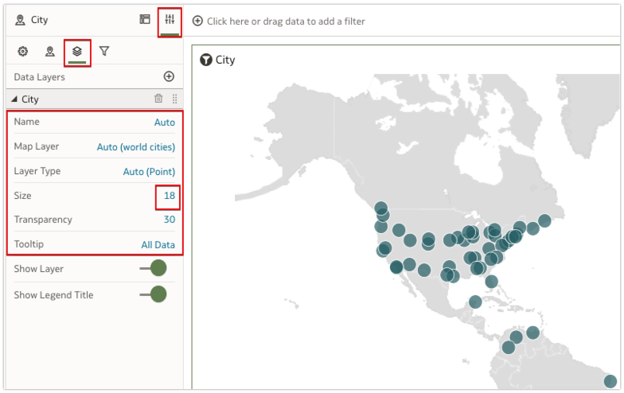
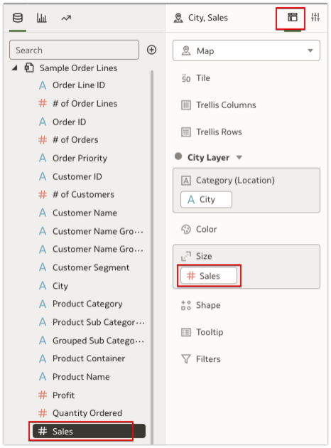
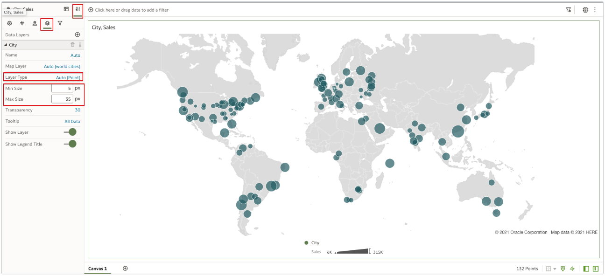

# How do I set Min and Max bubble size for point layer type in Oracle Analytics DV Maps?

Duration: 3 minutes

Depending on the type of geometries defined in a map layer, users can change the type of layer. This will change the way a layer is rendered on the map.  

Data Layers tab under map properties lets users manage the properties of all map layers like Name of the layer, Map Layer, Layer type, Transparency of a Layer and whether to show the layer or not.

With the current release of Oracle Analytics, you have option to set Min Size and Max Size for the Point type Geometry.

## Provision a FAW instance

>**Note:** You must have the **DV Content Author** role to complete this Sprint.

1. Login to DV, and from the home page, click on **Create**, select **Workbook**.

  

2. Select **Sample Order Lines** dataset.

    >**Note**: This is a sample dataset created for testing, you can create this dataset Sample Order Lines from the excel file [here](https://objectstorage.us-phoenix-1.oraclecloud.com/p/bKMx1O9ys8Q7DZOYwVZ71rFprosfFi68lZzLGPtqe0YB5Z9jMeMthPEbcU7cF2G_/n/idbwmyplhk4t/b/LiveLabsFiles/o/Sample%20Order%20Lines%20(Sprint)Sample%20Order%20Lines.xlsx)

  

3. Select **City** column, right click and select **Pick Visualization** option.

  

4. Select **Map**.

  

5. You see that **City Layer** has been added.

  

6. Select Properties section and then select Data Layers tab to change any of the City layer properties.

  

7. Navigate to **Grammar** pane, and include a size metric, in this example lets choose **#Sales**.

  

8. From the **Properties** section, select **Data Layers** tab and  set the **Min Size** and **Max Size** for the point type geometry layer.

  

## Acknowledgements
* **Author** - Ravi Bhuma, CEAL
* **Last Updated By/Date** - Nagwang Gyamtso,  April 2023
