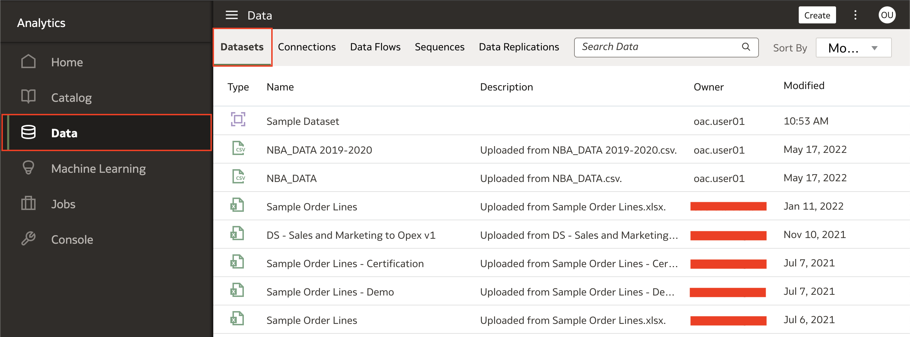
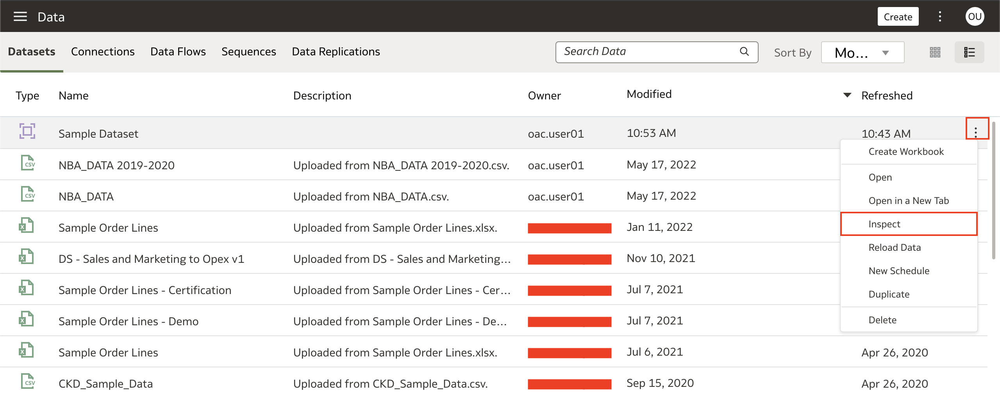
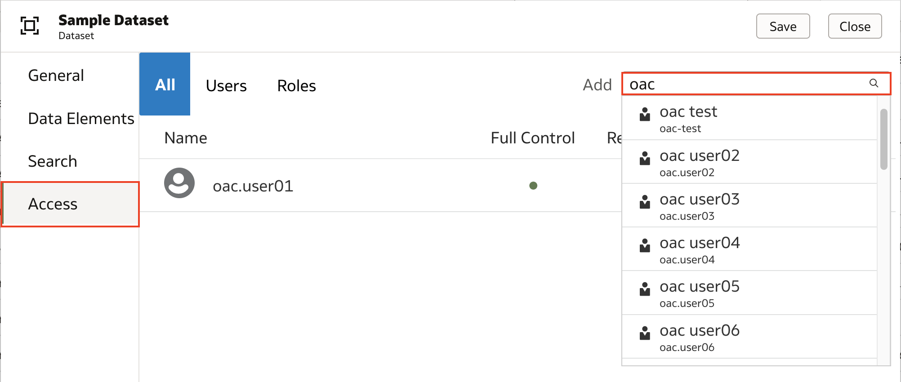
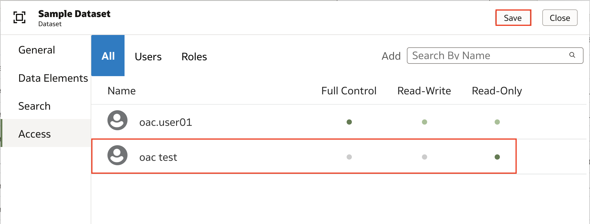
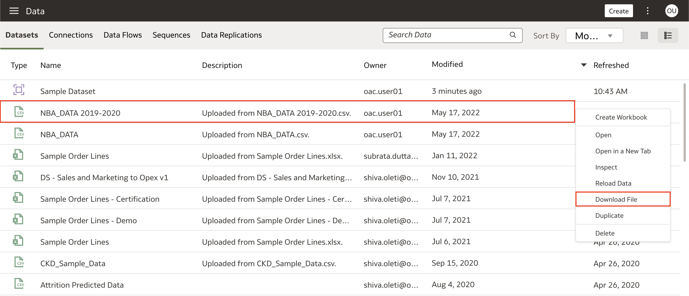

# Como compartilhar meus conjuntos de dados no Oracle Analytics Cloud (OAC)?

Duração: 2 minutos

Trabalhando com conjuntos de dados (datasets) no OAC, você pode colaborar com seu time compartilhando conjuntos de dados e dando acesso para esses dados. Essa sprint te mostra duas formas de fazer isso, compartilhando no OAC ou compartilhando com membros externos.

## Compartilhando Datasets - Pelo OAC

>**Nota:** Você deve ter o cargo **DV Author** para executar os próximos passos.

1. Na sua instância OAC, vá até **Datasets** dentro de **Dados** no menu de navegação. Sua lista de datasets estará disponível nessa janela.

    

2. Identifique os datasets que deseja compartilhar e clique com o botão direito do mouse ou clique em **Actions menu** representado pelos três pontinhos passando o mouse sobre o dataset. Selecione **Inspect** para ver mais detalhes do seu dataset.

    

3. Você verá os detalhes do conjunto de dados, tais como informações gerais, elementos de dados, busca e acesso. Clique em **Acesso** para visualizar quais usuários e cargos estão associados a este conjunto de dados. É aqui que terá a possibilidade de compartilhar o seu conjunto de dados com outros usuários, bem como conceder controles de acesso. Na secção **Adicionar**, procure e selecione o(s) usuário(s) com quem deseja compartilhar este conjunto de dados.

    

4. Uma vez selecionado o(s) usuário(s) para compartilhar o conjunto de dados, determine os acessos que você quer passar a ele(s). Neste exemplo, quero que o usuário 'oac test' possa apenas ler o conjunto de dados, então seleciono **Read-Only**. Finalizada a passagem de acessos, clique em **Save** para salvar suas modificações.
    >**Nota:** Uma boa prática é dar acesso a cargos no lugar de usuários individuais para o caso de usuários saindo da organização ou novos colaboradores entrando, para não precisar trocar essas autorizações, criar cargos e compartilhar acessos com eles é a melhor opção!

    

### Compartilhando Datasets - Externamente (funciona apenas para tabelas comuns)

1. Dentro de sua instância OAC, vá até **Datasets** dentro de **Data** no menu de navegação. Sua lista de datasets disponíveis será mostrada nessa janela. Clique com o botão direito do mouse no dataset que preferir e selecione **Download File**. Após o download completo, você pode compartilhar o dataset por email com seu time.

    >**Nota:** Você deve ter o acesso **Full Control** ao dataset e este tem que ser um arquivo padrão dos tipos: CSV, XLSX, XLS, ou TXT para ser possível o compartilhamento

    

Parabéns! Você acaba de aprender como compartilhar seu dataset com outros usuários pelo OAC ou com usuários externos!

## Saiba mais

* [Crie ou atualize uma permissão de dataset](https://docs.oracle.com/en/cloud/paas/analytics-cloud/acubi/add-or-update-datasets-permissions.html)

## Acknowledgements
* **Author** - Nagwang Gyamtso, Product Manager, Product Strategy
* **Tradução** - Isabel Giannecchini, Cloud Engineer GenO, Brazil Data & AI Team
* **Última Atualização** - Thais Henrique,  Março 2023