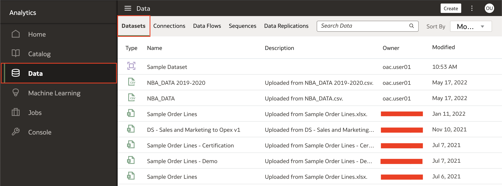
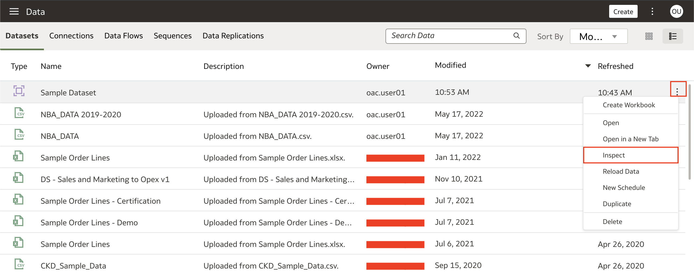
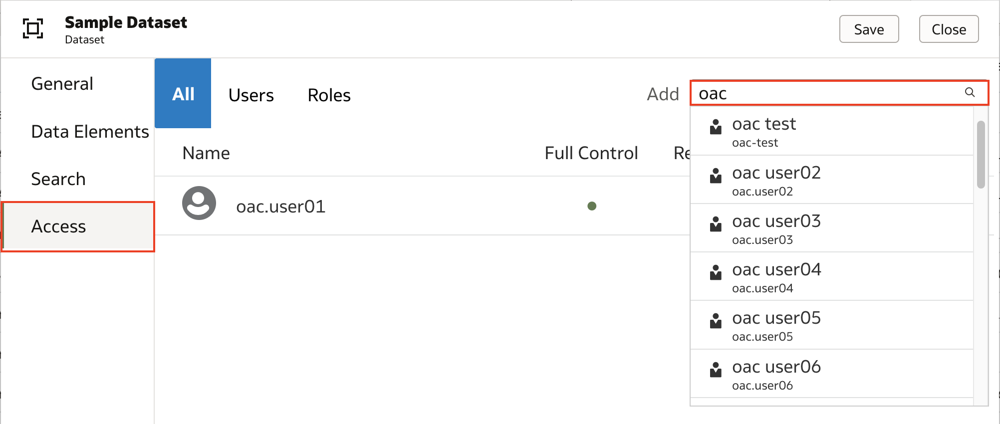
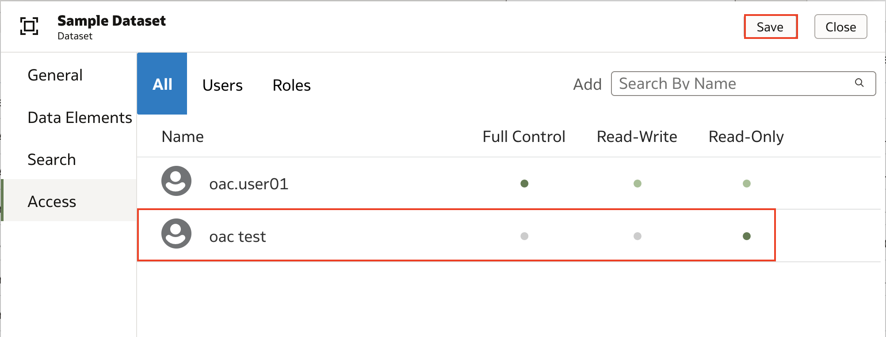
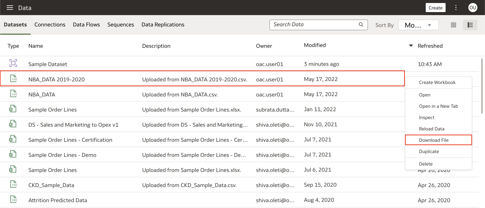

# How do I share my dataset in Oracle Analytics Cloud and Server (OAC & OAS)?

Duration: 2 minutes

When working with datasets in Oracle Analytics, you have the ability to collaborate with your team by sharing datasets and granting access control to those datasets. This Sprint will show you two ways to share datasets: sharing with other users in Oracle Analytics and sharing with external members.

## Sharing datasets

### Within Oracle Analytics

>**Note:** You must have the **DV Author** application role to complete the following steps.

1. Within your Oracle Analytics instance, navigate to the **Datasets** tab within the **Data** pane in the navigation menu. Your list of available datasets will be displayed in this window.

    

2. Identify the dataset you want to share and either **right-click** or click the **Actions menu** represented by the three dots when you over over the dataset. Select **Inspect** to view the details of the dataset.

    

3. You will see the details of the dataset such as general information, data elements, search, and access. Click on **Access** to view users and roles associated with this dataset. This is where you will have the ability to share your dataset with other users as well as grant access controls. In the **Add** section, search for and select the user(s) you want to share this dataset with.

    

4. Once you have selected the user(s) to share this dataset with, determine the access controls you want to grant the user(s). In this scenario, I want the 'oac test' user to only have the ability to read the dataset so I select **Read-Only**. When you are done granting access to user(s), click **Save** to save your changes.
    >**Note:** As a best practice, you should grant access to Roles rather than individual Users because Users may come and go, whereas Roles are more stable. Even if you are sharing a dataset with one user, create an Application Role for it.

    

### Externally (only works with flat files)

1. Within your Oracle Analytics instance, navigate to the **Datasets** tab within the **Data** pane in the navigation menu. Your list of available datasets will be displayed in this window. Right-click the dataset and select **Download File**. After the file is downloaded, you can email the dataset to your team.

    >**Note:** You must have **Full Control** access to the dataset and it must be a flatfile (CSV, XLSX or XLS, and TXT)

    

Congratulations, you have learned how to share your dataset with other users within Oracle Analytics and with external users!

## Learn More
* [Add or Update a Dataset's Permissions](https://docs.oracle.com/en/cloud/paas/analytics-cloud/acubi/add-or-update-datasets-permissions.html)

## Acknowledgements
* **Author** - Nagwang Gyamtso, Product Manager, Product Strategy
* **Last Updated By/Date** - Nagwang Gyamtso,  June 2022
