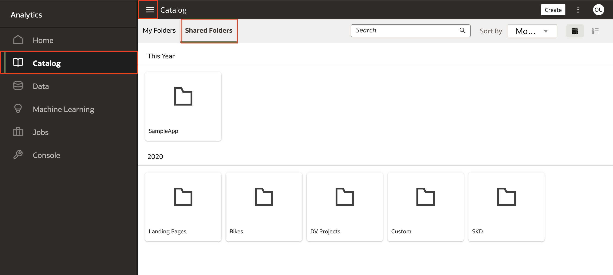
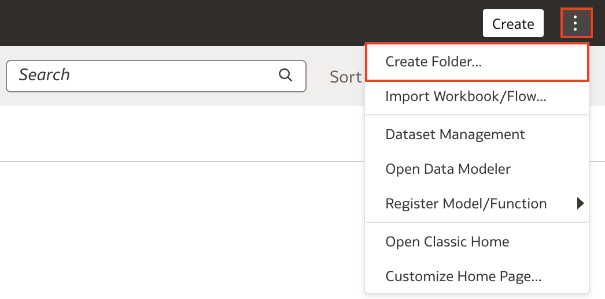
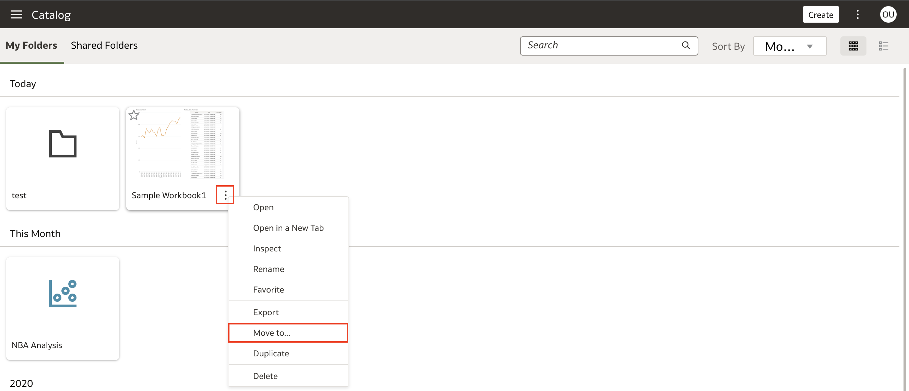
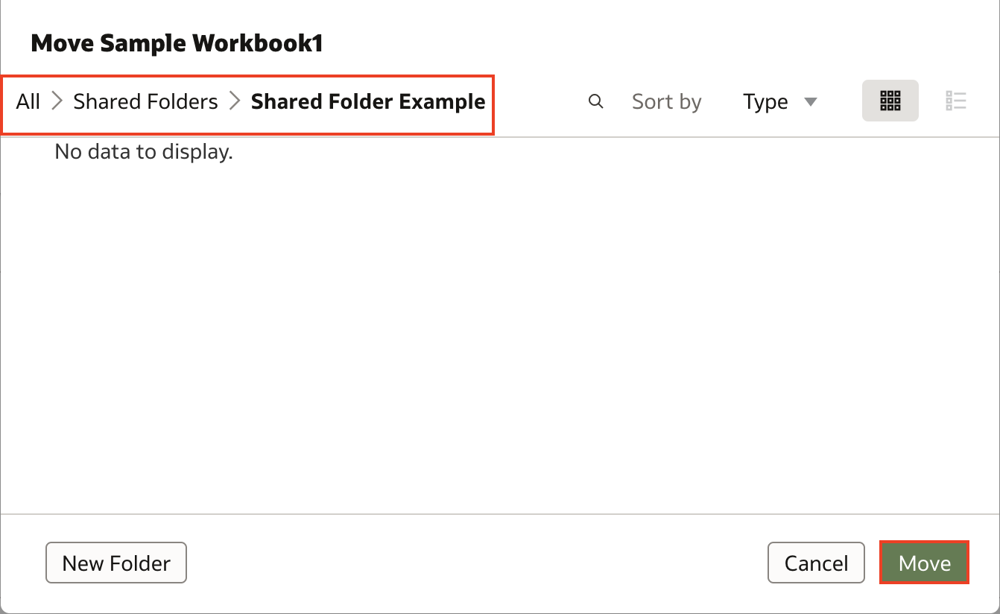
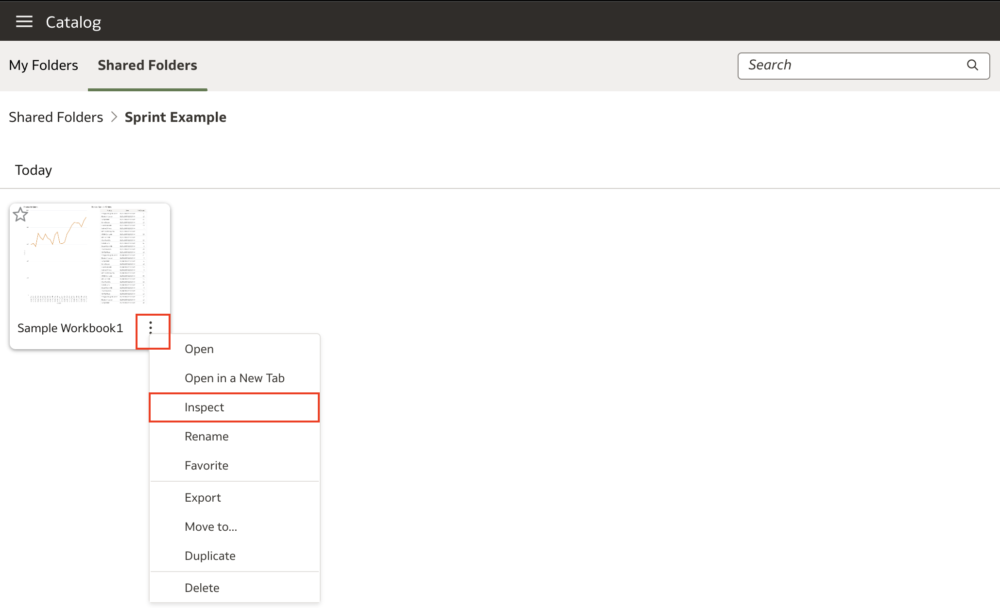
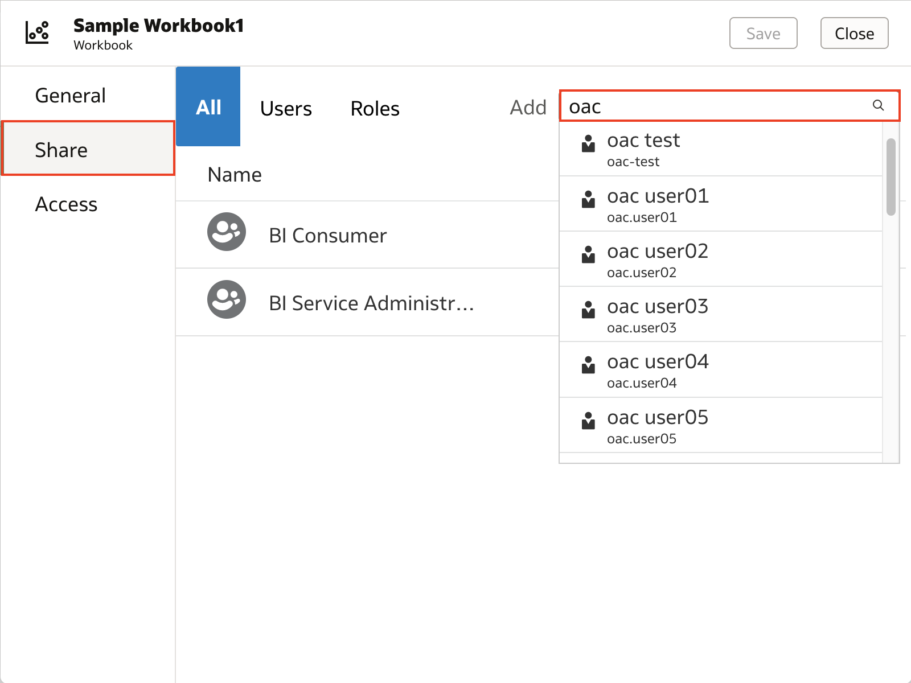

# Como compartilhar uma pasta de trabalho em Oracle Analytics Cloud (OAC)?

Duração: 2 minutos

Oracle Analytics te permite compartilhar suas pastas de trabalho (Workbook) com outras pessoas para facilitar a colaboração. Quando compartilhamos pastas de trabalho, existe a opção de dar privilégios de visualização ou edição para os demais usuários.
* **Edit** Permite aos usuários fazerem mudanças na pasta de trabalho
* **View** Permite aos usuários apenas visualizarem a pasta de trabalho sem poderem editar.

Compartilhar pastas de trabalho é uma ótima maneira de colaborar sem precisar exportar a pasta de trabalho inteiro, movê-lo de lugar e ainda arriscando criar fluxos de trabalho com informações desatualizadas por enviar trabalhos para diferentes usuários.

## Compartilhar um workbook
>**Nota:** Você deve ter o cargo **BI Content Author** para poder executar os próximos passos:

1. Na sua **Homepage**, clique em **Navigation menu** (o menu de hamburguer) e clique em **Catalog**. Clique em **Shared Folders**. Aqui ficam todos os seus workbooks para compartilhar com outras pessoas em sua organização.

    

2. Crie uma pasta clicando em **Page Menu** representado pelos três pontinhos. Então selecione **Create Folder**. Dê um nome para sua pasta então clique em **Save**.

    

3. Uma vez criada e compartilhada a pasta, vá para **My Folders** e encontre o workbook que você deseja compartilhar. Clique em **Actions Menu** daquele workbook e selecione **Move to...**

    

4. Vá até **Shared Folders** e selecione a pasta que você acabou de criar. Clique em **Move**. Seu workbook agora está na pasta compartilhada e nós podemos começar a compartilhar esse workbook com demais usuários.

    

5. Vá até **Shared Folders** e abra a pasta compartilhada que tem o seu workbook. Clique em **Actions Menu** do workbook que você deseja compartilhar. Selecione **Inspect**.

    

6. Clique em **Share** e, na barra de busca, procure os usuários ou o cargo com quem você deseja compartilhar seu workbook.

    >**Nota:** Uma boa prática é compartilhar workbooks com cargos em vez de pessoas individuais para o caso de aquela pessoa sair da organização.

    

7. Uma vez selecionado o usuário ou cargo, dê os privilégios de acesso decidindo entre edição ou visualização. Finalizado clique em **Save**. Usuários agora poderão acessar seu workbook compartilhado pelo catálogo deles.

    

Parabéns! Você acabou de aprender como compartilhar workbooks com outros usuários em Oracle Analytics Cloud!

## Saiba mais

* [Compartilhe um Workbook](https://docs.oracle.com/en/cloud/paas/analytics-cloud/acubi/share-workbook.html)

## Acknowledgements
* **Author** - Nagwang Gyamtso, Product Manager, Product Strategy
* **Tradução** - Isabel Giannecchini, Cloud Engineer GenO, Brazil Data & AI Team
* **Última Atualização** - Isabelle Dias,  Novembro 2022
