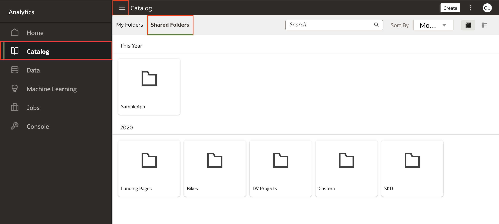
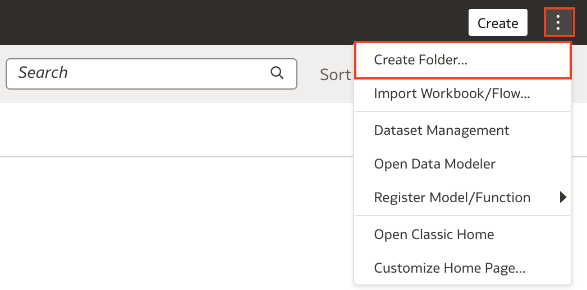
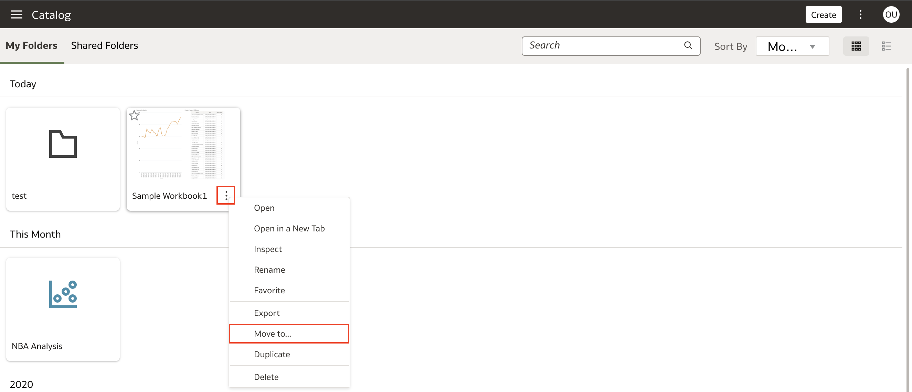
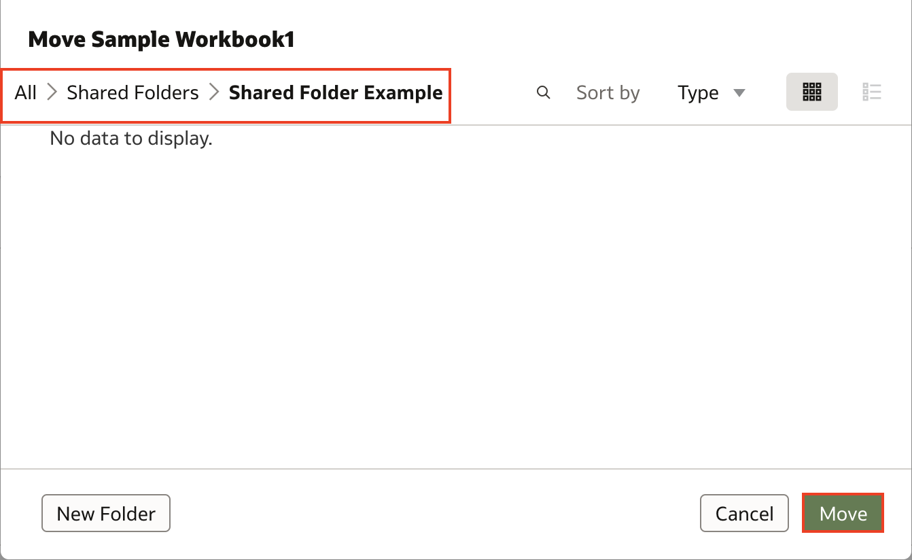
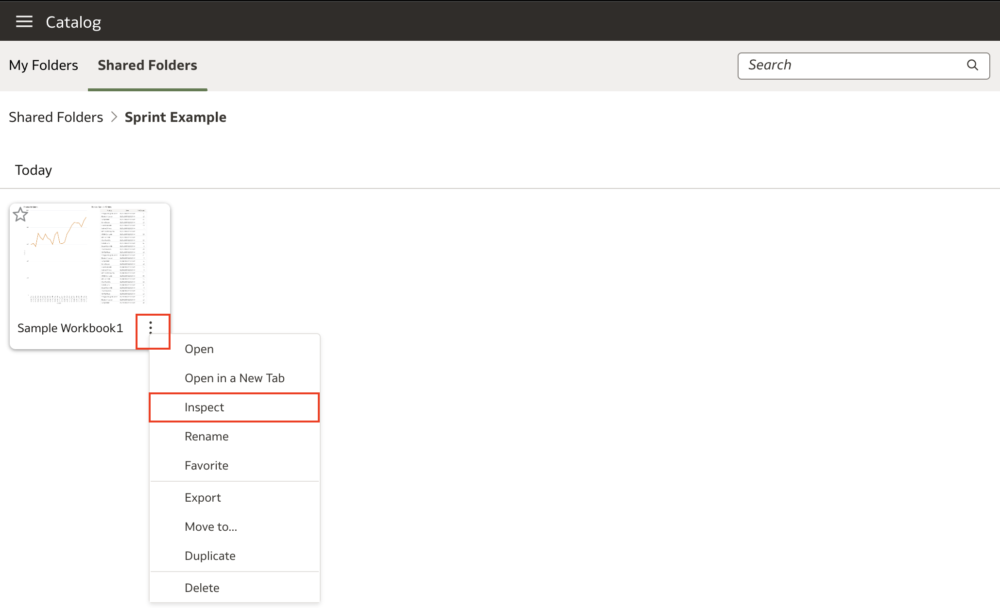
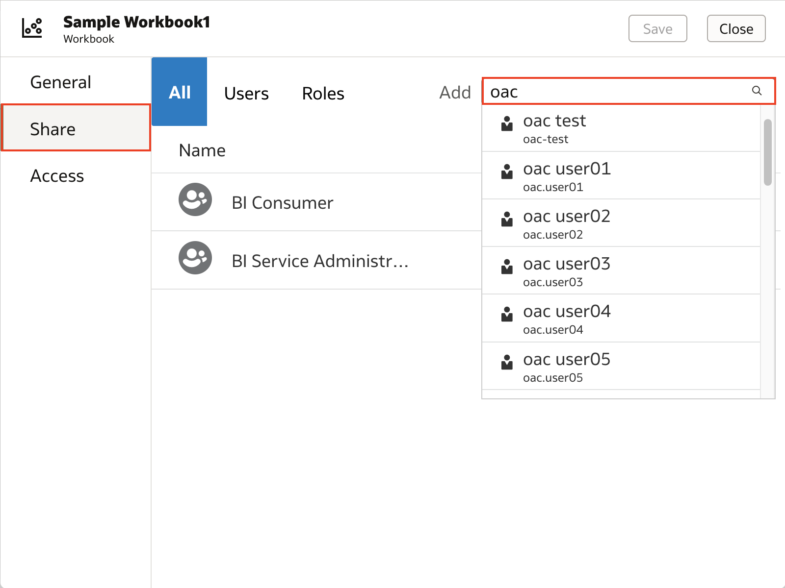
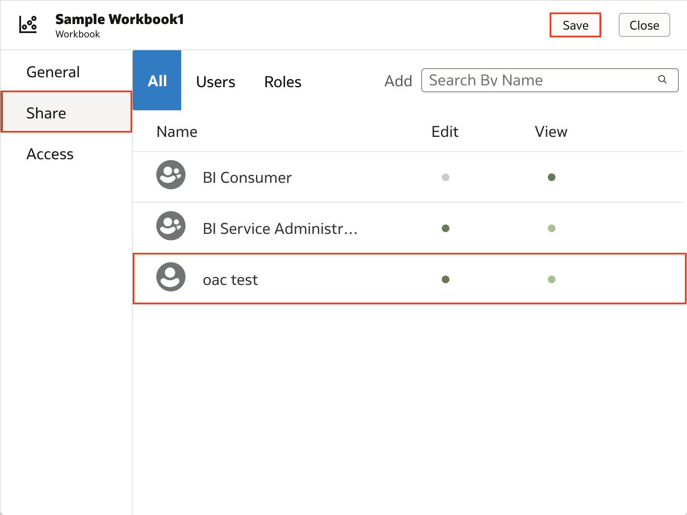

# How do I share a workbook in Oracle Analytics Cloud (OAC)?

Last updated June 6, 2022

Duration: 2 minutes

Oracle Analytics gives you the ability to share your workbook with others to facilitate collaboration. When you share workbooks, you have the option to provide Edit and View privileges to users.
* **Edit** allows users to edit the workbook and make changes
* **View** limits users to only view the workbook without having the permission to edit the workbook

Sharing workbooks is a great way to collaborate without having to export your whole workbook, move it around, and risk having misaligned versions from sending it back and forth between multiple users.

## Share a workbook
You must have **BI Content Author** application role to be able to execute the following steps:

1. On your **Homepage**, click on the **Navigation menu** and click on **Catalog**. Then click on **Shared Folders**. This is where you will place your workbooks to be shared with other users within your organization. 

    

2. Create a folder by clicking on the **Page Menu** represented by the three dots. Then select **Create Folder**. Give the folder and name and click **Save**.

    

3. Once you create the shared folder, navigate to **My Folders** and find the workbook you want to share. Click on the **Actions Menu** of that workbook and select **Move to...**

    

4. Navigate to the **Shared Folders** location and select the shared folder we have just created. Click **Move**. Your workbook is now in the shared folder and we can start assigning users to share the workbook with.

    

5. Navigate to **Shared Folders** and open the shared folder that contains the workbook. Click the **Actions Menu** of the workbook you want to share. Select **Inspect**.

    

6. Click **Share** and in the search bar, search for the user or role you want to share this folder with.

    >**Note:** As a best practice, you should share workbooks with application Roles instead of individual Users in case that user leaves your organization. 

    

7. Once you select the User or Role, grant access priviliges by deciding whether you want the User or Role to be able to Edit or View. When finished, click **Save**. Users will now be able to access the shared workbook from their catalog!

    

Congratulations! You have just learned how to share workbooks with users in Oracle Analytics Cloud!

## Learn More

* [Share a Workbook](https://docs.oracle.com/en/cloud/paas/analytics-cloud/acubi/share-workbook.html)
