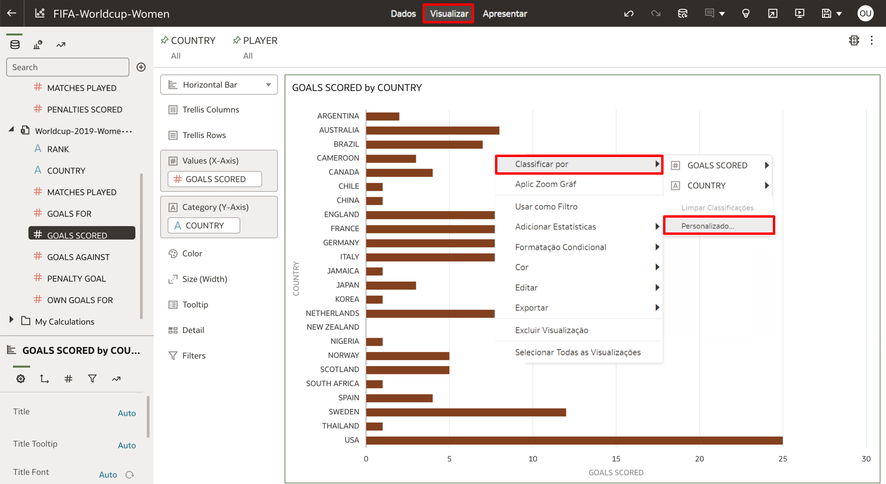
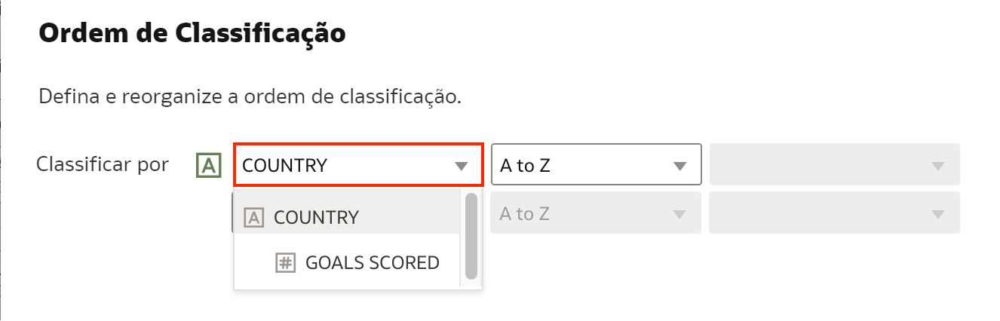
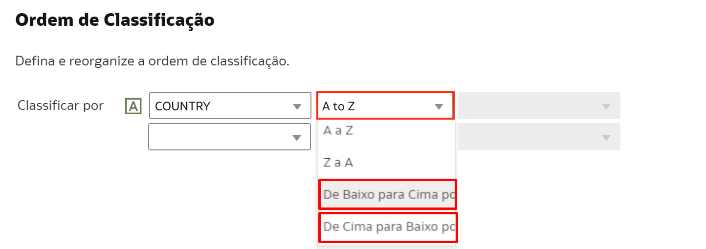
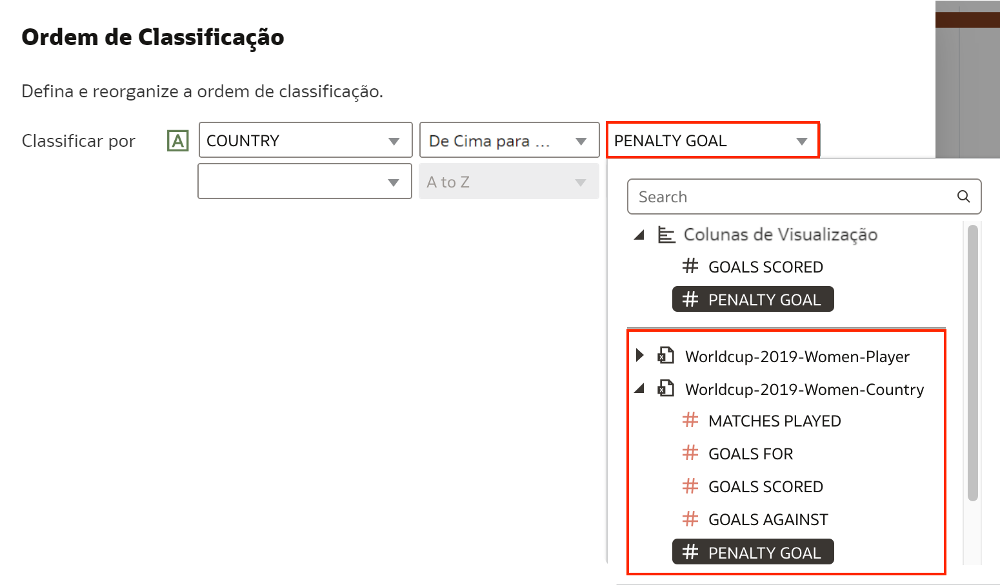
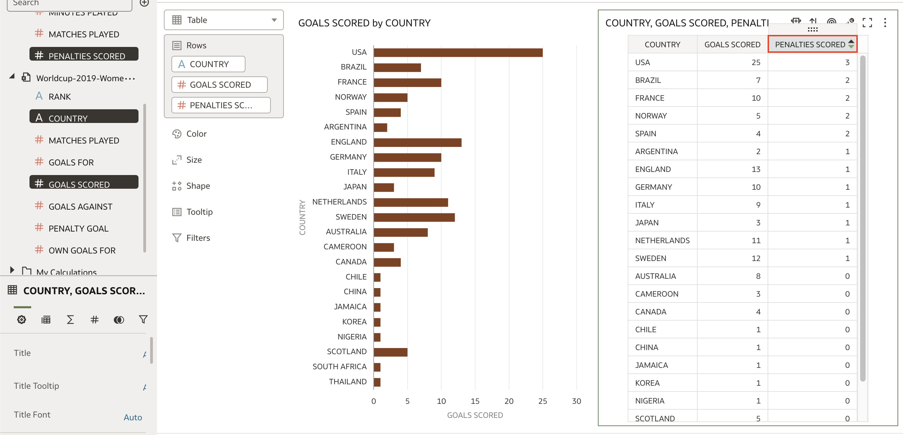

# Como classificar (sort) uma visualização por uma coluna não usada na visualização no Oracle Analytics Cloud (OAC)?

Duração: 1 minuto

A classificação (sort) é uma ótima maneira de restringir seu foco e reorganizar seus dados para obter facilmente insights de seus dados. Classificar por uma coluna é a maneira mais comum, mas o Oracle Analytics permite criar várias classificações, bem como classificar por colunas não usadas na visualização. Este Sprint irá orientá-lo sobre como criar classificações com colunas não usadas em sua visualização atual.

## Classificação Personalizada
>**Nota:** Você precisa ter a permissão **BI Content Author** para conseguir executar os próximos passos.

1. Abra uma pasta de trabalho (workbook) e crie uma visualização se você tiver uma tela vazia. Se você tiver visualizações, clique com o botão direito do mouse em uma visualização e selecione **Classificar por**. Em seguida, clique em **Personalizado**. Isso abrirá suas opções de classificação personalizadas.

    

2. É aqui que a mágica acontece. Na primeira caixa, o menu suspenso listará as colunas atualmente presentes em sua visualização. Certifique-se de escolher a coluna de atributo (Attribute). Escolher colunas de medida não nos permitirá classificar por uma coluna não presente na visualização, pois você já pode classificar pela coluna de medida (Measure) na visualização atual.

    

3. Na segunda caixa, certifique-se de escolher **De baixo para cima por** ou **De cima para baixo por**. Se você selecionar **A a Z** ou **Z a A**, não poderá classificar por uma coluna extra.

    

4. Na terceira caixa, selecione a medida pela qual você deseja classificar. Isso pode ser de qualquer medida que exista no conjunto de dados e não está sendo usada na visualização.

    >**Nota:** Você pode criar várias classificações usando as caixas adicionais abaixo do primeiro **Classificar por** para obter **Depois por**.

    

5. Sua visualização agora refletirá a nova classificação que você criou. Para verificar se a classificação está precisa, você pode criar uma tabela usando os atributos e as medidas usadas, incluindo a medida usada para classificar a visualização. Na tabela, classifique a coluna usada para classificar a visualização anterior clicando no ícone "para cima" ou "para baixo" no nome da coluna. Agora você verá que a classificação da visualização corresponde à classificação da tabela, o que significa que você conseguiu classificar com sucesso uma coluna que não estava na visualização.

    

Parabéns! Você aprendeu como classificar uma visualização por uma coluna não usada na visualização no Oracle Analytics Cloud! Congratulations!

## Saiba Mais

* [Sorting Data Visualization Based on Columns not Included in the Visualization](https://www.youtube.com/watch?v=i5m1tLIUxIc)

* [Sort, Drill, and Select Data in Visualizations](https://docs.oracle.com/en/cloud/paas/analytics-cloud/acubi/sort-drill-and-select-data-visualizations.html)

## Reconhecimentos
* **Autor** - Nagwang Gyamtso, Product Manager, Product Strategy
* **Tradução** - Thais Henrique, Cloud Engineer, Brazil Data & AI Team
* **Última Atualização** - Thais Henrique,  Março 2023
