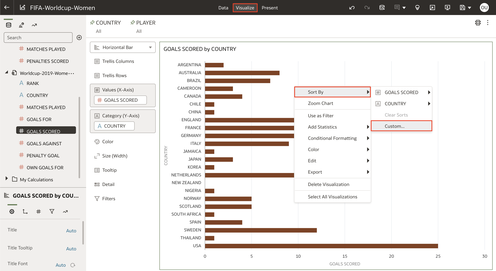
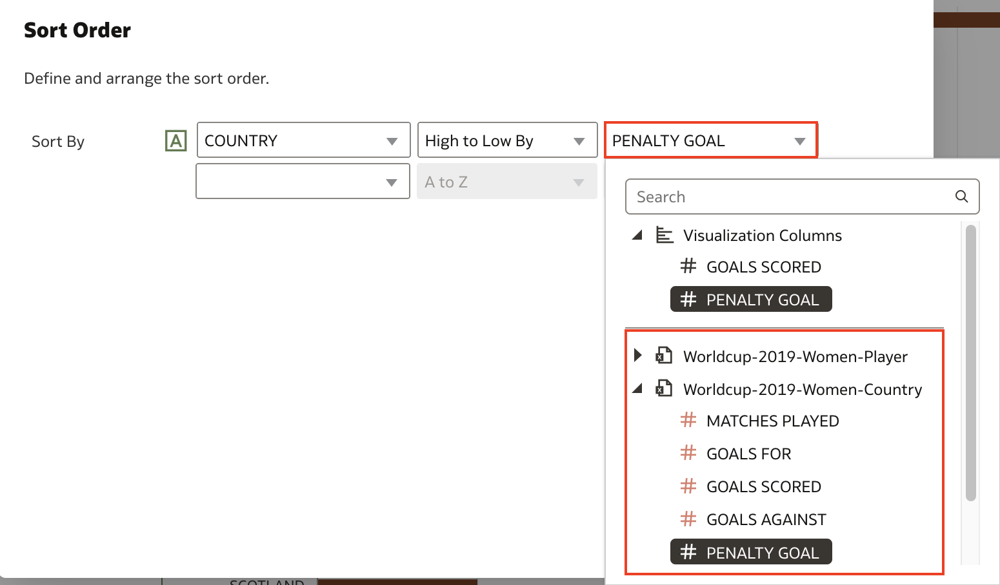

# How do I sort a visualization by a column not used in the visualization in Oracle Analytics Cloud (OAC)?
Duration: 1 minute 

Sorting is a great way to narrow your focus and reorganize your data to easily get insights out of your data. Sorting by one column is the most common way but Oracle Analytics allows you to create multiple sorts as well as sorting by columns not used in the visualization. This Sprint will guide you on how to create sorts with columns not used in your current visualization.

## Custom sort
You must have the **BI Content Author** application role to successfully execute the following steps. 

1. Open a workbook and create a visualization if you have an empty canvas. If you have visualizations, right-click a visualization and select **Sort By**. Then click **Custom**. This will open up your custom sort options.

    

2. This is where the magic happens. In the first box, the drop down menu will list the columns currently present in your visualization. Make sure to choose the attribute column. Choosing measure columns will not allow us to sort by a column not present in the visualization since you  can already sort by the measure column in the current visualization. 

    

3. In the second box, make sure to choose either **Low to High By** or **High to Low By**. If you select **A to Z** or **Z to A** you will not be able to sort by an extra column.

    

4. In the third box, select the measure that you want to sort by. This can be from any measure that exists in the dataset and is not used in the visualization. 

    >**Note:** You can create muliple sorts by using the additional boxes below the first **Sort By** to get **Then By**.

        

5. Your visualization will now reflect the new sort you have created. To verify that the sort is accurate, you can create a table using the attributes and measures used including the mesure used to sort the visualization. In the table, sort the column used to sort the previous visualization by clicking the up or down icon on the column name. You will now see that the sort from the visualization matches the sort from the table which means you were successfully able to sort with a column not in the visualization.

    

Congratulations! You just learned how to sort a visualization by a column not used in the visualization in Oracle Analytics Cloud!

## Learn More

* [Sorting Data Visualization Based on Columns not Included in the Visualization](https://www.youtube.com/watch?v=i5m1tLIUxIc)

* [Sort, Drill, and Select Data in Visualizations](https://docs.oracle.com/en/cloud/paas/analytics-cloud/acubi/sort-drill-and-select-data-visualizations.html)

