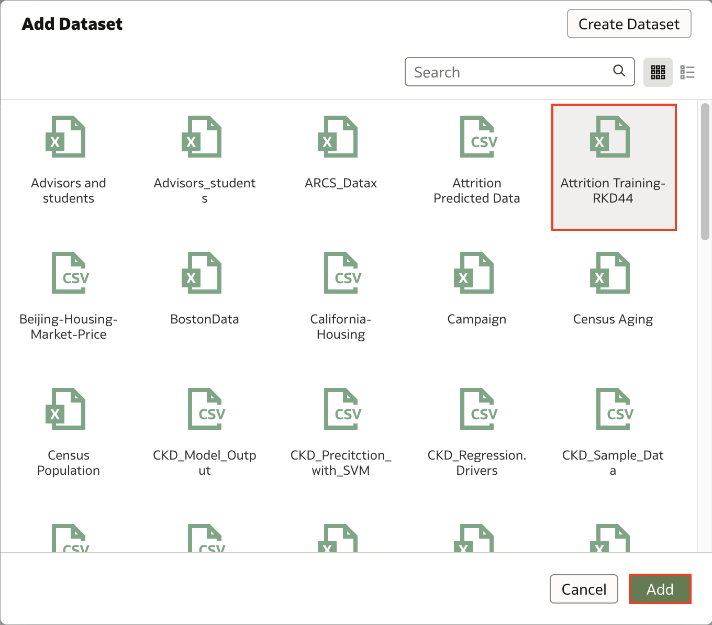
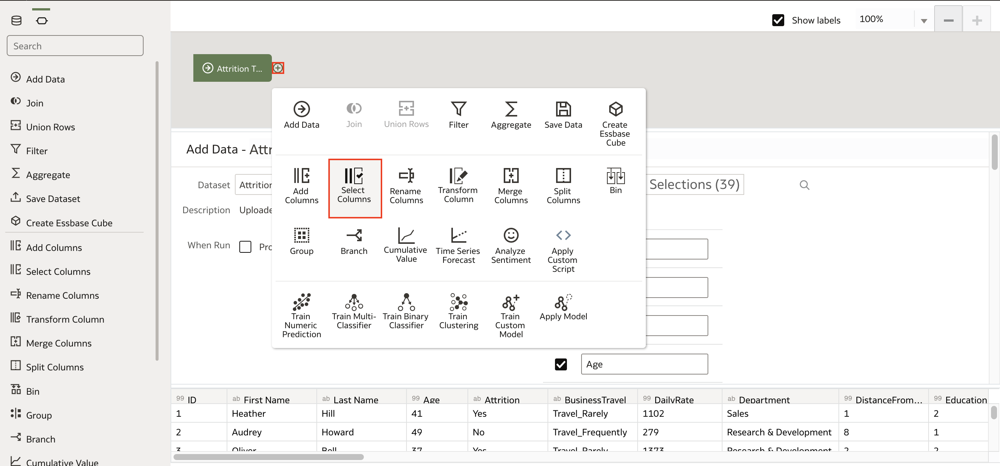
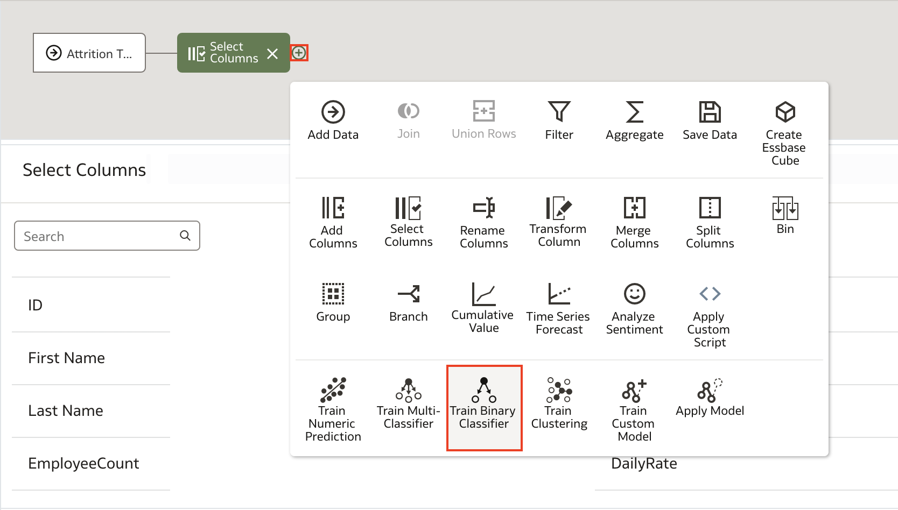
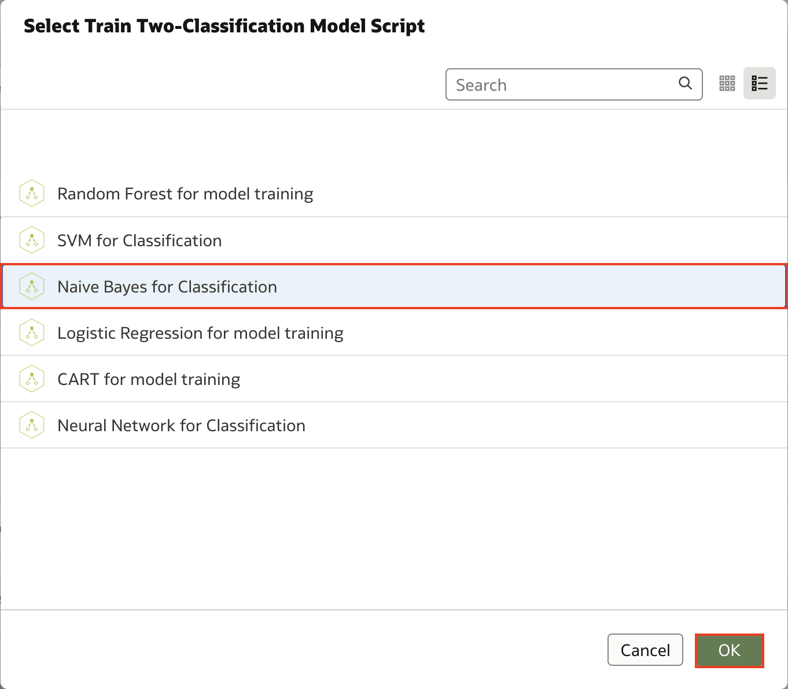
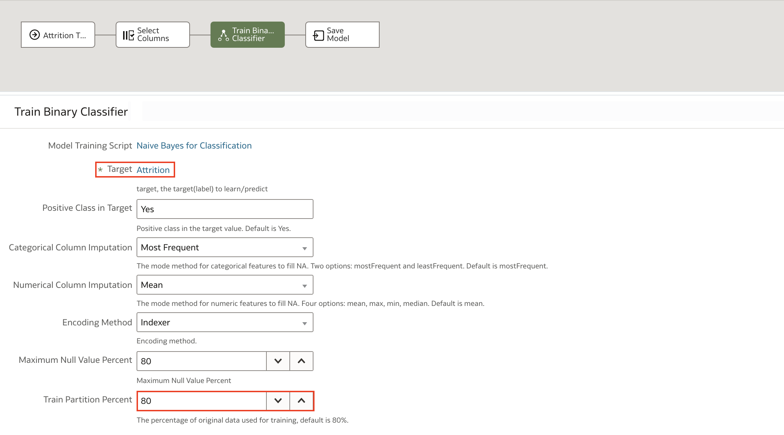
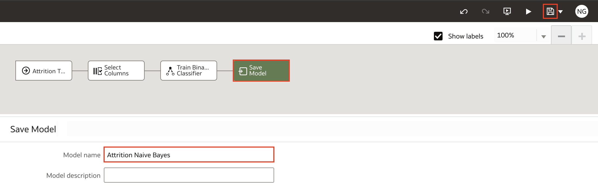
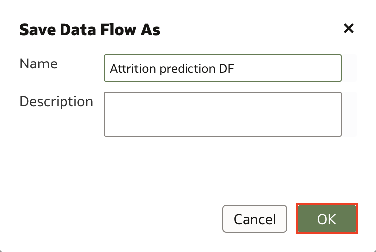
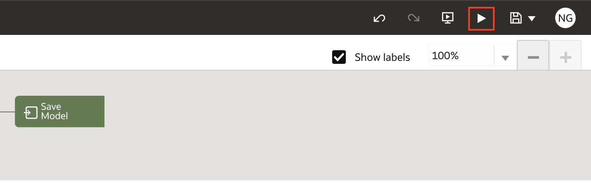
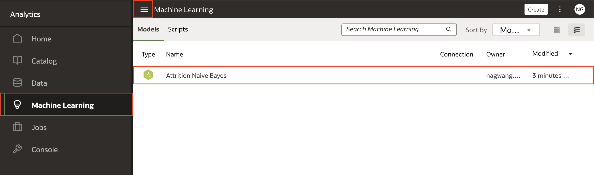
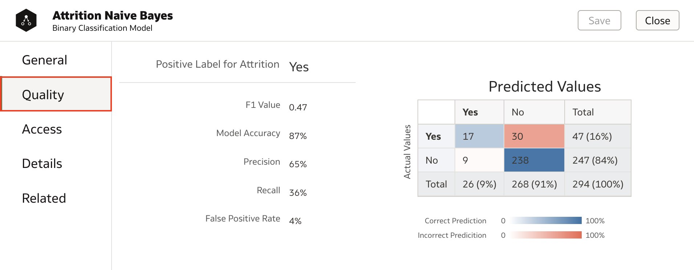

# Como treinar um modelo de machine learning no Oracle Analytics Cloud (OAC)?

Duração: 3 minutos

Machine learning é uma ferramenta poderosa para ajudar na tomada de decisão orientada a dados em diferentes casos de uso. Por exemplo, varejistas utilizam machine learning para prever quando um item sairá de estoque de forma que ele consiga reabastecer o produto em tempo hábil. No setor financeiro, machine learning é alplamente utilizado para detecção de fraudes utilizando padrões de reconhecimento e detecção de anomalias. Esses dois são alguns dos vários casos de uso possíveis e o Oracle Analytics te entrega as ferramentas para realizá-los.

Nessa sprint, nós usaremos as ferramentas de machine learning da Oracle integrados ao Oracle Analytics Cloud para treinar nossos datasets de RH e predizer o atrito dentro de uma companhia.

## Treinando um modelo de machine learning com Data Flow
>**Nota:** Você deve ter o cargo **DV Content Author** dentro da aplicação para executar os próximos passos.

1. Na página inicial da sua instância OAC, clique em **Create** e selecione **Data Flow**.

    

2. Selecione o dataset que você quer utilizar para treinar seu modelo de machine learning e clique em **Add**.

    

3. Clique no ícone **Add a step (+)** e clique em  **Select Columns**. Se você sabe exatamenmte quais colunas afetarão os valores que você quer prever, selecione as colunas que não tenham nenhum efeito e clique em **Remove selected**. Caso não tenha certeza, utilize todas as colunas.
   
    

4. Agora, vamos selecionar o modelo que queremos prever clicando no ícone **Add a step (+)** e escolhendo o modelo apropriado para o seu caso. Nesse exemplo, já que nosso alvo é "Attrition", que é um classificador binário, nós selecionamos a opção **Train Binary Classifier**.

    >**Nota:** Para aprender mais sobnre modelos de machine learning pré-treinados no OAC, [clique aqui.](https://docs.oracle.com/en/cloud/paas/analytics-cloud/acubi/create-and-use-oracle-analytics-predictive-models.html#GUID-97826D44-5785-48F2-BB1E-4709327ADB8B)

    

 1. Escolha o algoritmo que você deseja treinar e clique em **OK**.

     

5. Para um modelo supervisionado, como predição ou classificação, clique em **Target** e selecione a coluna que está tentando prever. Nesse exemplo, como estamos prevendo atrito, selecionamos a coluna **Attrition**. Se você está trabalhando com modelos não-supervisionados, como clusterização, então sua coluna alvo não é necessária.

    >**Nota:** Para saber mais sobre machine learning e os tipos de machine learning, [clique aqui.](https://www.oracle.com/data-science/machine-learning/what-is-machine-learning/)

    A **Train Partition Percent** sempre será definda como 80% por padrão. No geral, 80% do seu dataset deve ser usado para treinar o modelo e 20% para validar o modelo treinado. Essa proporção pode mudar de acordo com o tamanho do seu conjunto de dados.

     

6. Clique em **Save Model** e dê um nome para o seu modelo em **Model name**. Depois, clieuq no ícone **Save**.

     

7. Dê um nome para o Data Flow e clique em **OK**.

     

8. Clique em **Run Data Flow**. Uma vez que seu Data Flow seja executado com sucesso, volte para sua página inicial do OAC.

     

9.  Vamos conferir se seu modelo de machine learning foi treinado com sucesso. Clique no **Navigation menu** e selecione **Machine Learning**. O modelo que acabamos de treinar será mostrado junto com o tipo e o nome do modelo.

     

10. Para verificar a qualidade do seu modelo, com o botão direito do mouse, clique no modelo e selecione **Inspect**. Então clique em  **Quality** e as métricas de performance do modelo serão mostradas.

     

Parabéns, você acaba de aprender como treinar um modelo de Machine Learning em Oracle Analytics Cloud utilizando o  Data Flow!

## Saiba Mais
* [Crie e treine um modelo preditivo](https://docs.oracle.com/en/cloud/paas/analytics-cloud/acubi/create-and-use-oracle-analytics-predictive-models.html#GUID-533DCE34-CBFC-490F-BCAA-A0F99BAB6B10)
* [Machine Learning Supervisionado Vs. Não-supervisionado](https://blogs.oracle.com/ai-and-datascience/post/supervised-vs-unsupervised-machine-learning)

## Acknowledgements
* **Author** - Nagwang Gyamtso, Product Manager, Product Strategy
* * **Tradução** - Isabel Giannecchini, Cloud Engineer, Brazil Data & AI Team
* **Última Atualização** - Isabel Giannecchini,  Setembro 2022
