# How do I train a machine learning model in Oracle Analytics Cloud and Server (OAC & OAS)?

Duration: 3 minutes

This sprint teaches you how to use Oracle's embedded machine learning algorithms in OAC to train an HR dataset to predict attrition.

# Use data flow to train a machine learning model
>**Note:** You must have the **DV Content Author** role to complete the following steps.

1. In the Oracle Analytics Home page, click **Create** and select **Data Flow**.

    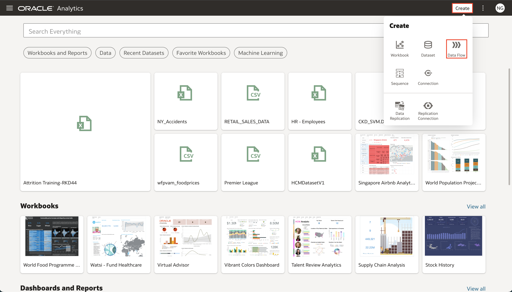

2. Select the dataset that you want to train the machine learning model with and click **Add**.

    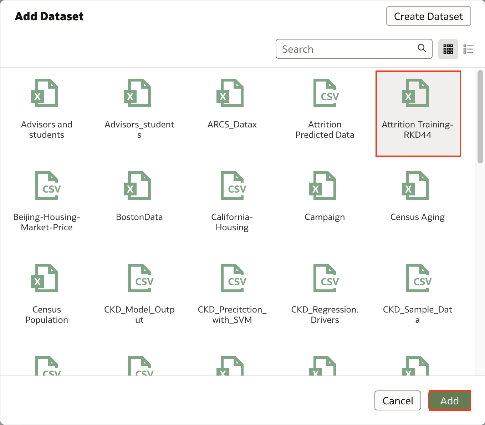

3. Click the **Add a step (+)** icon and click **Select Columns**. If you know which columns affect the value you are predicting for, select the columns that have no effect and select **Remove selected**. If you're not sure, then you can use all the columns.

    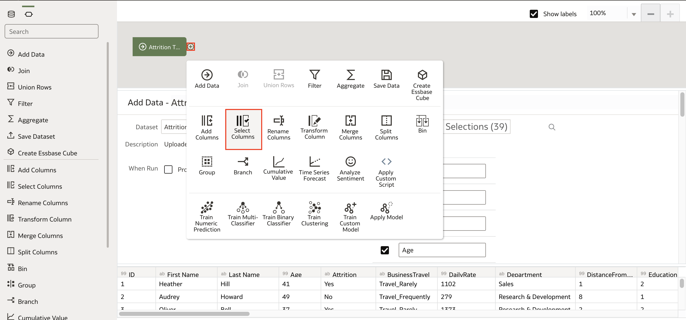

4. To select the model you want to predict, click **Add a step (+)** icon and choose the model appropriate for your case.  
 In this example, since our target is Attrition, which is a binary classifier, we select the **Train Binary Classifier** option.

    >**Note:** To learn more about the machine learning models pre-built into Oracle Analytics, click [here.](https://docs.oracle.com/en/cloud/paas/analytics-cloud/acubi/create-and-use-oracle-analytics-predictive-models.html#GUID-97826D44-5785-48F2-BB1E-4709327ADB8B)

    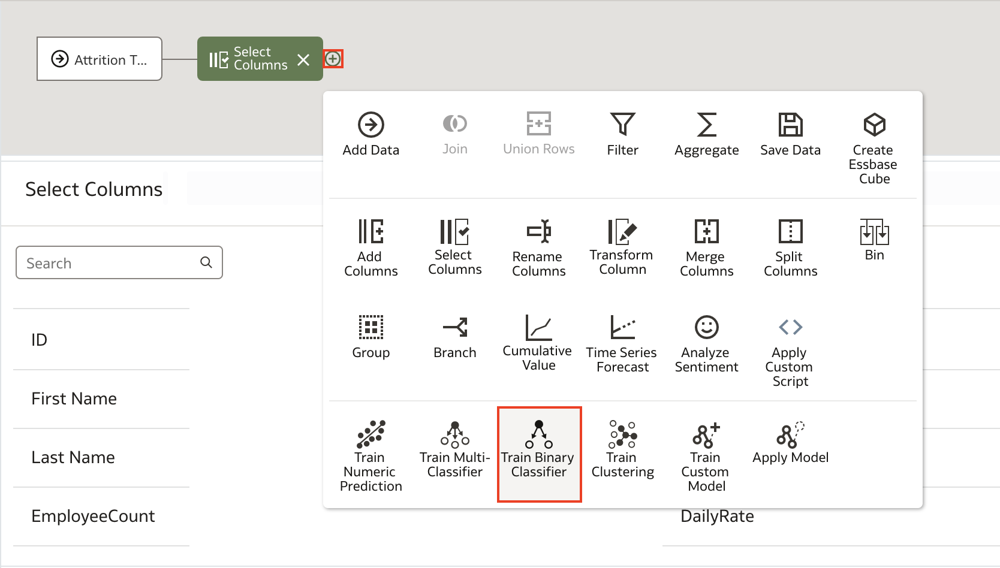

 5. Choose the algorithm you want to train and click **OK**.

     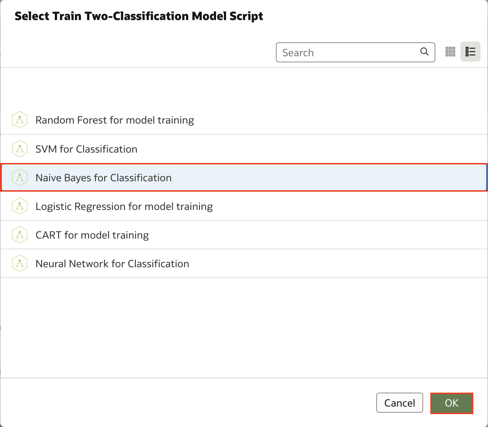

6. For a supervised model like prediction or classification, click **Target** and select the column you are trying to predict. In this example, since we're predicting attrition, we select the **Attrition** column. If you're working with an unsupervised model like clustering, then a target column isn't required.

    >**Note:** To learn more about machine learning and the types of machine learning, click [here.](https://www.oracle.com/data-science/machine-learning/what-is-machine-learning/)

    The **Train Partition Percent** will be set to 80% by default. As a general rule, 80% of your data should be used for training while  20% should be used for validating your training model. This ratio may change based on the size of your data.

     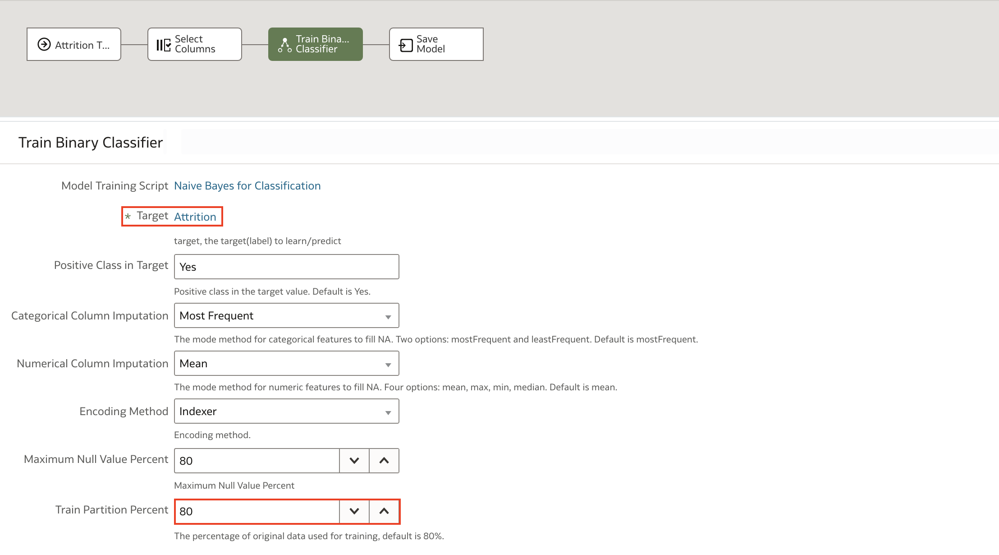

7. Click **Save Model** and give the model a name in **Model name**. Then click the **Save** icon.

     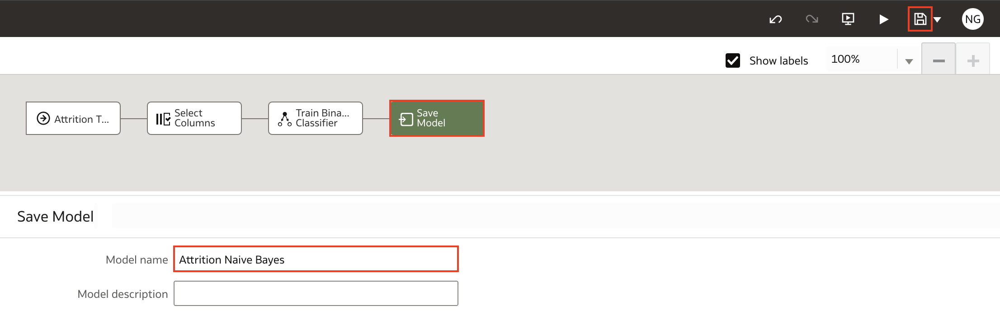

8. Enter a name for the Data Flow and click **OK**.

     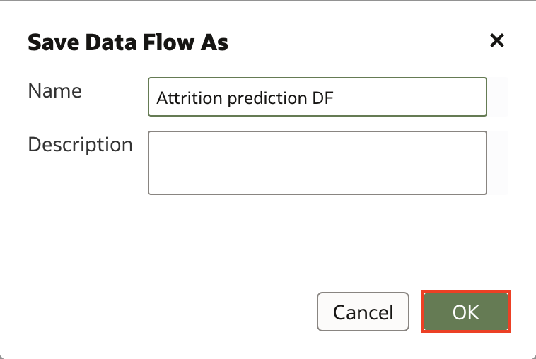

9. Click **Run Data Flow**. After your data flow runs successfully, click Go Back to navigate to the Home page.

     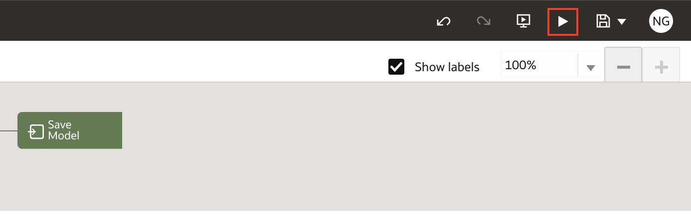

10. To verify that your machine learning model was successfully trained, click **Navigator** and select **Machine Learning**.

The model you trained is displayed and displays the model type and name. Let's verify that your machine learning model has successfully trained.

     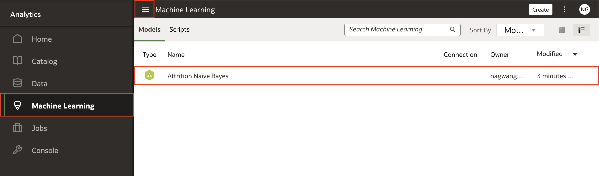

11. To view the quality of your machine learning model, right-click the model and select **Inspect**. Then click **Quality** and the model performance metrics are displayed.

     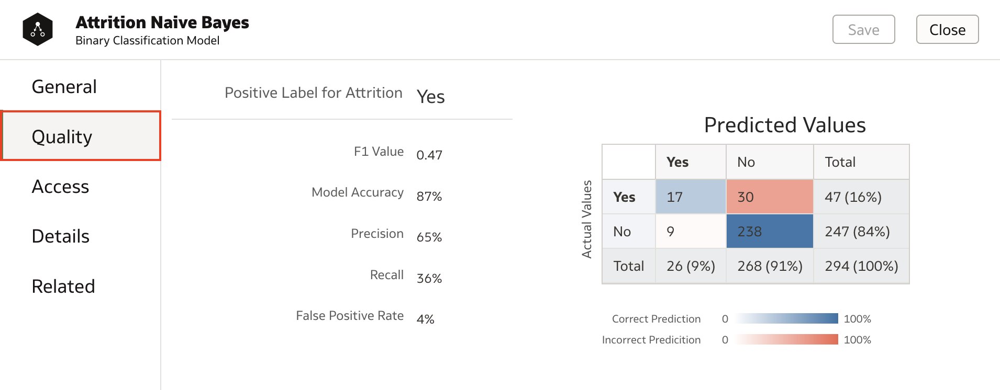

Congratulations, you've learned how to use data flow to train a machine learning model in Oracle Analytics!

## Learn More
* [Create and Train a Predictive Model](https://docs.oracle.com/en/cloud/paas/analytics-cloud/acubi/create-and-use-oracle-analytics-predictive-models.html#GUID-533DCE34-CBFC-490F-BCAA-A0F99BAB6B10)
* [Supervised vs. Unsupervised Machine Learning](https://blogs.oracle.com/ai-and-datascience/post/supervised-vs-unsupervised-machine-learning)

## Acknowledgements
* **Author** - Nagwang Gyamtso, Product Manager, Product Strategy
* **Last Updated By/Date** - Nagwang Gyamtso,  June 2022
