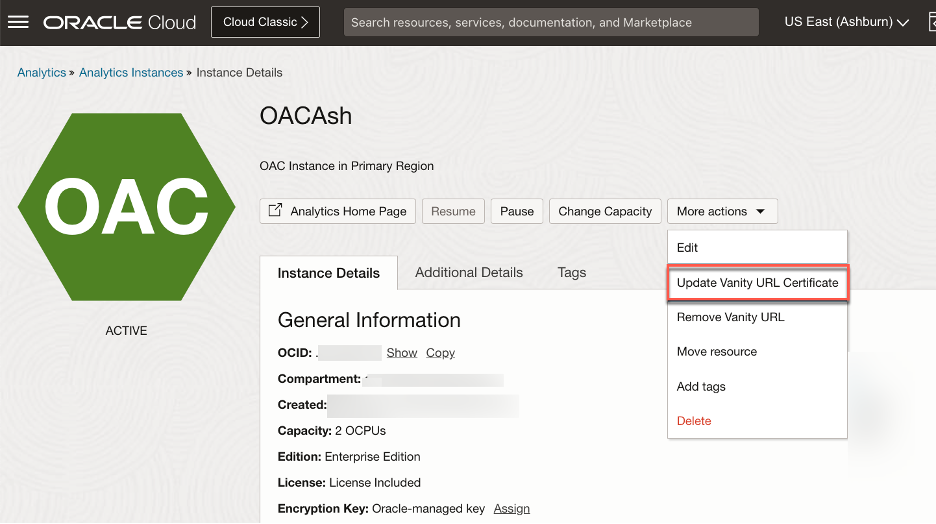
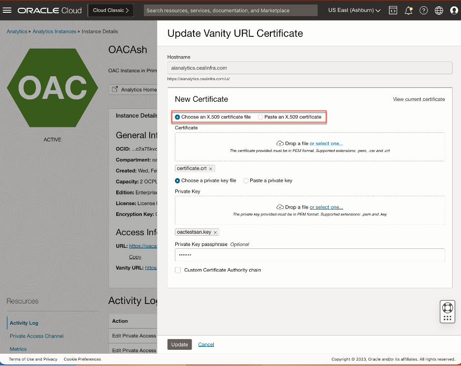
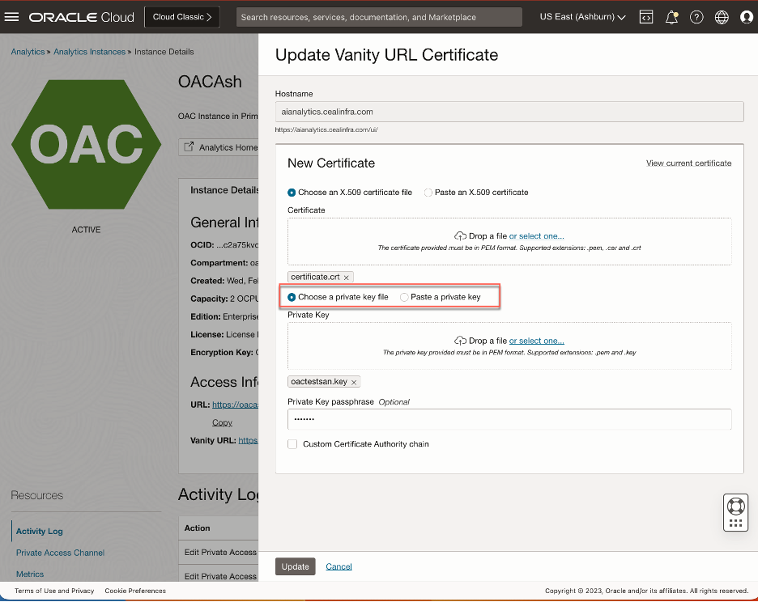
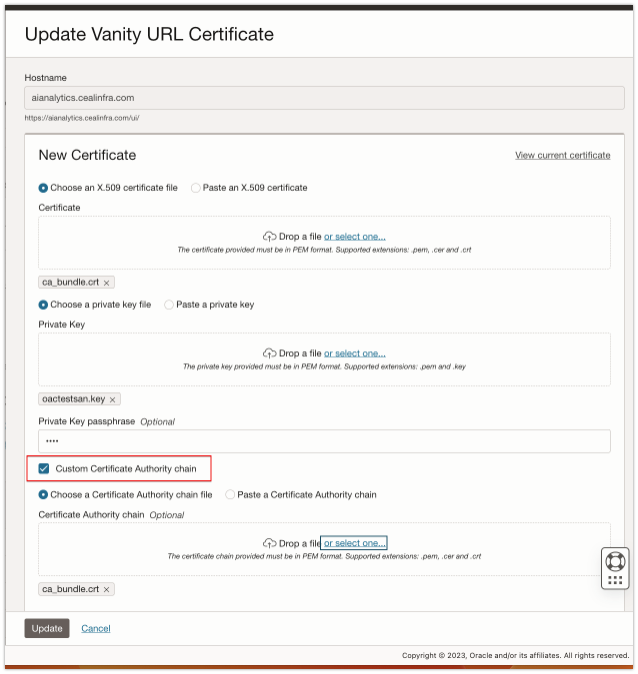
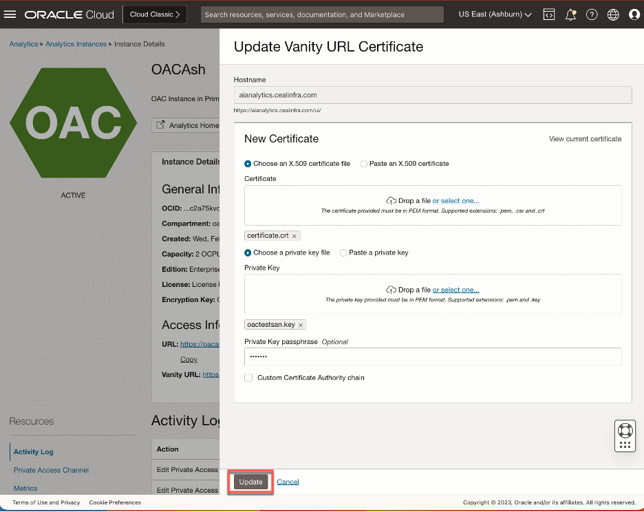

# How do I update an Oracle Analytics Cloud Vanity URL?

Duration: 2 minutes

In this sprint we will discuss the steps to update the SSL certificates for your OAC vanity URL from Oracle Cloud Infrastructure Console logged in an OAC Administrator.

Update the SSL certificates for your Vanity URL in below scenarios.
*	If your Existing SSL certificates are expired.
*	Existing SSL certificates are compromised and renewed.
*	Domain Name change and SSL certificate changes.

## Update OAC Vanity URL

>**Note:** You must have an **OAC Administrator** role to complete this Sprint.

1. Log in to the Oracle Cloud Infrastructure Console at https://cloud.oracle.com
    *	In Oracle Cloud Infrastructure Console, click **Navigation menu** in the top left corner.
    * Click **Analytics & AI**. Under Analytics, click **Analytics Cloud**.
    *	Select the compartment that contains the Oracle Analytics Cloud instance you want to update.
    *	Click on the name of the instance you want to update the vanity URL for.

2. On the Instance Details page, click **More Actions** and then select **Update Vanity URL Certificate**.

  

3. On the **Update Vanity URL Certificate** page, update the digital X.509 certificate for your vanity domain. You can do this by either uploading a valid certificate file in PEM format (with the extensions .pem, .cer, or .crt) or pasting the valid X.509 certificate text.

  

3. Next, update the private key for this certificate. You can do this by either uploading the private key file (with the extensions .pem or .key) or pasting the private key text. If your private key requires a passphrase, enter the passphrase in the **Private Key Passphrase** field.

  

4. If your certificate requires a new certificate authority chain, select **Custom Certificate Authority Chain** and update the chain by uploading the chain file (with the extensions .pem, .cer, or .crt) or pasting the chain text.

  

5. Once you have updated the certificate, key, and chain (if necessary), click **Update.** Wait for the update to complete. This may take a few moments.

  

6. Finally, verify that you can access Oracle Analytics Cloud by clicking on the vanity URL link that displays in the Access Information section. This will ensure that your vanity URL is correctly configured and that your users can access your Analytics Cloud instance without any issues.

## Learn More
* [Create, Update and Delete Oracle Analytics Cloud Vanity URL using UI and OCI CLI](https://blogs.oracle.com/analytics/post/create-update-delete-oac-vanity-url)

## Acknowledgements
* **Author** - Ravi Bhuma, CEAL
* **Last Updated By/Date** - Ravi Bhuma, June 2023
