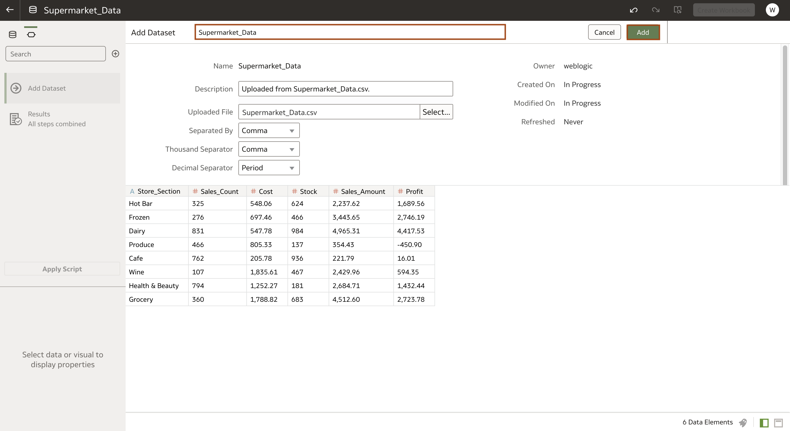
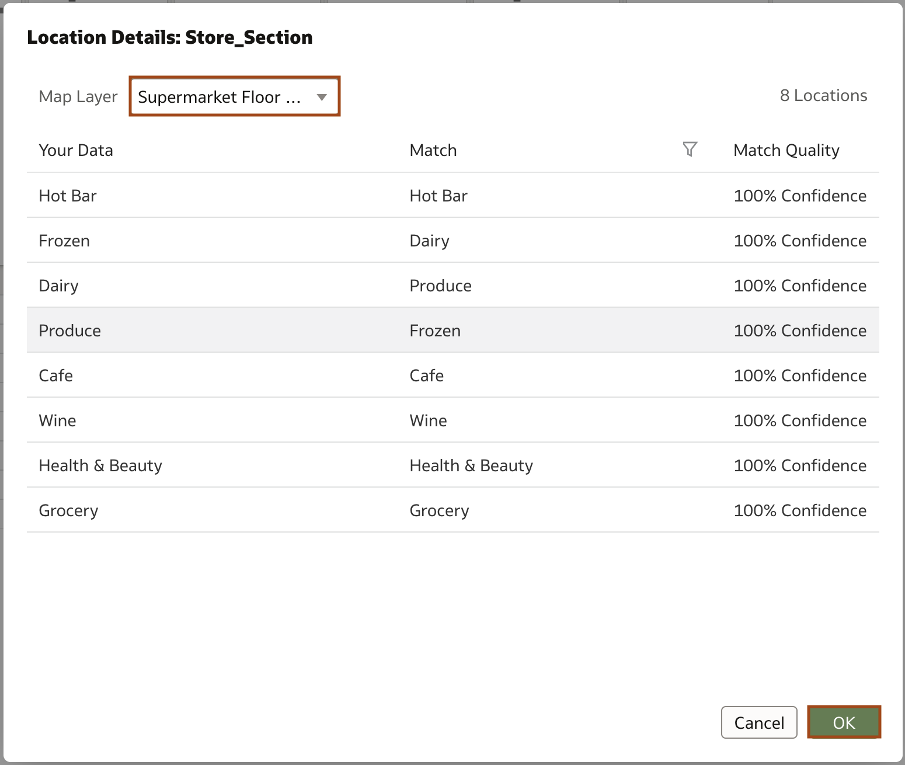
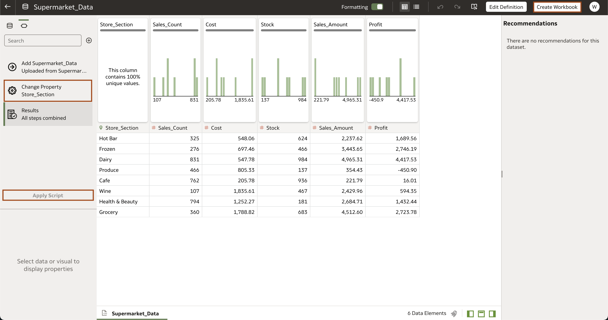

# How do I apply custom map layers to my datasets in Oracle Analytics Server (OAS)?
Duration: 3 minutes

## Answer

Custom map layers are a unique way to leverage the geo spatial capabilities of Oracle Analytics and add another level of customization when using your own image. Oracle Analytics automatically suggests map visualizations based on the key column in your datasets, but you can also choose a map layer to be applied each time. This is especially helpful if you have multiple map layers that may apply to your given data set or multiple workbooks that use the same dataset.

## Apply a custom map layer to a dataset
>**Note:** You must have the **DV Content Author** role to be able to successfully execute the following steps. 

1. On the **Home** page click on **Create** and **Dataset**. Create your dataset by uploading a file or choosing an existing subject area or database connection, then select **Create Connection**.
   >**Note:** You should upload a dataset with a key column matching the names of features in your custom map layer. 

   
   

2. On the Create Dataset page, review your data and make sure the text fields, such as the dataset name, are correct. Then select **Add**. You have now created a dataset. 

   

3. If you already have a custom map layer to apply, in the data diagram page, **right click** the name of the **key column**. Then select **Location Details** from the drop down menu. 
   >**Note:** If you do not have a custom map layer, refer to the related Sprint "How do I make a custom map layer using an image in Oracle Analytics Server (OAS)?"

   

4. In the **Location Details** dialog, select your map layer from the **Map Layer** dropdown menu. Select **Add**. 

   
   

5. On **Data Preparation Panel** on the left-hand side, you will see that it's tracked your location details edit. Select **Apply Script**. This will automatically apply the location details settings you just editted and save your dataset.

   

Congratulations! You've now associated a map layer with your dataset. 

## Learn More

* [Analytics Server Documentation](https://docs.oracle.com/en/middleware/bi/analytics-server/user-oas/use-image-map-background-and-draw-map-layer-shapes-image.html#GUID-C7D4FFA6-6390-4A7B-9DB6-0A7645A8BEDE)
* [Oracle Learning](https://www.youtube.com/watch?v=-tDUDMek7qA&ab_channel=OracleLearning)

## Acknowledgements
* **Author** - Malia German, Solution Engineer, North America Specialist Hub
* **Last Updated By/Date** - Malia German, August 2022 