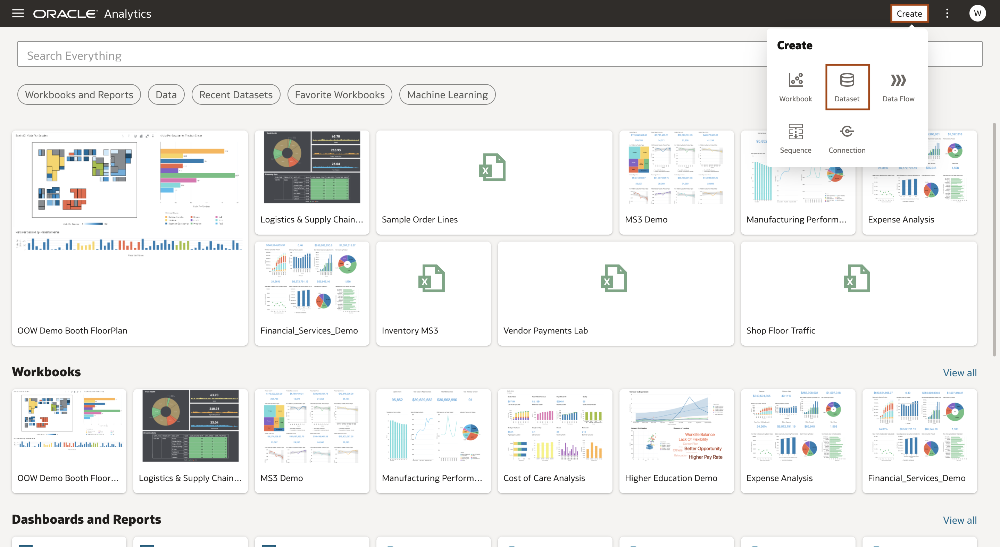

# How do I apply custom map layers to my datasets in Oracle Analytics Cloud and Server (OAC & OAS)?
Duration: 3 minutes

Custom map layers are a unique way to leverage the geo spatial capabilities of Oracle Analytics and add another level of customization when using your own image. Oracle Analytics automatically suggests map visualizations based on the key column in your datasets, but you can also choose a map layer to be applied each time. This is especially helpful if you have multiple map layers that may apply to your given data set or multiple workbooks that use the same dataset.

## Apply a custom map layer to a dataset
>**Note:** You must have the **DV Content Author** role to be able to successfully execute the following steps.

1. On the **Homepage** click on **Create**, then select **Dataset**.

   

2. Create your dataset by uploading a file, choosing an existing subject area, or creating a connection using the available OOTB connectors. In this example, we will be uploading a .csv file.
      >**Note:** You should upload a dataset with a key column matching the names of features in your custom map layer.

      

3. On the Create Dataset page, review your data and provide a dataset name. Then select **Add**. You have now created a dataset.

   

4. If you already have a custom map layer to apply, **right click** the name of the **key column** in the data diagram page. Then select **Location Details** from the drop down menu.
      >**Note:** If you do not have a custom map layer, refer to the related Sprint "How do I make a custom map layer using an image in Oracle Analytics Server (OAS)?"

      

5. In the **Location Details** dialog, select your map layer from the **Map Layer** dropdown menu. Select **OK**.

   

6. Your edits are tracked in the **Data Preparation Panel** on the left-hand side. Select **Apply Script**. This will automatically apply the location details settings you just edited and save your dataset. Then select **Create Workbook**.

   

7. Select your **key column** and any additional columns, then **right-click** and select **pick visualization**. From the visualization menu, select the **Map Visualization**. Oracle Analytics will automatically use the map layer you specified with your data.

   
   

Congratulations! You've now associated a map layer with your dataset.

## Learn More

* [Analytics Server Documentation](https://docs.oracle.com/en/middleware/bi/analytics-server/user-oas/use-image-map-background-and-draw-map-layer-shapes-image.html#GUID-C7D4FFA6-6390-4A7B-9DB6-0A7645A8BEDE)
* [Oracle Learning](https://www.youtube.com/watch?v=-tDUDMek7qA&ab_channel=OracleLearning)

## Acknowledgements
* **Author** - Malia German, Solution Engineer, North America Specialist Hub
* **Last Updated By/Date** - Malia German, September 2022
