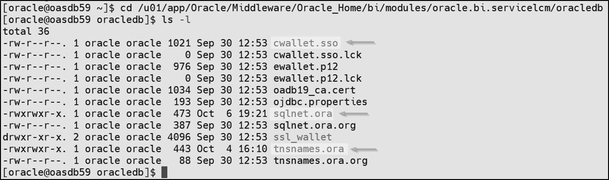
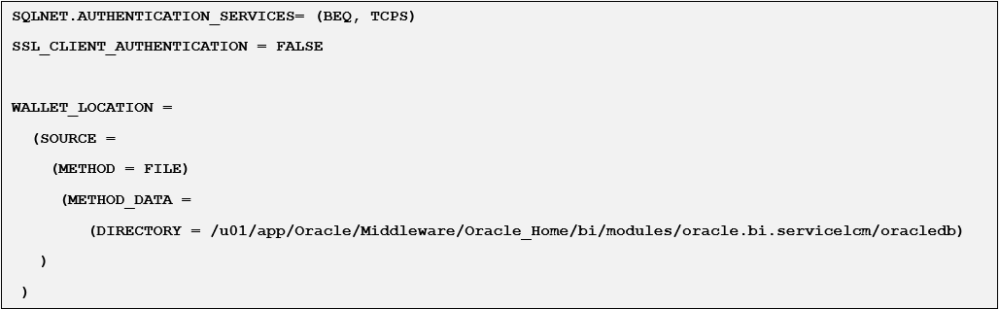
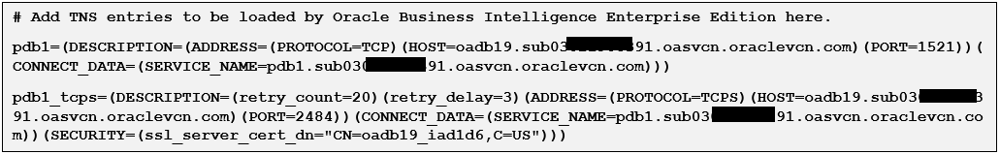
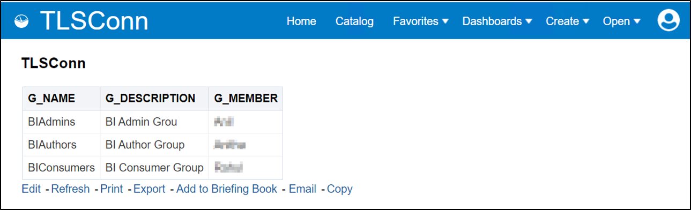

# How do I connect to Oracle Database as a data source using TLS Connection with TCPS Protocol from Oracle Analytics Server (OAS)?

Duration: 2 minute

Some organizations require Oracle Analytics Server to connect to data sources like Oracle Database to communicate securely using TCPS Protocol. In such a case, we need to configure connections of Oracle Database as a data source in RPD or Data Modeler of Oracle Analytics Server using TLS Connections with TCPS Protocol.

## Connect to Oracle Database using TLS Connection with TCPS Protocol
>**Note:** You must have the **BI Service Administrator** application role. You must also create the RPD using the Client Tool with TCPS Connections and upload it to the Oracle Analytics Server using Replace Data Model option to successfully complete this Sprint.

1. Upload the RPD using Replace Data Model Option in the UI or the datamodel.sh script on the Oracle Analytics Server

2. Export the Trusted Certificates of the Oracle Database Server from the Server Wallet.

    ```
      <copy>
      orapki wallet export -wallet /u01/app/oracle/product/19.0.0.0/dbhome_1/admin/oadb19_iad1d6/tls_wallet -dn 'CN=oadb19_iad1d6,C=US' -cert /tmp/oadb19_ca.cert
      <copy>
    ```
3. Create a client wallet to connect to the Oracle Database Server in TCPS Protocol.

  **a.** Navigate to the TNS_ADMIN path in the OAS Server

  OAS 5.5: <code>[DOMAIN_HOME]/bidata/components/core/serviceinstances/ssi/oracledb</code>

  OAS 5.9 & 6.4: <code>/u01/app/Oracle/Middleware/Oracle_Home/bi/modules/oracle.bi.servicelcm/oracledb</code>

  **b.** Create the wallet:

    <code>orapki wallet create -wallet /u01/app/Oracle/Middleware/Oracle_Home/bi/modules/oracle.bi.servicelcm/oracledb -auto_login -pwd Oracle123</code>

  **c.** Import the Trusted Certificate/Certificates to the Client’s wallet:

  <code>orapki wallet add -wallet /u01/app/Oracle/Middleware/Oracle_Home/bi/modules/oracle.bi.servicelcm/oracledb -trusted_cert -cert oadb19_ca.cert -pwd Oracle123</code>


  **d.** Check the contents of the wallet:
  <code>orapki wallet display -wallet /u01/app/Oracle/Middleware/Oracle_Home/bi/modules/oracle.bi.servicelcm/oracledb</code>

  **e.** List the files: <code>cwallet.sso</code> and <code>ewallet.p12</code> should be listed

4. Copy the <code>sqlnet.ora</code> & <code>tnsnames.ora</code> files from the Oracle DB Server to the Oracle Analytics Server Machine to the TNS_ADMIN Path: <code>/u01/app/Oracle/Middleware/Oracle_Home/bi/modules/oracle.bi.servicelcm/oracledb</code>

  

5. Edit the <copy>sqlnet.ora<copy> to have client required info.

  

6. Edit the <copy>tnsnames.ora<copy> to have the Data Source Connection Details.

  

7. Open an Analysis Report that uses the RPD Subject Area or Create a new Report to test the TCPS connection to the Oracle Data source.

8. The report should have no issues displaying the data in the report.

  

### **Troubleshooting**

If any issues or errors occur while displaying the data, check the obis1/n component logs
e.g. <code>/u01/data/domains/bi/servers/obis1/logs</code>

If you notice that the logs show that the file cwallet.sso doesn’t exist under <code>/u01/app/Oracle/Middleware/Oracle_Home/bi/modules/oracle.bi.servicelcm/oracledb/wallets/client</code>

Please create a folder  
<code>mkdir -p /u01/app/Oracle/Middleware/Oracle_Home/bi/modules/oracle.bi.servicelcm/oracledb/wallets/client</code>
and copy the cwallet.sso and ewallet.p12 and then restart the obis1/n services and re-test the report.

## Learn more
* [End-to-End SSL Configuration for Oracle Analytics Server](https://blogs.oracle.com/analytics/post/oas-mp-end-to-end-ssl)

## Acknowledgements

* **Author** - Veera Raghavendra Rao Koka, CEAL
* **Last Updated By/Date** - Nagwang Gyamtso, March 2023
