# How do I Connect to Oracle Database as a Data Source using TLS Connection with TCPS Protocol from Oracle Analytics Client Tools for Oracle Analytics Server (OAS)?

Duration: 10 minutes

Some Organizations require Oracle Analytics Server to connect to Data Sources like Oracle Database to communicate securely using TCPS Protocol. In such a case, we need to configure connections of Oracle Database as a Data Source in RPD or Data Modeler of Oracle Analytics Server using TLS Connections with TCPS Protocol.

## Connect to Oracle Database using TLS Connection with TCPS Protocol from Oracle Analytics Client Tools
> **Note:** You must have the **BI Service Administrator** role to complete the following steps.

1. Export the Trusted Certificates of the Oracle Database Server from the Server Wallet.

  <code>orapki wallet export -wallet /u01/app/oracle/product/19.0.0.0/dbhome_1/admin/oadb19_iad1d6/tls_wallet -dn 'CN=oadb19_iad1d6,C=US' -cert /tmp/oadb19_ca.cert</code>

2. Create a client wallet to connect to the Oracle Database Server in TCPS Protocol.

  **A**. Navigate to the below path of the Oracle Analytics Client Tool <code>C:\Oracle\Middleware\Oracle_Home\domains\bi\config\fmwconfig\bienv\core</code>

  **B**. Create the wallet

  <code>orapki wallet create -wallet
  C:\Oracle\Middleware\Oracle_Home\domains\bi\config\fmwconfig\bienv\core -auto_login -pwd Oracle123</code>

  **C**. Import the Trusted Certificate/Certificates to the Client wallet

  <code>orapki wallet add -wallet C:\Oracle\Middleware\Oracle_Home\domains\bi\config\fmwconfig\bienv\core -trusted_cert -cert oadb19_ca.cert -pwd Oracle123</code>

  **D**. Check the wallet

  orapki wallet display -wallet <code>C:\Oracle\Middleware\Oracle_Home\domains\bi\config\fmwconfig\bienv\core</code>

  **E**. List the Files: cwallet.sso and eWallet.p12 should be listed

3. Copy the cwallet.sso, sqlnet.ora & tnsnames.ora files from the Oracle DB Server to the Oracle Analytics Client Machine Path:
<code>C:\Oracle\Middleware\Oracle_Home\domains\bi\config\fmwconfig\bienv\core</code>

  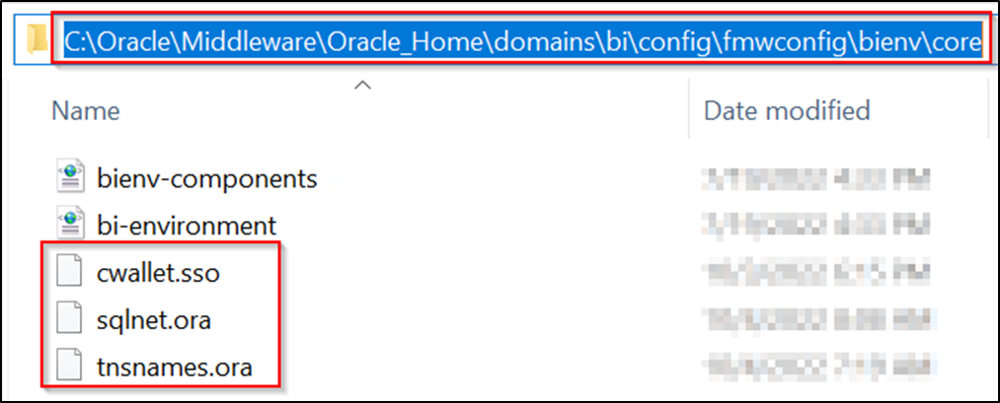

4. Edit the sqlnet.ora to have client required info.

  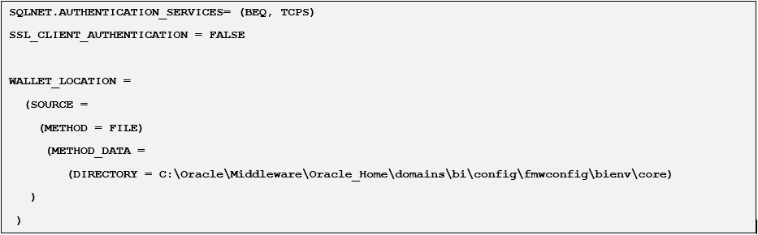

5. Edit the tnsnames.ora to have the Data Source details.

  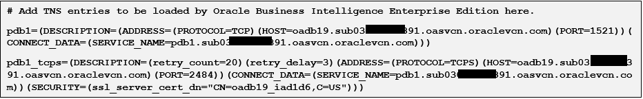

6. Open the Oracle Analytics Client Tool and create an RPD.

  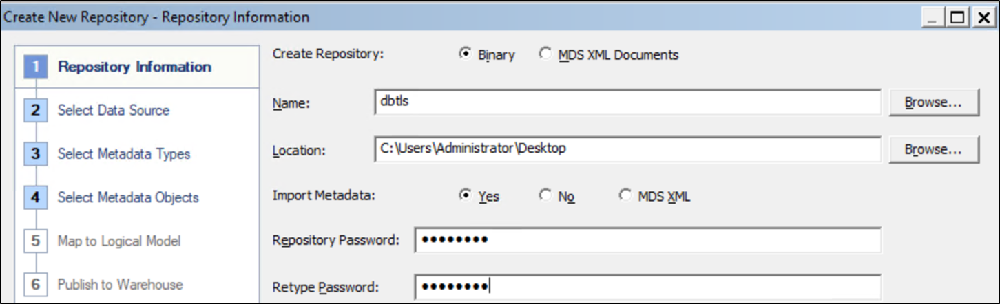

7. Click Import Metadata.

  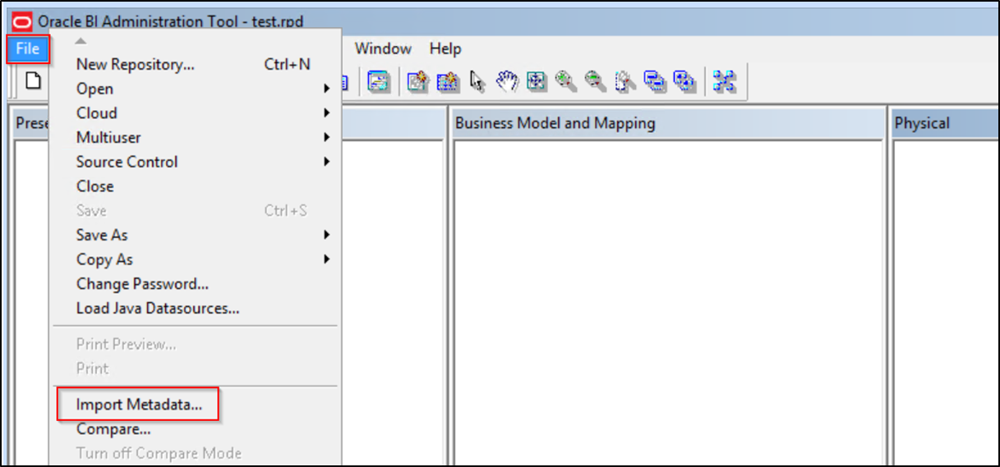

8. Select Oracle Call Interface (OCI) and enter the Oracle Database TNS Details. Either you use the TNS Name that is used in tnsnames.ora or use the Description.

  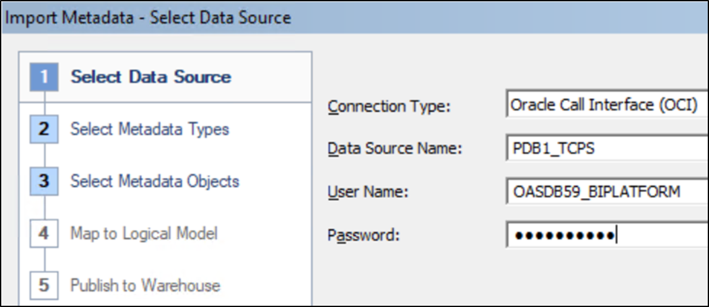

  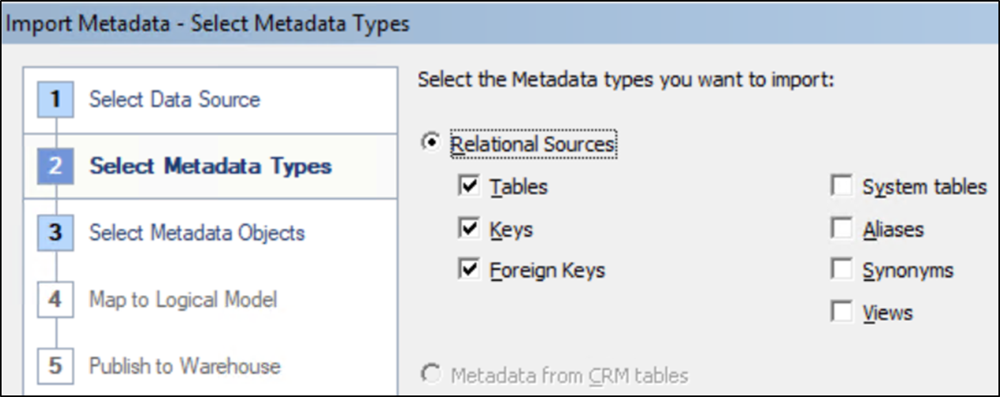

9. Or use the TNS Entry:

  <code>(DESCRIPTION=(retry_count=20)(retry_delay=3)(ADDRESS=(PROTOCOL=TCPS)(HOST=oadb19.sub03021908391.oasvcn.oraclevcn.com)(PORT=2484))(CONNECT_DATA=(SERVICE_NAME=pdb1.sub03021908391.oasvcn.oraclevcn.com))(SECURITY=(ssl_server_cert_dn="CN=oadb19_iad1d6,C=US")))</code>

  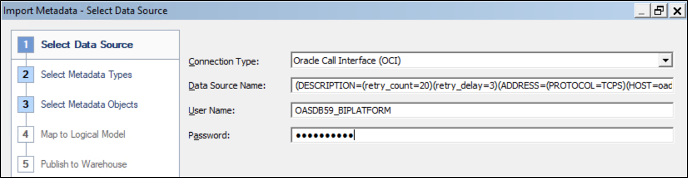

  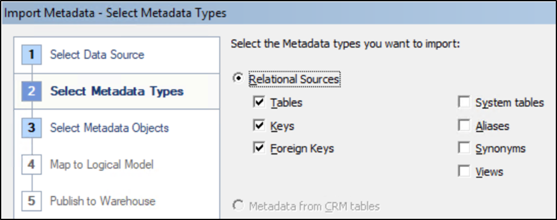

10. Select the Schema where the Data Source tables exist.

  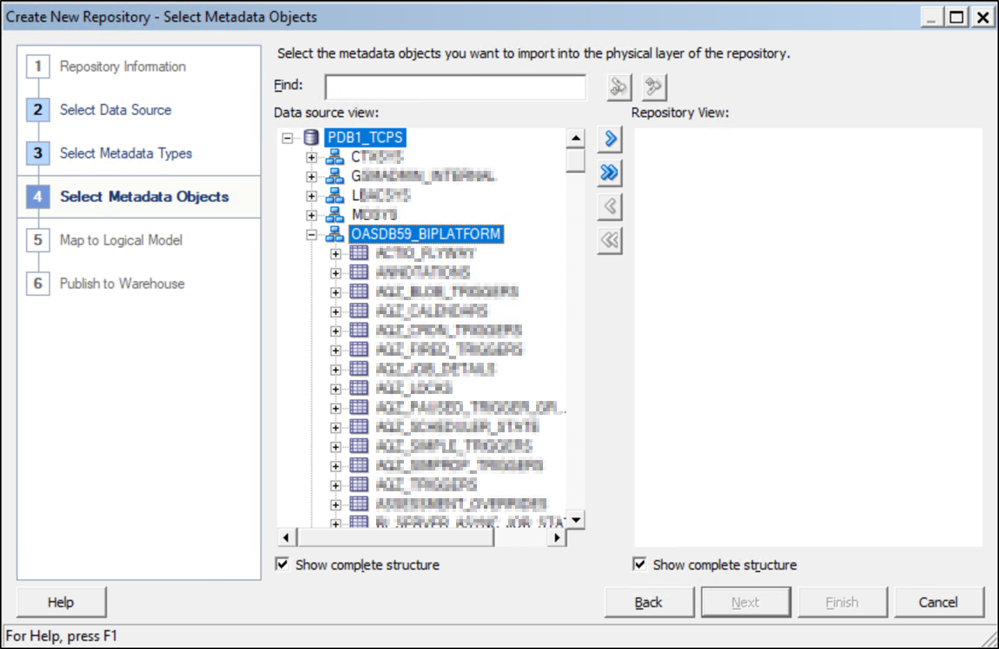

11. Select the Required Tables

  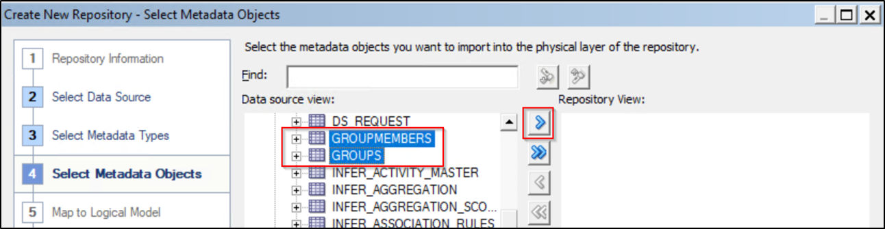

12. Connection Pool is created.

  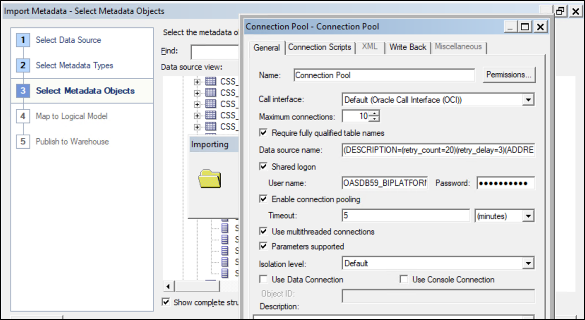

13. Selected tables are Imported.

  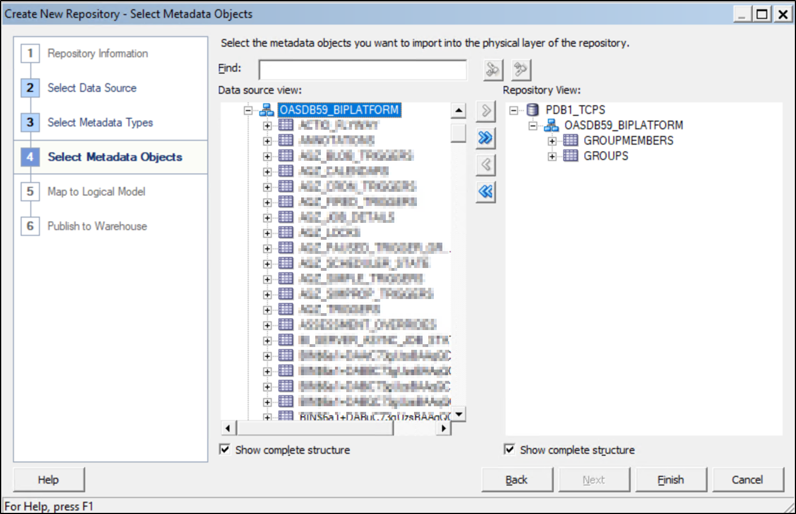

14. Create the Subject Area and Save the RPD.

  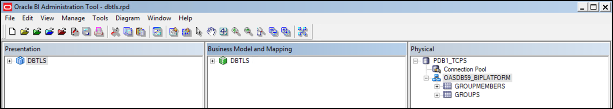

15. Upload the new RPD or the existing RPD with Connection Pool changes to use TCPS, using the Replace Data Model Option in the UI of the Oracle Analytics Server.

  

16. We can also Replace the Data Model using the datamodel.sh script on the Oracle Analytics Server.

  <code>./datamodel.sh uploadrpd -I RPDname.rpd -SI ssi -U username -P password -S oas-hostname.com -N 9502</code>

  Or

  <code>./datamodel.sh uploadrpd -I RPDname.rpd -SI ssi -U username -P password -S oas-hostname.com -N 9503 -SSL -TS /u01/data/domains/bi/ssl/oas-serveridentity.jks -TSP password_of_the_keystore</code>

Congratulations, you have successfully learned how to connect to Oracle Database using TLS Connection with TCPS Protocol from Oracle Analytics Client Tools.

## Learn more
* [End-to-End SSL Configuration for Oracle Analytics Server](https://blogs.oracle.com/analytics/post/oas-mp-end-to-end-ssl)

## Acknowledgements
* **Author** - Veera Raghavendra Rao Koka, Consulting Solutions Architect, Oracle Analytics
* **Last Updated By/Date** - Nagwang Gyamtso,  March 2023
