# How do I Connect to Oracle Database using TLS Connection with TCPS Protocol for the RCU Schemas of Oracle Analytics Server (OAS)?

Duration: 6 minutes

Some Organizations require End-to-End Secure Communication to access Oracle Analytics Server, please follow this blog [End-to-End SSL Configuration for Oracle Analytics Server](https://blogs.oracle.com/analytics/post/oas-mp-end-to-end-ssl) to accomplish such configuration.  

Further to End-to-End Secure Communication, some Organizations even require the products involved in the environment like Oracle Database to communicate securely using TCPS Protocol.
In such a case, we need to configure both the Oracle Analytics Server RCU Schemas and Oracle Database as a Data Source to use TLS Connections using TCPS Protocol.

## Connect to Oracle Database using TLS Connection with TCPS Protocol for RCU Schemas of OAS
> **Note:** You must have the **BI Service Administrator** access to the Weblogic console and login to OAS as OS User who installed OAS e.g., Oracle to successfully complete this Sprint.

Stop all the Services in the OAS Server and change the Oracle Database connection to use TCPS.

1. Export the Trusted Certificates of the Oracle Database Server from the Server Wallet.

  <code>orapki wallet export -wallet /u01/app/oracle/product/19.0.0.0/dbhome_1/admin/oadb19_iad1d6/tls_wallet -dn 'CN=oadb19_iad1d6,C=US' -cert /tmp/oadb19_ca.cert</code>

2. Copy the sqlnet.ora and tnsnames.ora files from Oracle Database Server to Oracle Analytics Server.

  <code>/u01/app/Oracle/Middleware/Oracle_Home/bi/modules/oracle.bi.servicelcm/oracledb</code>

  File Locations on Oracle DB Server are as below:

  ***** <code>/u01/app/oracle/product/19.0.0.0/dbhome_1/network/admin/sqlnet.ora</code>

    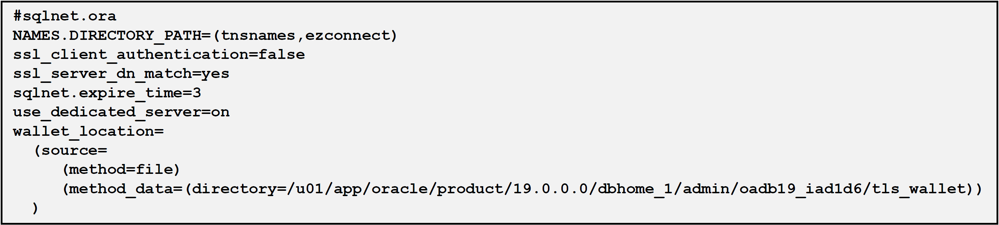

  ***** <code>/u01/app/oracle/product/19.0.0.0/dbhome_1/network/admin/tnsnames.ora</code>

    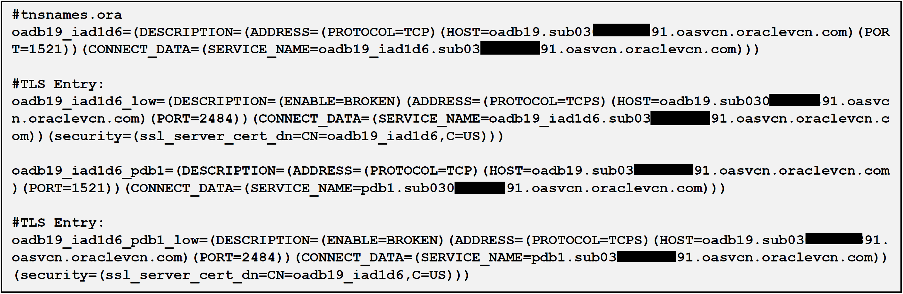

3. Create a client wallet to connect to the Oracle Database Server in TCPS Protocol.

  ***** Go to the TNS_ADMIN path

    **OAS 5.5**: [DOMAIN_HOME]/bidata/components/core/serviceinstances/ssi/oracledb

    **OAS 5.9 & 6.4**: /u01/app/Oracle/Middleware/Oracle_Home/bi/modules/oracle.bi.servicelcm/oracledb

  ***** Create the wallet

  <code>export PATH=/u01/app/Oracle/Middleware/Oracle_Home/oracle_common/bin:$PATH</code>

  <code>orapki wallet create -wallet /u01/app/Oracle/Middleware/Oracle_Home/bi/modules/oracle.bi.servicelcm/oracledb -auto_login -pwd Oracle123</code>

  ***** Import the Trusted Certificate/Certificates to the Client wallet

  <code>orapki wallet add -wallet /u01/app/Oracle/Middleware/Oracle_Home/bi/modules/oracle.bi.servicelcm/oracledb -trusted_cert -cert oadb19_ca.cert -pwd Oracle123</code>

  ***** Check the wallet

  <code>orapki wallet display -wallet /u01/app/Oracle/Middleware/Oracle_Home/bi/modules/oracle.bi.servicelcm/oracledb</code>

  ***** List the Files

  cwallet.sso and ewallet.p12 should be listed.

4. Make sure the cwallet.sso, sqlnet.ora & tnsnames.ora files exist at below path on the OAS Server
  <code>/u01/app/Oracle/Middleware/Oracle_Home/bi/modules/oracle.bi.servicelcm/oracledb</code>

  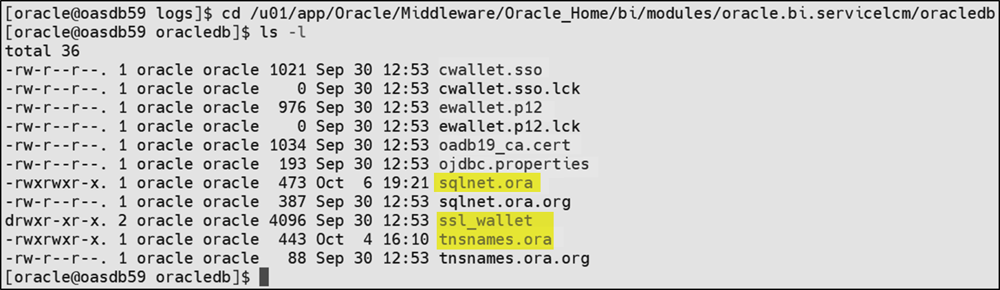

5. Edit the sqlnet.ora to have client required info.

  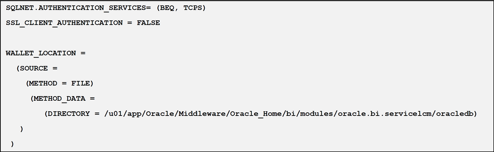

6. Edit the tnsnames.ora to have the RCU Schemas connection string.

  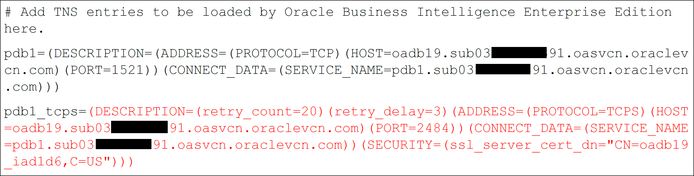

7. Create ojdbc.properties in the path:
  <code>/u01/app/Oracle/Middleware/Oracle_Home/bi/modules/oracle.bi.servicelcm/oracledb</code> And enter the below lines in the file

  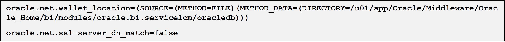

8. Edit all the jdbc xml files or do it from WebLogic Admin Console. Start only the AdminServer to edit the Database Connection details using the WebLogic administration console. Edit the Connection Pool to be:
  <code>jdbc:oracle:thin:@pdb1_tcps?TNS_ADMIN=/u01/app/Oracle/Middleware/Oracle_Home/bi/modules/oracle.bi.servicelcm/oracledb</code>

  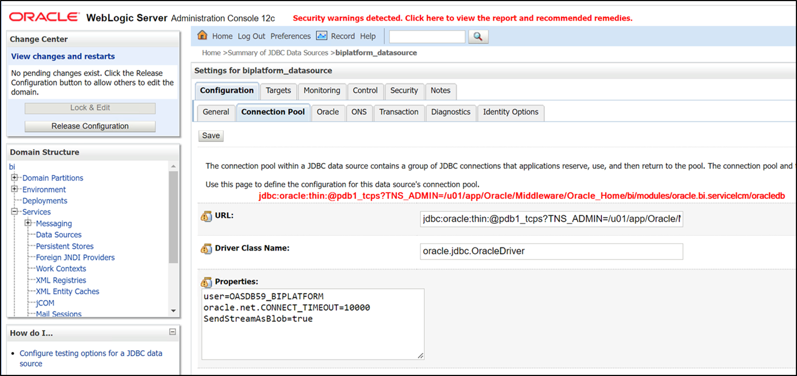

  ***** Change the URL for all the below Data Sources:
    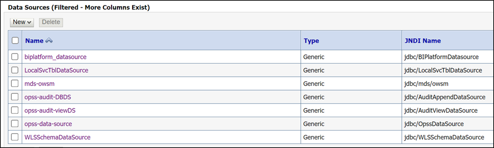

  ***** Or edit the files in the below path:
  <code>/u01/data/domains/bi/config/jdbc/*.xml</code>

    >**Note**: All the Services should be down to edit files in the backend.

    

9. Edit the jps-config.xml and jps-config-jse.xml files in below path

  <code>/u01/data/domains/bi/config/fmwconfig/jps-config.xml</code>

  and

  <code>/u01/data/domains/bi/config/fmwconfig/jps-config-jse.xml</code>

  vi the xml file and run below cmd

  <code>:%s/jdbc\:oracle\:thin\:@\/\/oadb19.sub03123456791.oasvcn.oraclevcn.com\:1521\/PDB1.sub030123456791.oasvcn.oraclevcn.com/jdbc\:oracle\:thin\:@pdb1_tcps?TNS_ADMIN=\/u01\/app\/Oracle\/Middleware\/Oracle_Home\/bi\/modules\/oracle.bi.servicelcm\/oracledb/g</code>

10. Update the default DSN for Oracle Delivers (scheduler) in <code>[DOMAIN_HOME]/config/fmwconfig/biconfig/OBISCH/schedulerconfig.xml</code>

  For example:

  From:

  <code><DSN>(DESCRIPTION=(ADDRESS_LIST=(ADDRESS=(PROTOCOL=TCP)(HOST= oadb19.sub03123456791.oasvcn.oraclevcn.com)(PORT=1521)))(CONNECT_DATA=(SERVICE_NAME= pdb1.sub03123456791.oasvcn.oraclevcn.com)))</DSN></code>

  To:

  <code><DSN>(DESCRIPTION=(ADDRESS_LIST=(ADDRESS=(PROTOCOL=TCPS)(HOST= oadb19.sub03123456791.oasvcn.oraclevcn.com)(PORT=2484)))(CONNECT_DATA=(SERVICE_NAME= pdb1.sub03123456791.oasvcn.oraclevcn.com)))</DSN></code>

    >**Note**: This DSN cannot have the TNSName Format as below

    <code><DSN> pdb1?TNS_ ADMIN=/u01/app/Oracle/Middleware/Oracle_Home/bi/modules/oracle.bi.servicelcm/oracledb</DSN></code>

11. Stop all the Services

  <code>/u01/data/domains/bi/bitools/bin/stop.sh</code>

  Run sync_midtier_db.sh

  <code>/u01/data/domains/bi/bitools/bin/sync_midtier_db.sh</code>

  This script will modify the odbc.ini with the Data Sources connection with TCPS details

  <code>cat /u01/data/domains/bi/config/fmwconfig/bienv/core/odbc.ini</code>

  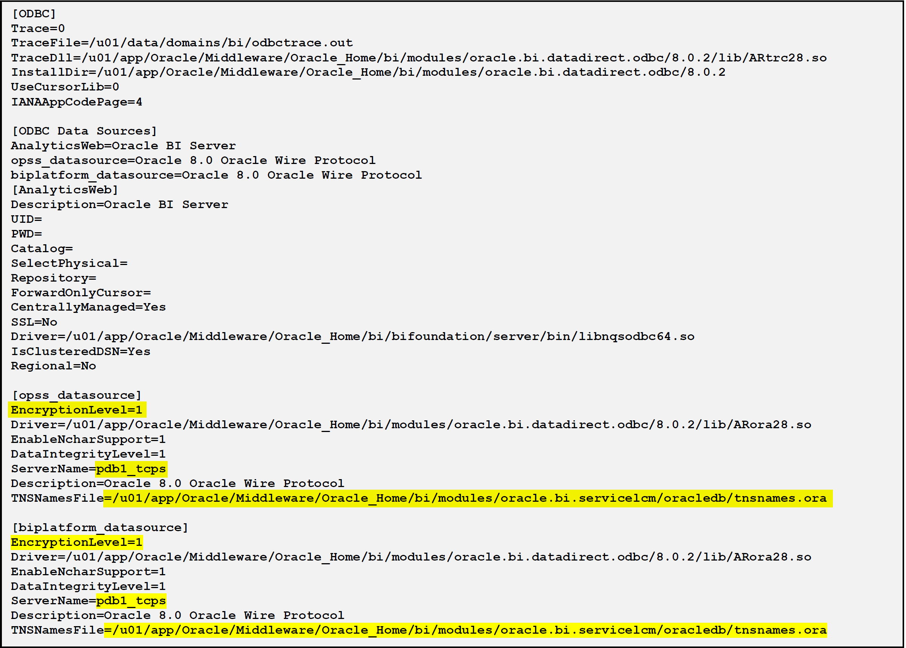

12. Edit the datasource.properties file manually

  <code>/u01/data/domains/bi/config/fmwconfig/bienv/core/datasource.properties

  cd /u01/data/domains/bi/config/fmwconfig/bienv/core

  vi datasource.properties</code>

  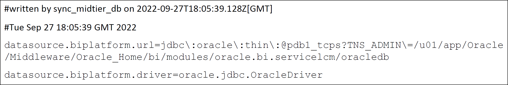

13. Edit the odbc.ini file manually
  <code>vi /u01/data/domains/bi/config/fmwconfig/bienv/core/odbc.ini</code>

  Add below Parameters in the Datasource definition

  <code>ValidateServerCertificate=0
  EncryptionMethod=1
  CryptoProtocolVersion=TLSv1.2</code>

    >**Note**: The files (datasource.properties and odbc.ini) will not be overwritten unless you run sync_midtier_db.sh yourself.  

    >**Note**: In case you run the sync_midtier_db.sh , please edit the two files manually to have the correct URL and the parameters respectively.

  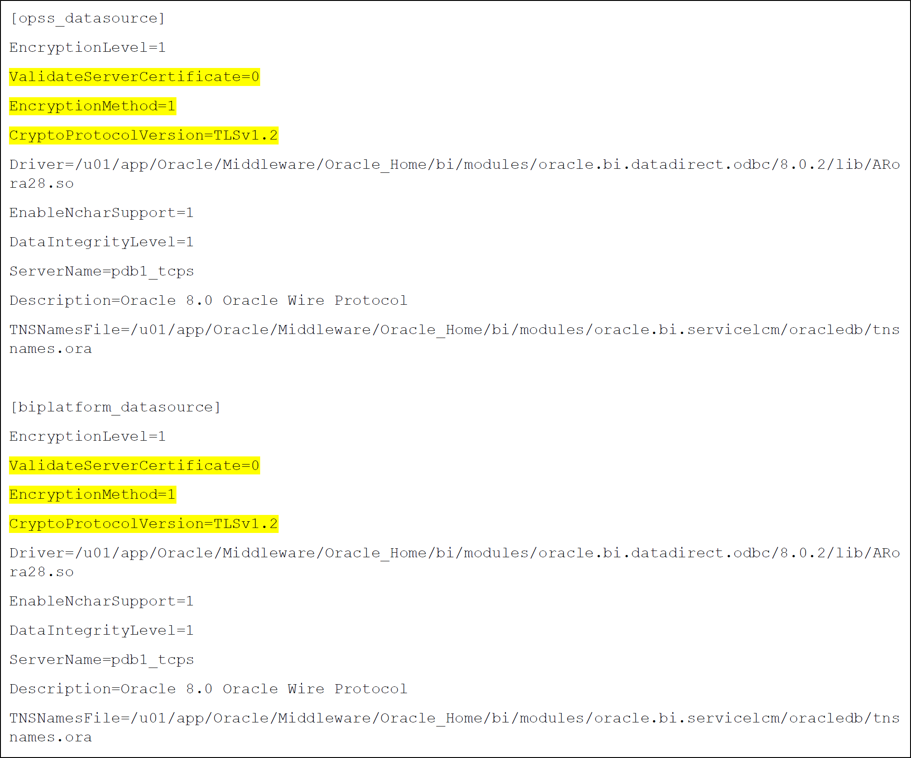

14. Start all the Services

  <code>/u01/data/domains/bi/bitools/bin/start.sh</code>

15. Check the Status of the Services

  <code>/u01/data/domains/bi/bitools/bin/status.sh</code>

  >**Note**: All Services should be RUNNING.

Congratulations, you have successfully learned how to connect to Oracle Database using TLS Connection with TCPS Protocol for the RCU Schemas of OAS.

## Learn more
* [End-to-End SSL Configuration for Oracle Analytics Server](https://blogs.oracle.com/analytics/post/oas-mp-end-to-end-ssl)

## Acknowledgements
* **Author** - Veera Raghavendra Rao Koka, Consulting Solutions Architect, Oracle Analytics
* **Last Updated By/Date** - Nagwang Gyamtso,  March 2023
