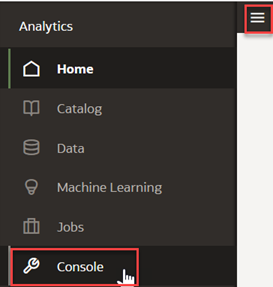
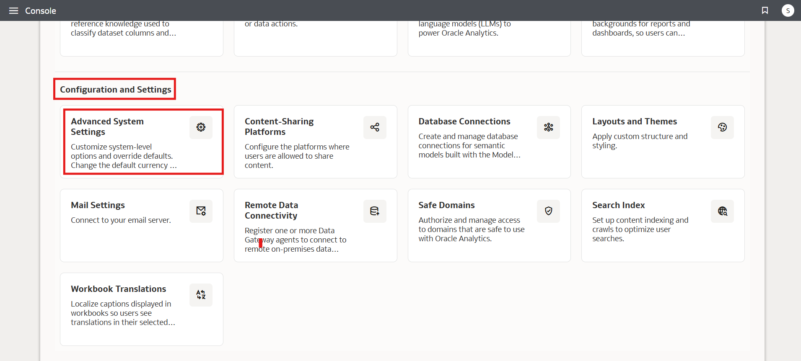
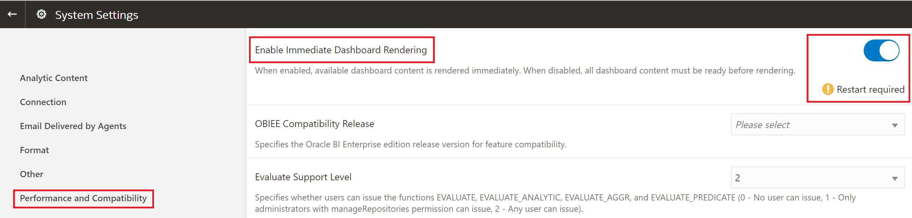
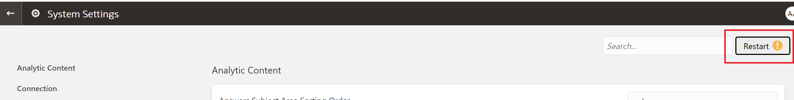
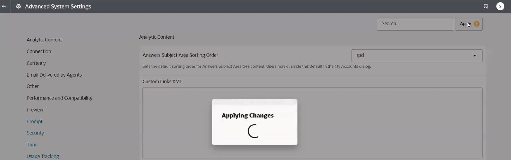

# How do I enable immediate dashboard rendering in Oracle Analytics Cloud (OAC)?

Duration: 1 minute

When the 'Enable Immediate Dashboard Rendering' option is enabled, it displays dashboard content immediately even if some content is unavailable. This option is a great way to improve end user experience by displaying available dashboard content immediately instead of waiting until all the dashboard content is ready.

## Enable immediate dashboard rendering

>**Note:** You must have the **BI Service Administrator** application role to complete this Sprint.

1. In your Oracle Analytics instance, click the **Navigation menu** and select **Console**.

  

2. Under **Configuration and Administration**, select **System Settings**.

  

3. Within the System Settings, click on **Performance and Compatibility** and search for **Enable Immediate Dashboard Rendering**. Toggle the button to enable this option.

  

4. Once you enable this option, scroll to the top and click **Restart** to apply this change.

  

5. Click **OK** to restart the OBI Presentation Server component. Your dashboard content should now be rendered immediately.

  

## Acknowledgements

* **Author** - Ahmed Awan, CEAL
* **Last Updated By/Date** - Nagwang Gyamtso, November 2022
