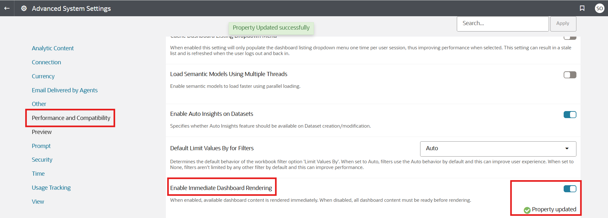

# How do I enable immediate dashboard rendering in Oracle Analytics Cloud and Server (OAC & OAS)?

Duration: 1 minute

Use the Enable Immediate Dashboard Rendering system setting to display dashboard content immediately even, if some content isn't available. This option is a great way to improve the end user experience by displaying available dashboard content immediately instead of waiting until all the dashboard content is ready.

## Enable immediate dashboard rendering

>**Note:** You must have the **BI Service Administrator** role to complete this following steps.

1. In your Oracle Analytics instance, click the **Navigation menu** and select **Console**.

  

2. Under **Configuration and Settings**, select **Advanced System Settings**.

  

3. Within the System Settings, click the **Performance and Compatibility** and search for **Enable Immediate Dashboard Rendering**. Click the toggle to enable it.

  

4.Your dashboard content should now be rendered immediately.

  

## Acknowledgements

* **Author** - Ahmed Awan, CEAL
* **Last Updated By/Date** - Nagwang Gyamtso, November 2022
