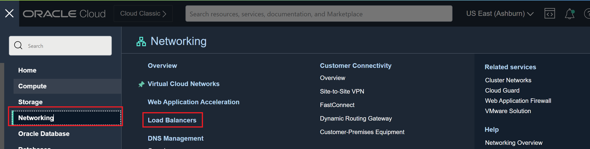
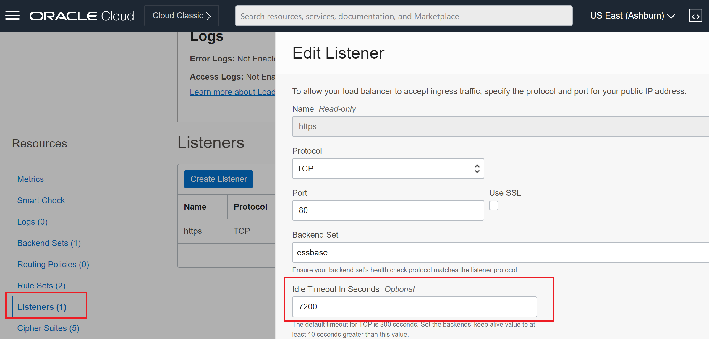

# How do I set timeout settings for load balancing in OCI and communicating with Oracle Analytics Server (OAS)?

Duration: 1 minute

The default timeout values set for load balancing in Oracle Cloud Infrastructure (OCI) are:
*	60 seconds for HTTP listeners.
*	60 seconds for HTTPS listeners.
You can increase the default timeout setting to 7200 seconds if either the Oracle Analytics Server (OAS) instance or the backend database server requires more time for the HTTP response. Some examples include:
    * The Oracle Analytics Server instance sends a database query to the backend server and the database takes more than 600 seconds to run. Therefore, the backend server does not transmit any data within 600 seconds.
    * Downloading a large Microsoft Excel file in Oracle Analytics Server takes more than 300 seconds to render.

## Set timeout settings for load balancing for OAS

>**Note:** You must have an Oracle Cloud account to complete this Sprint.

1. Sign into the Oracle Cloud Infrastructure Console.

2. Open the **Navigation menu** in the Oracle Cloud console and click **Networking**. Then select **Load Balancers**.

  

3. Select the appropriate load balancer, and then under Resources click Listeners.

4. Select and edit the appropriate **Listener**.

5. In the **Idle Timeout In Seconds** field, enter the value *7200* and save your changes. The timeout setting should now be set to 7200, allowing your Oracle Analytics Server instance more time for the HTTPS response. 

  

## Acknowledgements
* **Author** - Ahmed Awan, CEAL
* **Last Updated By/Date** - Nagwang Gyamtso, November 2022
