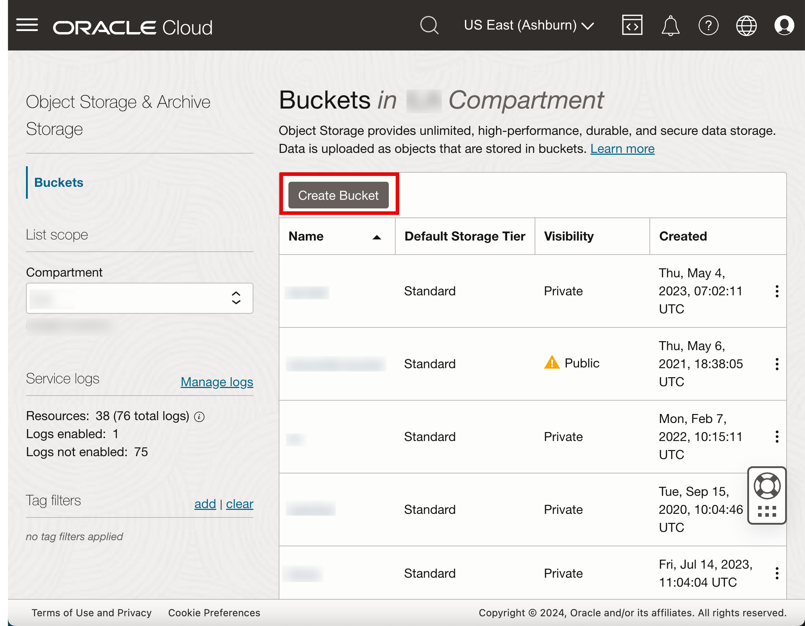
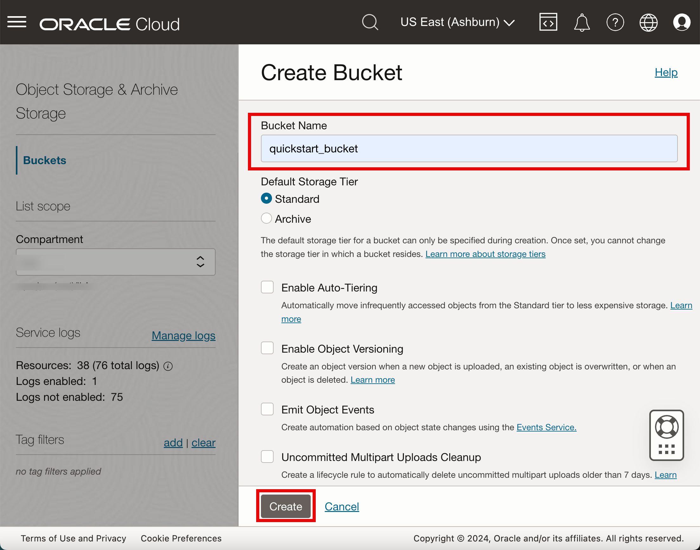
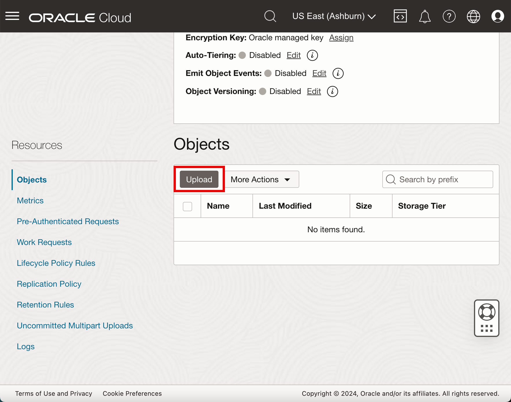
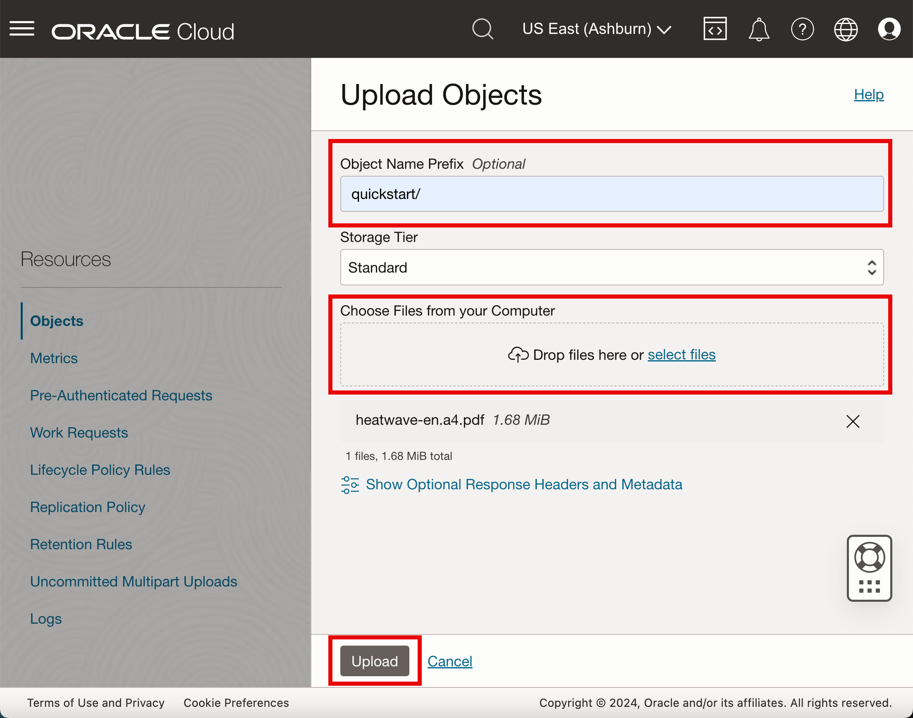

# How to Set Up a HeatWave GenAI-Powered Chat?

This lab demonstrates to use the vector store functionality and use HeatWave Chat to create an AI-powered Help chat that refers to the HeatWave user guide to respond to HeatWave related queries. 

**Note**: This lab assumes that you’re familiar with the HeatWave Database Systems.

## Before You Begin

1. [Connect to your HeatWave Database System](https://docs.oracle.com/en-us/iaas/mysql-database/doc/compute-instance.html#GUID-6087DA45-06E0-44AD-9CAB-0FC37423A07A).
   To run this quickstart, you need a HeatWave Database System `9.0.0 - Innovation` or higher. The ECPU Shape of the HeatWave Database System must be `MySQL.32`.
1. If not already done, [add a HeatWave Cluster to your database system](https://docs.oracle.com/en-us/iaas/mysql-database/doc/adding-heatwave-cluster.html). The shape of the cluster must be `HeatWave.512`.
1. If not already done, [enable HeatWave Lakehouse on the database system](https://docs.oracle.com/en-us/iaas/mysql-database/doc/managing-heatwave-cluster.html#MYAAS-GUID-1E6279C0-B7DB-4110-975B-2812846E3CD7).

1. If not already done, enable the database system to access an OCI Object Storage bucket. For more information, see [Resource Principals](https://dev.mysql.com/doc/heatwave/en/mys-hw-resource-principal.html).

## Create an Object Storage Bucket  

1. Download the [HeatWave user guide PDF (A4) - 1.7Mb](https://downloads.mysql.com/docs/heatwave-en.a4.pdf).
1. In the [OCI Console](cloud.oracle.com), open the navigation menu and click **Storage**, and then click **Buckets** under **Object Storage & Archive Storage**.
   
   

1. Under **List Scope**, select a compartment from the list. All buckets in that compartment are listed in tabular form. 

1. Click **Create Bucket**.

   

1. On the **Create Bucket** dialog box that appears, in the **Bucket Name** field, enter`quickstart_bucket`.

   

1. Click **Create**. The bucket is listed with all over buckets available in that compartment in tabular form.

## Upload the PDF File to the Object Storage Bucket

1. Select `quickstart_bucket`. The buckets **Details** page appears.
1. Under **Objects**, click **Upload**.
   
   
   
1. On the **Upload Objects** dialog box that appears, do the following:

   1. In the **Object Name Prefix** field, enter `/quickstart`.
   1. In the **Choose Files from your Computer**, click **select files** to upload the `heatwave-en.a4.pdf` which you downloaded in the previous section.
   1. Click **Upload**.

      

1.  After the file upload is complete, click **Close** to close the **Upload Objects** dialog.
   
## Setting Up the Vector Store

1. After you've connected to your DB system, on your local machine, create a new database:

    ```mysql
    create database quickstart_db;
    ```
1. Create the new database:

    ```mysql
    use quickstart_db;
    ```
1. Call the following method to create a schema used for task management:

    ```mysql
    select mysql_task_management_ensure_schema();
    ```

1. Create the vector table and load the source document:

    ```mysql
    call sys.vector_store_load('oci://quickstart_bucket@<TenancyName>/quickstart/heatwave-en.a4.pdf', '{"table_name": "quickstart_embeddings"}');
    ```

   Replace <var>&lt;TenancyName&gt;</var> with the name of the tenancy that you're using.

   This creates a task in the background which loads the vector embeddings into the specified table `quickstart_embeddings`.

1. To track the progress of the task, run the task query displayed on the screen:
    
    ```mysql
    select id, name, message, progress, status, scheduled_time,estimated_completion_time, estimated_remaining_time, progress_bar FROM mysql_task_management.task_status WHERE id=<TaskID>\G
    ```

    Replace <var>&lt;TaskID&gt;</var> with the task ID that is displayed.

    The output looks similar to the following:

    ```text
    ---
                           id: 1
                         name: Vector Store Loader
                      message: Task starting.
                     progress: 0
                       status: RUNNING
               scheduled_time: 2024-07-02 14:42:38
    estimated_completion_time: NULL
     estimated_remaining_time: NULL
                 progress_bar: __________
    ---
    ```

1. After the task status has changed to `Completed`, verify that embeddings are loaded in the vector embeddings table:

    ```mysql
    select count(*) from quickstart_embeddings;
    ```

    If you a numerical value in the output, similar to the following, then your embeddings are successfully loaded in the table:


    ```text
    +----------+
    | count(*) |
    +----------+
    |     2112 |
    +----------+

    ```

## Starting a Chat Session 

1. Clear the previous chat history and states:

    ```mysql
    set @chat_options=NULL;
    ```

1.  Ask your question using HeatWave Chat:
    
    ```mysql
    call sys.heatwave_chat("What is HeatWave AutoML?");
    ```

    The `heatwave_chat` method automatically loads the LLM and runs a contextual search on the available vector stores by default. The output is similar to the following: 

    ```text
    |  HeatWave AutoML is a feature of MySQL HeatWave that makes it easy to use machine learning,
    whether you are a novice user or an experienced ML practitioner. It analyzes the characteristics
    of the data and creates an optimized machine learning model that can be used to generate
    predictions and explanations. The data and models never leave MySQL HeatWave, saving time and
    effort while keeping the data and models secure. HeatWave AutoML is optimized for HeatWave shapes
    and scaling, and all processing is performed on the HeatWave Cluster. | 
    ```

1. Ask a follow-up question:

    ```mysql
    call sys. heatwave_chat("How to set it up?");
    ```

    The output is similar to the following:

    ```text
    |  To set up HeatWave AutoML in MySQL HeatWave, you need to follow these steps:
      1\. Ensure that you have an operational MySQL DB System and are able to connect to it using a MySQL client.
      If not, complete the steps described in Getting Started with MySQL HeatWave.
      2\. Ensure that your MySQL DB System has an operational HeatWave Cluster. If not, complete the steps
      described in Adding a HeatWave Cluster.
      3\. Obtain the MySQL user privileges described in Section 3.2, Before You Begin.
      4\. Prepare and load training and test data. See Section 3.4, Preparing Data.
      5\. Train a machine learning model. See Section 3.5, Training a Model.
      6\. Make predictions using the trained model. See Section 3.6, Making Predictions.
      7\. Generate explanations for the predictions made by the model. See Section 3.7, Generating Explanations.
      8\. Monitor and manage the performance of the model. See Section 3.8, Monitoring and Managing Performance. |
    ```
 
      You can continue asking follow-up questions in the same chat session.

## Cleaning Up 

To avoid being billed for the resources that you created for this quickstart, perform the following steps:

1.  Delete the database that you created:

    ```mysql
    drop database quickstart_db;
    ```

1.  Delete `quickstart_bucket`.

   ### Deleting the Bucket

   1. In the [OCI Console](cloud.oracle.com), open the navigation menu and click **Storage**, and then click **Buckets** under **Object Storage & Archive Storage**.
   
   

   2. Under **List Scope**, select a compartment from the list. All buckets in that compartment are listed in tabular form.
   3. Select `quickstart_bucket`. The buckets **Details** page appears.
   4. Click **Delete**.
   5. In the **Delete Bucket** dialog that appears, enter `quickstart_bucket` to confirm resource and bucket deletion, and then click **Delete**. The bucket is deleted and no longer appears in the list of buckets in the compartment. 
   
