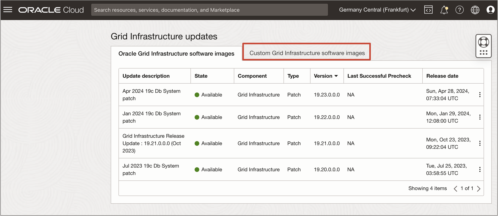

# How do I Create a Custom Oracle Grid Infrastructure Software Image for Oracle Exadata Database Service?
Duration: 20 minutes

We are pleased to announce the general availability (GA) of custom Oracle Grid Infrastructure software images for Oracle Exadata Database Service on Dedicated Infrastructure and Oracle Exadata Database Service on Cloud@Customer. This capability allows creation of a custom Oracle Grid Infrastructure software image by specifying customization needed (one-off patches) on top of standard Oracle-published image Release Update (RU). Users can automate and standardize a custom Oracle Grid Infrastructure software image that can be created once and used multiple times for an in-place Oracle Grid Infrastructure update operation. 

> **Note:** This feature is intended for an easy automated way to create Oracle Grid Infrastructure software images by specifying customization needed (one-off patches) on top of standard Oracle-published image Release Updates (RU’s) without special entitlements required to download patches from MOS. It also provides capability to simplify management of Oracle Grid Infrastructure software images across multiple regions. With this enhancement, users do not have to create and manage the same Software Image in multiple regions. They can create an Oracle Grid Infrastructure software image in one region and can access it from another region, thereby eliminating the efforts and object storage cost of managing the same image in multiple regions. 

Custom Oracle Grid Infrastructure software images can be viewed and managed in the Oracle Cloud Infrastructure (OCI) console and automatically saved to a service-managed OCI Object Storage bucket. To build a custom image, users can specify an Oracle Grid Infrastructure release (such as 19c) with a specific release update and optionally specify one-off patch IDs as a comma-separated list and,or upload an existing Oracle Grid Infrastructure Home inventory file (opatch lsinventory output). Users can fully manage the lifecycle of these custom software images, which are compartment-aware and belong to a specific region in which they are created.
 
## Create a Custom Oracle Grid Infrastructure Software Image

1. Log in to the OCI Console, click **Oracle Database** and **Oracle Exadata Database Service on Dedicated Infrastructure**.

   

2. Under **Resources**, click **Software Images** and **Create Software Image**.
   
   
   
3. In the **Create software image** page, select **Grid Infrastructure Software image** as the **Image type**, the desired **Grid Infrastructure release**, and **release update** to build the custom image.
   
   
   
   > **Note:** Users can optionally specify one-off patch numbers (comma-separated) and can additionally upload an Oracle Home inventory file to customize the Oracle Grid Infrastructure software image to meet their specific requirements.

4. Click **Create software image**.
   
   

   

   

   The custom Oracle Grid Infrastructure software image gets created with the selected Oracle Grid Infrastructure version and specified one-off patches. In the **Software image details** page, click **show** to view the list of **One-Off patches** included in the software image. The one-off patch list will display all the additional one-off patches (if any) supplied by Oracle on top of the standard Oracle-published image release update along with all the one-off patches (if any) supplied by user.

   You can view the created custom Oracle Grid Infrastructure software image by navigating to the list of software images. The resulting software images page displays the list of custom software images, use the filters to select your **Compartment**, select **Grid Infrastructure** in **Image type**, and select the type of your Oracle Exadata Database Service in **Service type**.

   
   
## Update Oracle Grid Infrastructure using a Custom Oracle Grid Infrastructure Software Image

Users can choose to update Oracle Grid Infrastructure with an Oracle-published image or a custom Oracle Grid Infrastructure software image.

1. Navigate to the virtual machine (VM) cluster for which you want to perform the Oracle Grid Infrastructure update. In the **Exadata VM Cluster Details** page, under **Version**, click **View Updates**.
   
   

2. Click **Updates** and navigate to **Grid Infrastructure updates** to view the list of available updates. Click **Custom Grid Infrastructure software images** to select a custom Oracle Grid Infrastructure software image.
   
   
   
   > **Note:** Users will be presented with Oracle Grid Infrastructure software images applicable to the existing Oracle Grid Infrastructure version. The custom Oracle Grid Infrastructure software image selection list available for an Oracle Grid Infrastructure update operation is filtered by compartment and region. 

   

3. Click the **Actions** (three dots) icon at the end of the Oracle Grid Infrastructure upgrade to perform the patch operation. 
   
   Users can choose the desired Oracle Grid Infrastructure software image for the **Run PreCheck** or **Apply Grid Infrastructure Patch** actions.

   

   

   Once the Oracle Grid Infrastructure upgrade operation has been completed, in the VM cluster details page, under **Version**, you will see the upgraded VM cluster **Grid Infrastructure version** and the underlying custom **Grid Infrastructure Software Image** used during the last successful update operation.

   

## Learn More

- [What's New in Oracle Exadata Database Service on Dedicated Infrastructure](https://docs.oracle.com/en-us/iaas/exadatacloud/exacs/exa-whats-new.html)

- [Exadata Database Service on Dedicated Infrastructure How To's Video Playlist](https://www.youtube.com/playlist?list=PLdtXkK5KBY55lKBR3SS3YrbfgxcgdC6ZT)
  
- [Oracle LiveLabs Workshop: Get Started with Oracle Exadata Database Service on Dedicated Infrastructure](https://livelabs.oracle.com/pls/apex/f?p=133:180:17374221011687::::wid:3311)

- [What's New in Oracle Exadata Database Service on Cloud@Customer Gen2](https://docs.oracle.com/en-us/iaas/exadata/doc/ecc-whats-new-in-exadata-cloud-at-customer-gen2.html)
  
- [Exadata Database Service on Cloud@Customer How To's Video Playlist](https://www.youtube.com/playlist?list=PLdtXkK5KBY56Grlr6Cr0FiSxBesR2c12C)

- [Oracle LiveLabs Workshop: Get Started with Oracle Exadata Database Service on Cloud@Customer](https://livelabs.oracle.com/pls/apex/r/dbpm/livelabs/view-workshop?wid=3639&clear=RR,180&session=109385721060957)

## Acknowledgements
* **Authors** - Sujit Dhawalkar, Tammy Bednar, Leo Alvarado, Product Management
* **Last Updated By/Date** - Leo Alvarado, Product Management, July 2024
