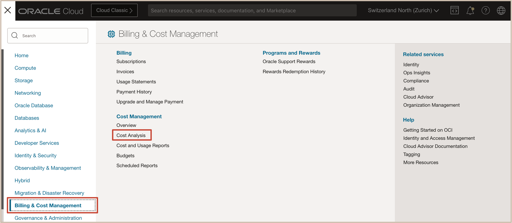
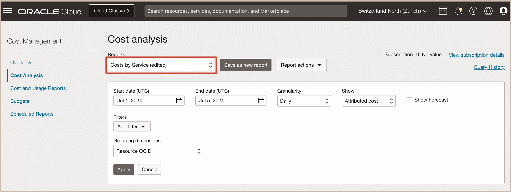
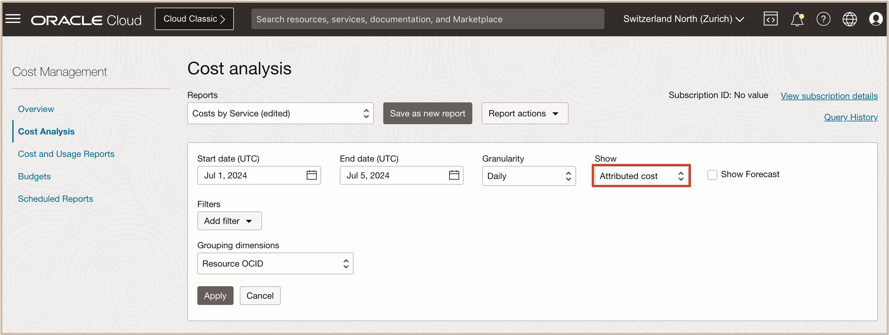
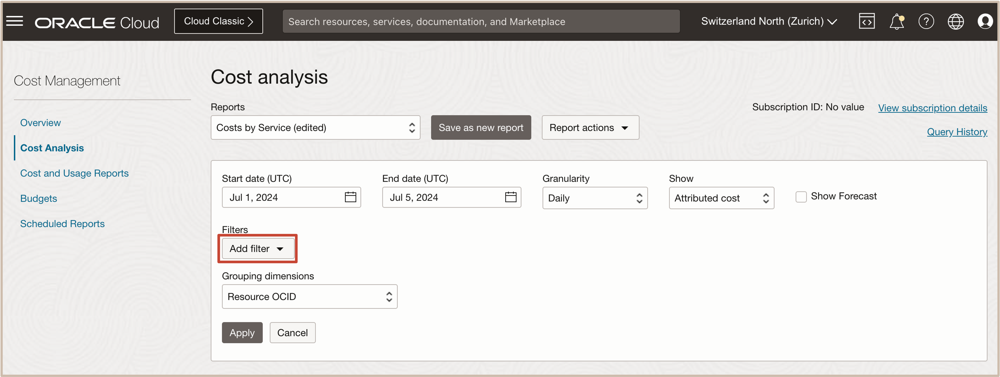
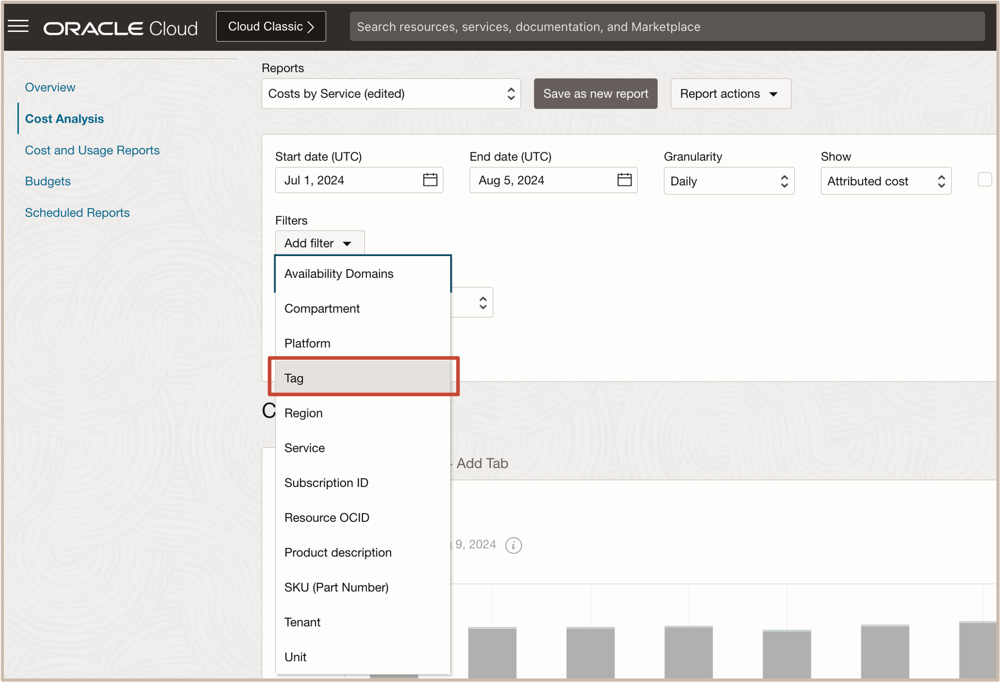
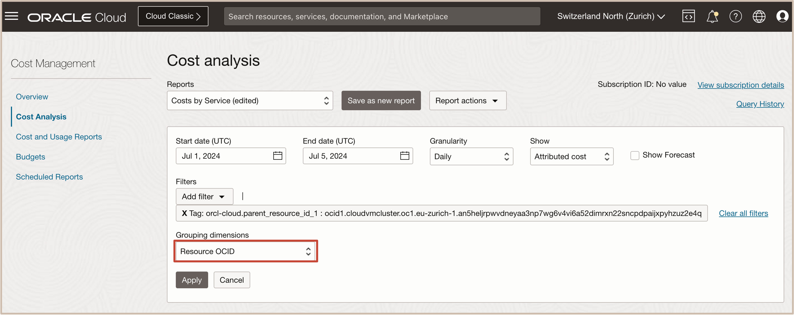
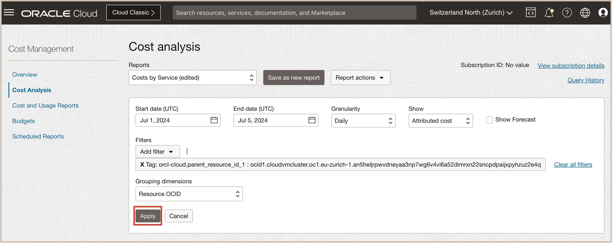
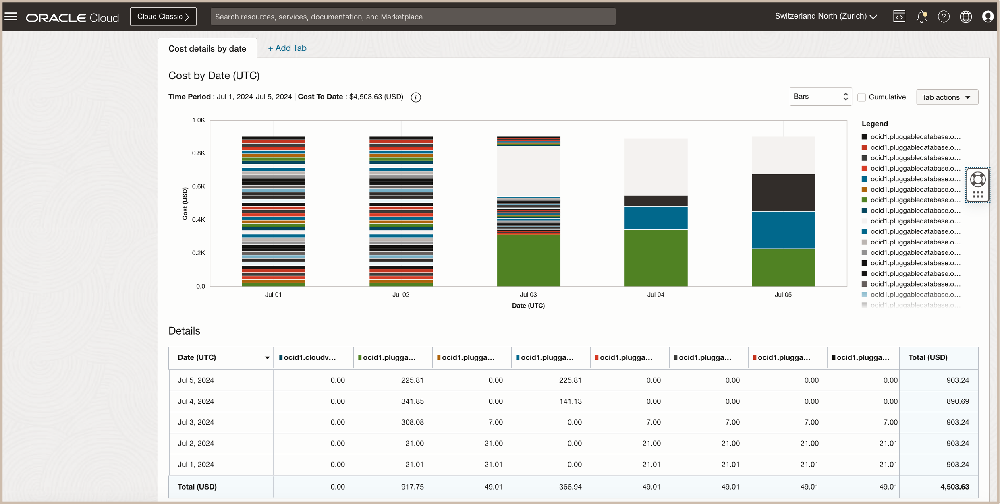
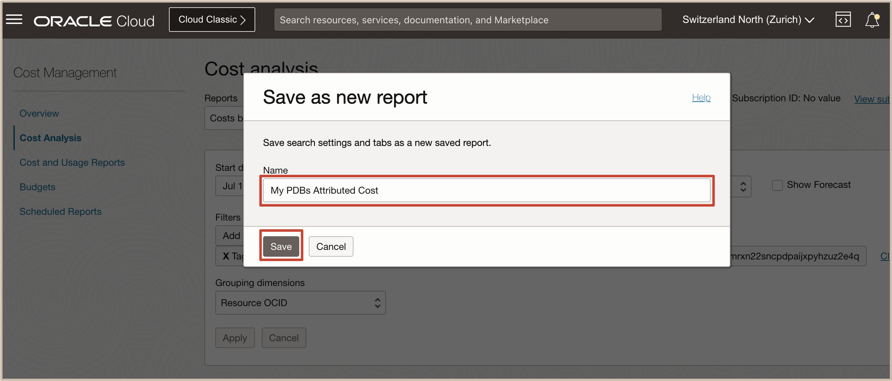

# How do I Generate Attributed Cost and Usage Analysis Report for Pluggable Databases on Exadata Database Service?

Duration: 10 minutes

We are pleased to announce the General Availability (GA) of the attributed usage and cost feature for Pluggable databases (PDBs) running on Exadata Database Service on Dedicated Infrastructure and Exadata Database Service on Cloud@Customer. This feature is intended to provide the ability to view the attributed usage and costs for all PDBs in a VM Cluster.

This feature allows you to query attributed PDB usage based on user-defined tags and identify costs per application and charge back these attributed costs to various line of business (Departments, Business units, etc.) for better reporting and accounting.

   
## Generate Attributed Cost and Usage Analysis Report for PDBs on Exadata Database Service

1. Open the navigation menu and click **Billing & Cost Management**. Under **Cost Management**, click **Cost Analysis**.

   

2. From **Reports**, select one of the predefined reports, or use the default **Costs by Service report**.
   
   
   
   Make your preferred query adjustments. 

      * From **Show**, select ***Attributed cost***
   
   

      * From **Filters**, click **Add Filter** then select ***Tag***. 
   
   

   

      * In the resulting Tag dialog, select ***orcl-cloud*** as the tag with the key ***parent_resource_id_1*** equal to the OCID of the VM Cluster.
   
   

      * From **Grouping dimensions**, select ***Resource OCID***.

         > **Note:** The VM Cluster OCID is the parent of the CDBs it contains, and the CDB OCID is the parent OCID of the PDBs it contains.

   
 
3. Click **Apply** to apply the changes. 
   
   
   
   The generated report will show the attributed costs for all the PDBs in the VM Cluster. 

   

4. After making changes and if you want to save a new report, click **Save as new report**.
   
   

5. In the Save as new report dialog, enter the report name in the **Name** field.
   
   Click **Save**.
   
   

   A notification is displayed that your report has been saved, and the report is also selected in the **Reports** menu.

   
## Learn More

- [What's New in Oracle Exadata Database Service on Dedicated Infrastructure](https://docs.oracle.com/en-us/iaas/exadatacloud/exacs/exa-whats-new.html)

- [Exadata Database Service on Dedicated Infrastructure How To's Video Playlist](https://www.youtube.com/playlist?list=PLdtXkK5KBY55lKBR3SS3YrbfgxcgdC6ZT)
  
- [Oracle LiveLabs Workshop: Get Started with Oracle Exadata Database Service on Dedicated Infrastructure](https://apexapps.oracle.com/pls/apex/f?p=133:180:17374221011687::::wid:3311)

- [What's New in Oracle Exadata Database Service on Cloud@Customer](https://docs.oracle.com/en-us/iaas/exadata/doc/ecc-whats-new-in-exadata-cloud-at-customer-gen2.html)
  
- [Exadata Database Service on Cloud@Customer How To's Video Playlist](https://www.youtube.com/playlist?list=PLdtXkK5KBY56Grlr6Cr0FiSxBesR2c12C)

- [Oracle LiveLabs Workshop: Get Started with Oracle Exadata Database Service on Cloud@Customer](https://apexapps.oracle.com/pls/apex/r/dbpm/livelabs/view-workshop?wid=3639&clear=RR,180&session=109385721060957)

## Acknowledgements
* **Authors** - Sanjay Narvekar, Tammy Bednar, Leo Alvarado, Product Management
* **Last Updated By/Date** - Leo Alvarado, Product Management, August 2024
