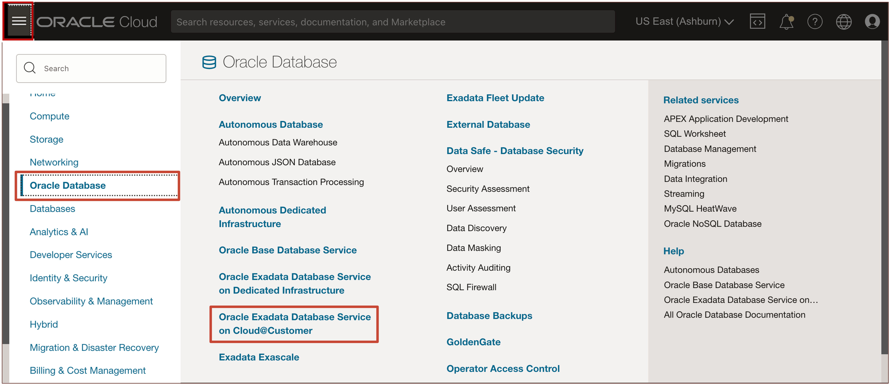
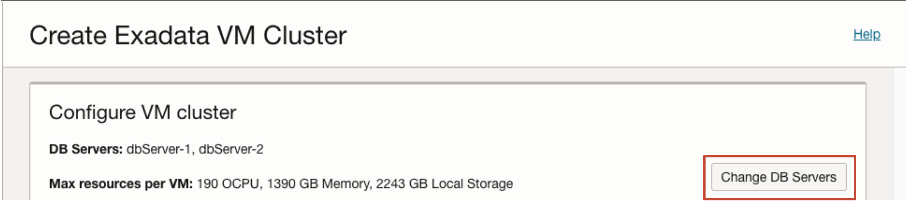
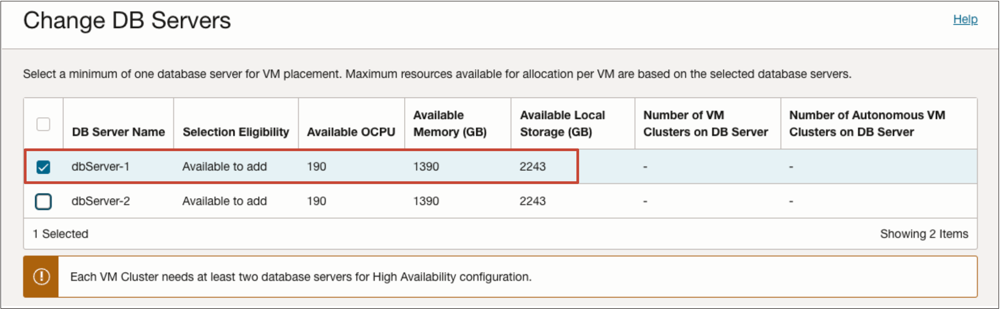
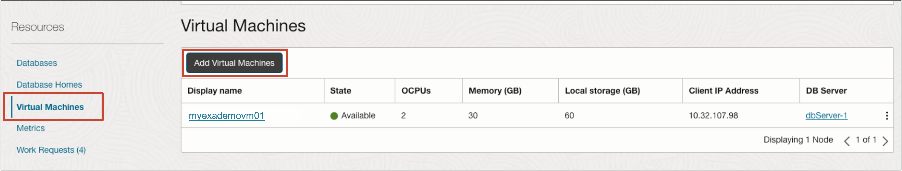
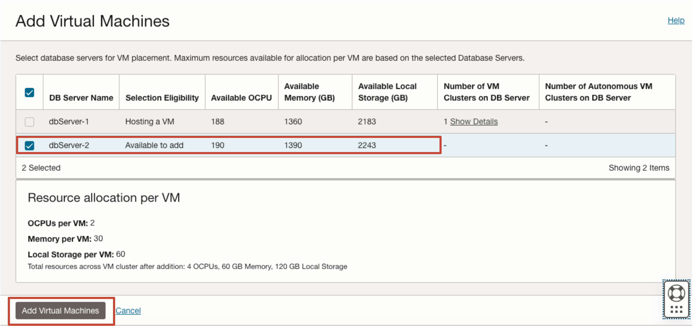
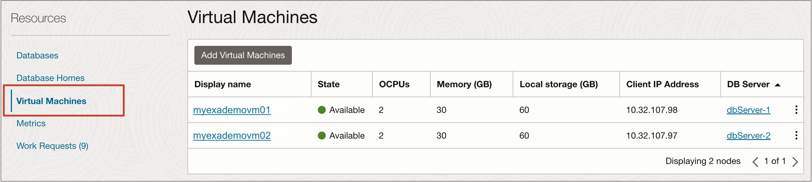
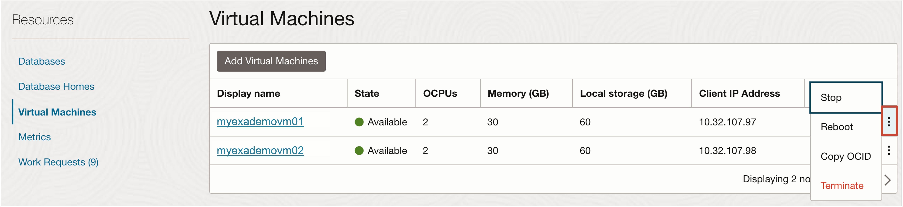

# How do I Create a VM Cluster on a Single VM for Oracle Exadata Database Service on Cloud@Customer?
Duration: 20 minutes

We are pleased to announce the general availability (GA) of virtual machine (VM) clusters running on a single VM for Oracle Exadata Database Service on Cloud@Customer (ExaDB-C@C). Before the release of this feature, all VM clusters required a minimum of two VMs, and databases running in those VM clusters were all multi-node Oracle Real Application Clusters (RAC).
 
## Create a VM Cluster on a Single VM

The process of creating a VM cluster on a single VM is identical to creating a VM cluster on multiple VMs. The only difference is to select a single physical database server to host the VM cluster. Any databases deployed in the single VM cluster will be RAC capable, but only running on a single VM.

1. Open the navigation menu and click **Oracle Database** and **Oracle Exadata Database Service on 
   Cloud@Customer**.

   

2. Select the **Region** that contains your Oracle Exadata Cloud Infrastructure.

3. Click **Exadata VM Clusters** and **Create Exadata VM cluster**.

   

4. Enter the following required information on the **Create VM Cluster** page.
   - **Select a compartment:** Select the compartment that you want to contain the VM cluster.
   - **Provide the display name:** The display name is a name that you can use to identify the VM cluster.
   - **Select Exadata Database Service on Cloud@Customer Infrastructure:** From the list, select the Oracle Exadata Cloud Infrastructure to host the VM cluster.
   - **Select a VM Cluster Network:** Select a VM cluster network definition to use for the VM cluster. You must have an available and validated VM cluster network before you can create a VM cluster.
   - **Select the Oracle Grid Infrastructure version:** Select the Oracle Grid Infrastructure release that you want to install on the VM cluster.
   - **Configure VM cluster**
    * The VM by default is placed on all database servers associated with the VM cluster network you specified.

    * Click **Change DB Servers** to change the VM placement.

    * On the **Change DB Servers** dialog, deselect any servers that you do not want to host VMs in your cluster. Deselect all but one database server to create a VM cluster on a single VM.

    > **Note:** Note the warning message that **Each VM cluster needs at least two database servers for a high availability configuration**.

     

     

    Click **Save Changes** and continue to create the VM cluster as normal. You can view the VM resources on the detail page for the cluster to verify it is a **single VM cluster**.

## Scale out from a Single VM Cluster to Two VM Cluster

The process of adding a VM to a VM cluster is the same as adding a VM to any multi-VM cluster. The cloud automation will automatically create the new VM and the necessary database homes. All databases running in the VM cluster will be extended from running on a single VM to running on all the VMs in the resulting cluster. Oracle Grid Infrastructure software will be configured on the new VM so the VM can join the cluster. Voting file placement will be optimized to ensure full high availability protection for the multi-VM cluster and its databases.

1. Click the name of the **VM cluster** where you want to add virtual machines.

2. In the **VM Cluster Details page**, under **Resources**, click **Virtual Machines**, and then click **Add Virtual Machines**.

   

3. Select an eligible database server with the **Available to add** status to add to the VM cluster and then click **Add Virtual Machines**, **Save Changes**.

   

## Scale in from a Two VM Cluster to Single VM Cluster

The process of removing a VM from a two VM cluster is the same as the process to remove a VM from any multi-VM cluster. Databases in the resulting cluster will only run on a single VM, but will remain RAC capable and can be reconfigured later to a multi-VM RAC deployment.

1. Click the name of the **VM cluster** for which you want to remove a virtual machine.

2. In the **VM Cluster Details page**, under **Resources** click **Virtual Machines**.

   

3. In the list of virtual machines, click **Actions** icon (three dots) for a virtual machine, and then click **Terminate**.

   

4. On the **Delete Virtual Machine** dialog, enter the name of the virtual machine to confirm deletion, and then click **Remove**.

## Learn More

- [What's New in Oracle Exadata Database Service on Cloud@Customer Gen2](https://docs.oracle.com/en-us/iaas/exadata/doc/ecc-whats-new-in-exadata-cloud-at-customer-gen2.html)

- [Exadata Database Service on Cloud@Customer How To's Video Playlist](https://www.youtube.com/playlist?list=PLdtXkK5KBY56Grlr6Cr0FiSxBesR2c12C)

- [Oracle LiveLabs Workshop: Get Started with Oracle Exadata Database Service on Cloud@Customer](https://livelabs.oracle.com/pls/apex/r/dbpm/livelabs/view-workshop?wid=3639&clear=RR,180&session=109385721060957)

## Acknowledgements
* **Authors** - Bob Thome, Tammy Bednar, Leo Alvarado, Product Management
* **Last Updated By/Date** - Leo Alvarado, Product Management, July 2024
