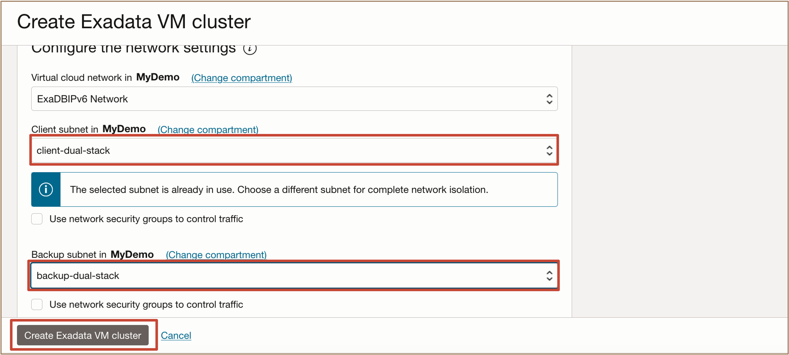

# How do I configure IPv4/IPv6 Dual-Stack Networking for Oracle Exadata Database Service on Dedicated Infrastructure?

**Duration:** ***20 minutes***

Users can now configure IPv4/IPv6 dual-stack networking for Oracle Exadata Database Service on Dedicated Infrastructure (ExaDB-D). This new feature enables users to adopt IPv6, a next-generation Internet protocol designed to overcome IPv4 limitations by offering a significantly larger address space. As an intermediary step towards full IPv6 adoption, IPv4/IPv6 dual-stack architecture allows both IP versions to operate in parallel, thus facilitating a smooth and gradual transition from the existing IPv4 network to IPv6.  

Previously, only IPv4 addresses were supported when provisioning VM Clusters. Now, users can provision new VM Clusters with IPv4/IPv6 dual-stack networking, enabling both IPv4 and IPv6 addresses.

## Create a Virtual Cloud Network (VCN) with IPv4/IPv6 dual-stack subnet

1. Log in to the OCI Console, click **Networking** and **Virtual Cloud Networks**.

   

2. Under **Networking**, click **Virtual cloud networks** then click **Create VCN**.

   

3. Provide the required information for creating a VCN including the following: 
   
      * VCN Name
      * Select Compartment
      * IPv4 CIDR Blocks
      * DNS label 

  

4. Enable IPv4/IPv6 dual-stack networking, by selecting the option from the toggle switch to assign an IPv6 prefix to your Virtual Cloud Network.
   
    >**Note:** OCI provides multiple IPv6 prefix options, namely Global Unicast Addresses (GUA), Unique Local Addresses (ULA), and Bring Your Own IP (BYOIP). Select the option appropriate to a organization's needs. More details on IPv6 prefix can be found [here](https://docs.oracle.com/en-us/iaas/Content/Network/Concepts/ipv6.htm)

    

5. Click **Create VCN**. Once the VCN has been created, both IPv4 and IPv6 addresses are associated and displayed in the **VCN Information** of the **Virtual Cloud Network Details** page. 

   

6. Create a subnet with IPv4, then specify an IPv6 address range for the subnet.
   
   

   The subnet is created with IPv4 and IPv6 addresses

   

## Create a VM Cluster with IPv4/IPv6 dual-stack networking

1. Open the navigation menu. Under **Oracle Database**, click **Oracle Exadata Database Service on Dedicated Infrastructure**.

   

2. In the **Exadata VM Clusters** page, click **Create VM cluster**.
   
   

3. Provide the basic information required the Exadata VM Cluster. 
   
   

4. In the **Configure the network settings** section, select the previously created dual-stack VCN and subnet.

    >**Note:** Both Client and Backup networks are supported with dual-stack networking

    

   Continue with the Exadata VM Cluster creation by providing the required information for the Exadata VM Cluster then click on **Create VM Cluster**.

5. Once the VM Cluster is created and available, it's IPv6 SCAN addresses are displayed in the **Network** section of the **VM Cluster Details** page.
   
   

## Learn More

- [What's New in Oracle Exadata Database Service on Dedicated Infrastructure](https://docs.oracle.com/en-us/iaas/exadatacloud/exacs/exa-whats-new.html)

- [Exadata Database Service on Dedicated Infrastructure How To's Video Playlist](https://www.youtube.com/playlist?list=PLdtXkK5KBY55lKBR3SS3YrbfgxcgdC6ZT)
  
- [Oracle LiveLabs Workshop: Get Started with Oracle Exadata Database Service on Dedicated Infrastructure](https://apexapps.oracle.com/pls/apex/f?p=133:180:17374221011687::::wid:3311)

## Acknowledgements
* **Author** - Deepika Pandhi, Tammy Bednar, Leo Alvarado, Product Management
* **Last Updated By/Date** - Leo Alvarado, Product Management, March 2025
