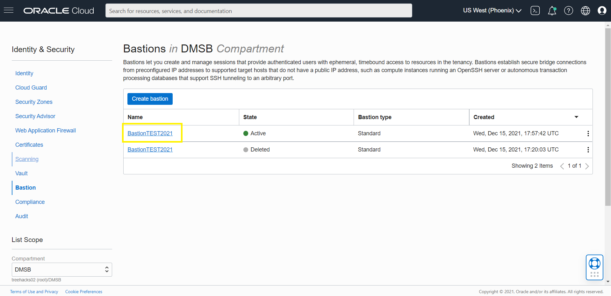

# How do I create a managed SSH session?

Duration: 10 minutes

In this lab you will create a managed SSH session using Bastion.

## Managed SSH Session creation

1. Open the navigation menu and click Identity & Security. Click Bastion

2.  Under List Scope, in the Compartment list, click the name of the compartment where you want to create a bastion session.

3. Click the name of the session

    

4. Click "Create Session" 

    

5. Choose a session type by selecting "Managed SSH Session" 

6. Enter a display name for the new session 

    

7. Under Add SSH Key, provide the public key file of the SSH key pair that you want to use for the session.
Later, when you connect to the session, you must provide the private key of the same SSH key pair.

8. When you are finished, click "Create session"

    

## Learn More
* [Managing Sessions] (https://docs.oracle.com/en-us/iaas/Content/Bastion/Tasks/managingsessions.htm)
* [Bastion Overview] (https://docs.oracle.com/en-us/iaas/Content/Bastion/Concepts/bastionoverview.htm)
* [Bastion Documentation] (https://docs.oracle.com/en-us/iaas/Content/Bastion/home.htm)