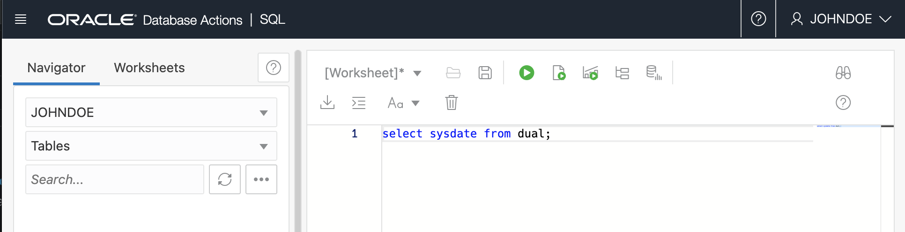

# How do I grant access to database actions?
Duration: 10 minutes

##  Create Users on Autonomous Database and grant access to database actions

There are several options to create users on Autonomous Database. You can use Oracle Database Actions Database Users card or use client-side tools that connect to the database to create database users or follow the instructions below. 

### Create Autonomous Database user

1. Create Autonomous Database user johndoe 

      ```
      <copy> 
            CREATE USER johndoe IDENTIFIED BY < password >; 
      </copy>
      ```
### Grant create session to johndoe

1. Grant create session to johndoe

      ```
      <copy> 
            GRANT CREATE SESSION TO johndoe;  
      </copy>
      ```      

2. grant access to Database actions 
      ```
      <copy>
      BEGIN
            ORDS_ADMIN.ENABLE_SCHEMA(
            p_enabled => TRUE,
            p_schema => 'johndoe',
            p_url_mapping_type => 'BASE_PATH',
            p_url_mapping_pattern => 'johndoe',
            p_auto_rest_auth => TRUE
            );
            COMMIT;
            END;
      /;
      </copy>
      ```

3. Sign out as Admin and Sign In as johndoe

      
      

## Learn More

* [Create Users on Autonomous Database](https://docs.oracle.com/en/cloud/paas/autonomous-database/adbsa/manage-users-create.html)
