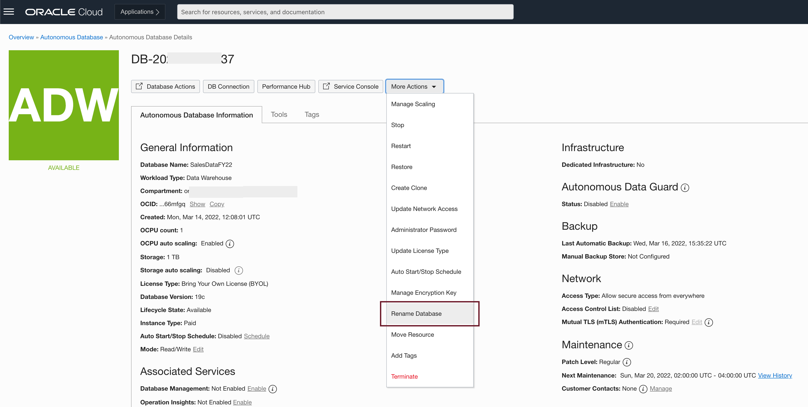
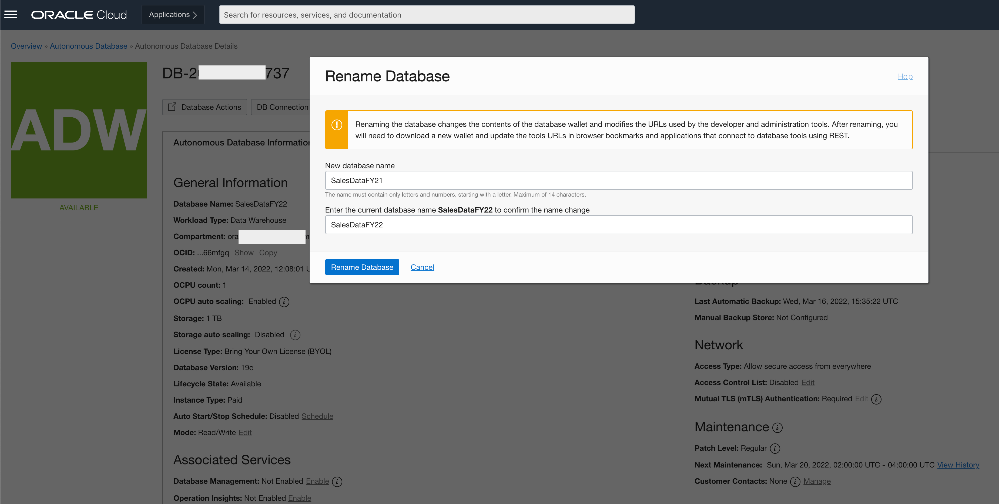

# How do I rename Autonomous Database?
Duration: 10 minutes

## Renaming an Autonomous Database

Before you rename your database, note the following:

* A single tenancy in the same region cannot contain two Autonomous Databases with the same name.
* The database rename operation changes the connection strings required to connect to the database.
  
### Renaming 

1. Access Autonomous Database Details from Cloud Console
     
      Select More Actions in the dropdown menu and then select *Rename Database*

      
     
      Select More Actions in the dropdown menu and then select Rename

      

      Enter new database name and old database name

      Click on *Rename Database* Button
       
## Learn More

* [Rename Autonomous Database](https://docs.oracle.com/en/cloud/paas/autonomous-database/adbsa/autonomous-rename.html)
