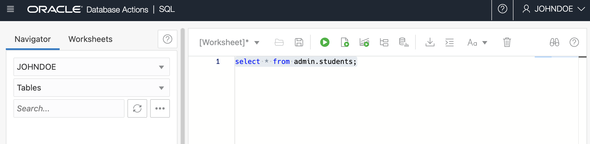

# How can I grant another user access to view tables?
Duration: 10 minutes

##  Manage User Roles and Privileges on Autonomous Database

There are several options to create users on Autonomous Database. You can use Oracle Database Actions Database Users card or use client-side tools that connect to the database to create database users or follow the instructions below. 

### Create Autonomous Database user

1. Create Autonomous Database user johndoe 

      ```
      <copy> 
            CREATE USER johndoe IDENTIFIED BY < password >; 
      </copy>
      ```
### Grant create session to johndoe

2. Grant create session to user named johndoe

      ```
      <copy> 
            GRANT CREATE SESSION TO johndoe;  
      </copy>
      ```      

3. Create sample table and insert a record

      ```
      <copy> 
            CREATE TABLE students ( student_id NUMBER , first_name VARCHAR2(128) , last_name VARCHAR2(128)  );  
      </copy>
      ```  

      insert a sample record

      ```
      <copy> 
            insert into students (STUDENT_ID, first_name, last_name) values (1, 'Jane', 'Doe');
      </copy>
      ```  

4. grant access to Database actions as required
    
      ```
      <copy>
      GRANT
            SELECT,
            INSERT,
            UPDATE,
            DELETE
            ON
      ADMIN.STUDENTS
            TO
            johndoe;
      </copy>
      ```

5. Sign out as Admin and Sign In as johndoe

      
      

## Learn More

* [Manage User Roles and Privileges on Autonomous Database](https://docs.oracle.com/en/cloud/paas/autonomous-database/adbsa/manage-users-privileges.html)
