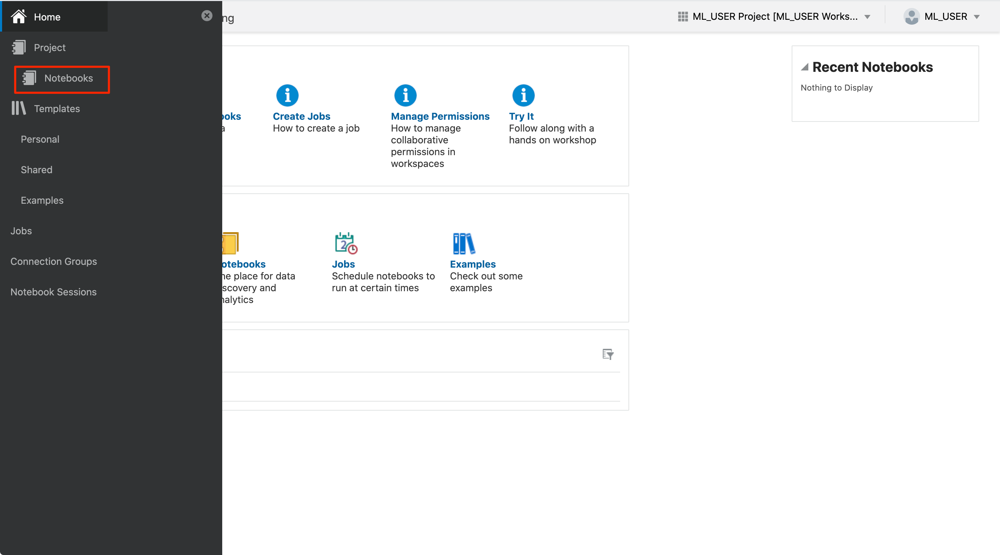
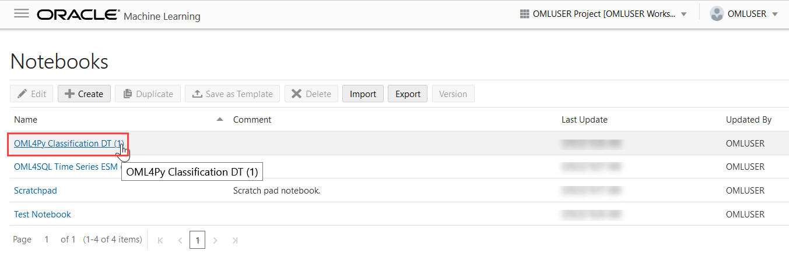
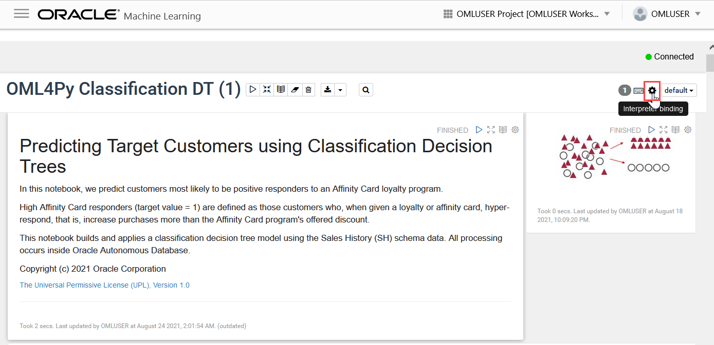
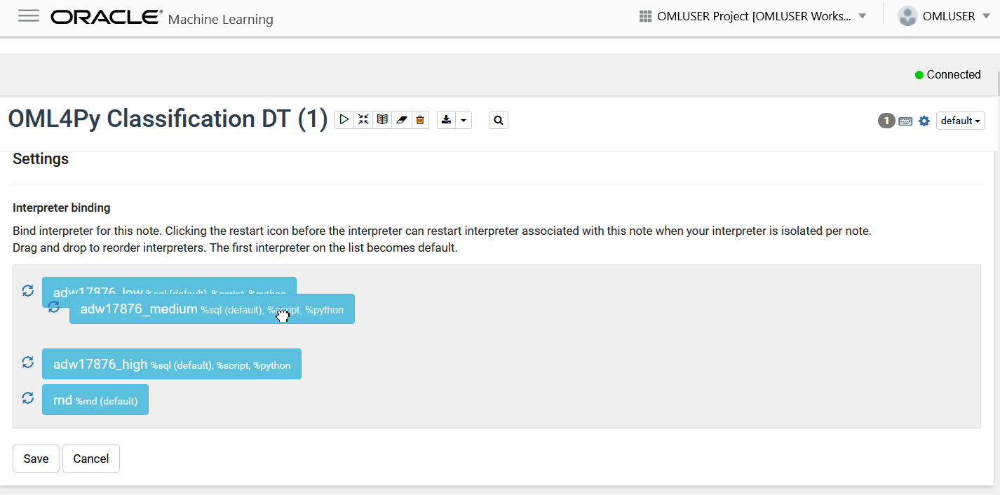
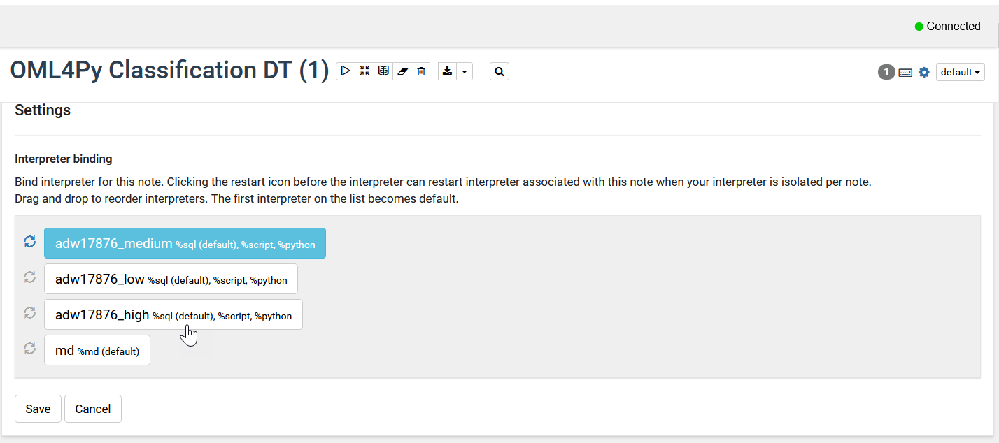
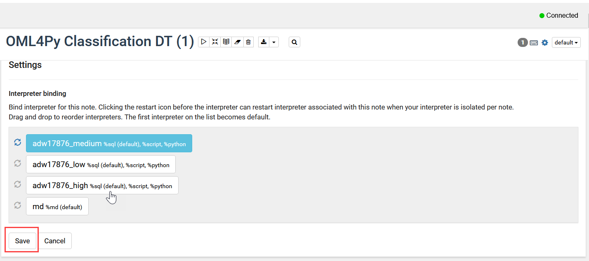

# How can I change my Machine Learning Notebook interpreter binding settings in Oracle Autonomous Database?

An interpreter allows using a specific data processing language at the backend to process commands entered in a notebook paragraph. For the notebooks in Oracle Machine Learning, you use the following interpreters:

* SQL interpreter for SQL Statements
* PL/SQL  interpreter for PL/SQL scripts/statements
* Python interpreter to process Python scripts
* md (MarkDown) interpreter for plain text formatting syntax so that it can be converted to HTML.

This is the initial binding order of the interpreters. You can change the order of the interpreter bindings by clicking and dragging an entry above or below others (turns from white to blue). You can also deselect a binding to disable it (turns from blue to white). This does not require dragging the enabled interpreters above the disabled ones.

* **Low** (Default): Provides the least level of resources for in-database operations, typically serial (non-parallel) running of database operations. It supports the maximum number of concurrent in-database operations by multiple users. The interpreter with low priority is listed at the top of the interpreter list, hence the default.
* **Medium:** Provides a fixed number of CPUs to run in-database operations in parallel, where possible. It supports a limited number of concurrent users, typically 1.25 times the number of CPUs allocated to the Autonomous Database instance.
* **High:** Provides the highest level of CPUs to run in-database operations in parallel, up to the number of CPUs allocated to the Autonomous Database instance. It offers the highest performance but supports the minimum number of concurrent in-database operations, typically 3.

	> **Note:** The interpreter binding order set for a notebook applies to all the paragraphs in that notebook. However, you can override the binding of an individual paragraph also. This is an advanced topic and is not covered in this sprint.

Let's see how to set the interpreter bindings.

Duration: 5 minutes

## Change your OML Notebook interpreter binding settings in Oracle ADB

1. If you have your ADB ML user sign-in URL bookmarked, navigate to the link and enter the username and password you provided when you created your machine learning user, and click on **Sign in**. This will launch the Oracle Machine Learning home page.

    

    

    
If you do not have your ADB ML user sign-in URL bookmarked, click expand to view the steps to sign in as a machine learning user!

    1. If you do not have your ADB ML user sign-in URL bookmarked, click the navigation menu in the upper left of the Oracle Cloud Console, navigate to **Oracle Database**, select **Autonomous Database** and navigate to your ADB instance.

    2. From the compartment drop-down menu, select the **Compartment** where your Oracle Autonomous Database resource is provisioned. If there were a long list of databases, you could filter the list by the **State** of the databases and sort by **Workload Type**.

    3. From the databases displayed, click **Display Name** of the database you wish to create a notebook for the machine learning user and click **Service Console**. The Launch Service Console dialog opens. Wait till the Service Console opens.

	    

    4. On the Service Console page, click **Development** on the left pane.

	    

    5. Click **Oracle Machine Learning User Interface.** This opens the Oracle Machine Learning sign-in page.

        

    6. Enter the username and password you provided when you created your machine learning user and click on **Sign in**. This will launch the Oracle Machine Learning home page.

        

    

2.  Click on the upper-left navigation menu and select **Notebooks**.

    

3.  On the Notebooks page, click on the notebook from the existing notebooks you wish to change the interpreter binding settings. The notebook opens in the Notebook editor.

	

4. Click  on the top right corner of the notebook. This opens the interpreter settings.

	

5. In this example, click **medium** and drag and drop it on top of the list.

	

	> **Note:** You can disable a particular binding by deselecting it (turns from blue to white) or enable it by selecting it (turns from white to blue). However, this does not require dragging the enabled interpreters above the disabled ones.

	

6. Once you successfully drag and drop it on top of the list, click **Save**.

	

    Clicking **Save** records the changes and hides the interpreter settings. You can verify it again by clicking the gear icon .

## Learn More

* [Oracle Machine Learning UI](https://docs.oracle.com/en/database/oracle/machine-learning/oml-notebooks/)
* [Interactive Tour - Oracle Machine Learning UI](https://docs.oracle.com/en/cloud/paas/autonomous-database/oml-tour/)