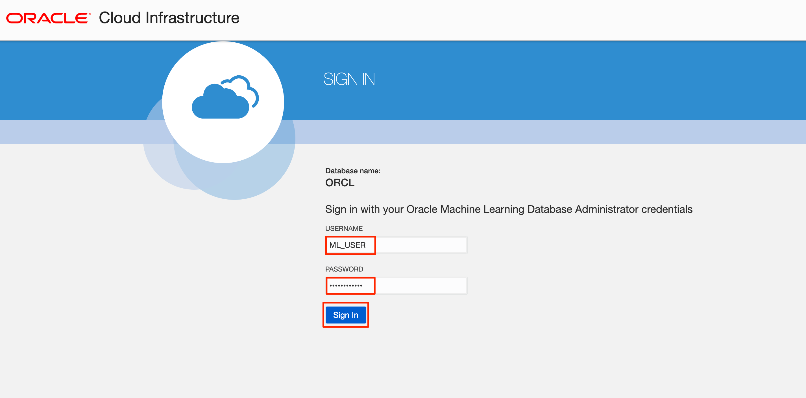
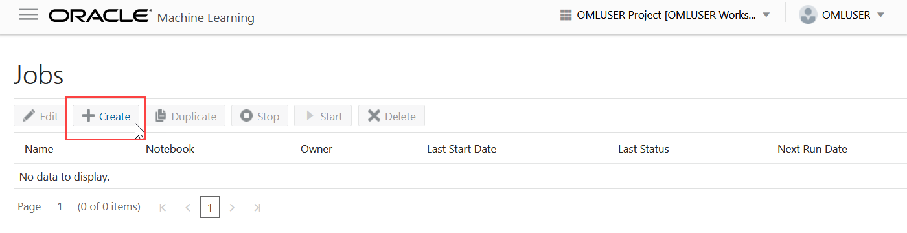
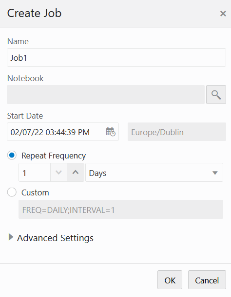
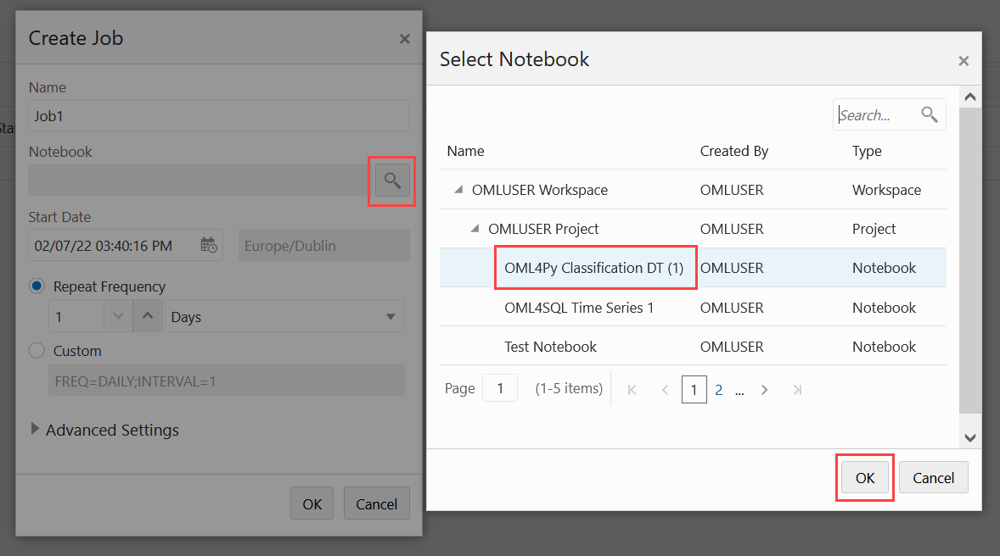
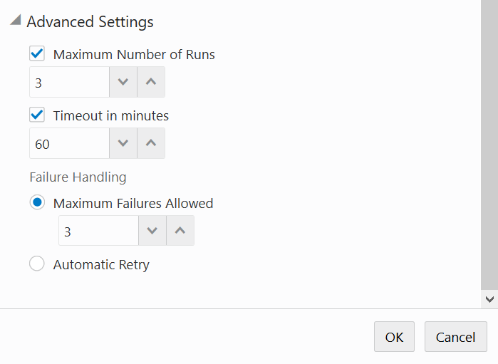
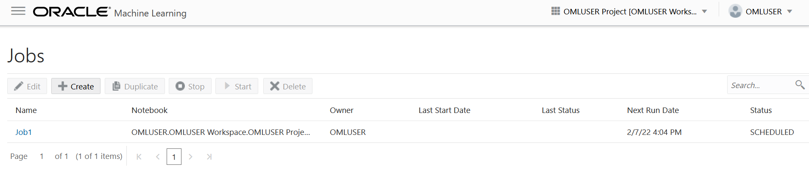
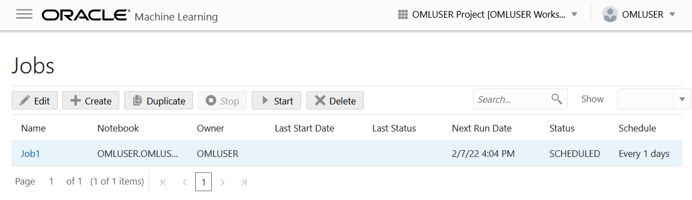

# How can I create jobs to schedule a Machine Learning Notebook to run in Oracle Autonomous Database?

Jobs allow you to schedule the running of notebooks. On the Jobs page, you can create jobs, duplicate jobs, start and stop jobs, delete jobs, and monitor job status by viewing job logs, which are read-only notebooks. Let's see how to create a job to schedule the running of a notebook.

Duration: 10 minutes

## Create jobs to schedule a Machine Learning Notebook to run in Oracle Autonomous Database

1. If you have your ADB ML user sign-in URL bookmarked, navigate to the link and enter the username and password you provided when you created your machine learning user, and click on **Sign in**. This will launch the Oracle Machine Learning home page.

    

    

    
If you do not have your ADB ML user sign-in URL bookmarked, **click expand** to view the steps to sign in as machine learning user!

    1. If you do not have your ADB ML user sign in URL bookmarked, click the navigation menu in the upper left of the Oracle Cloud Console, navigate to **Oracle Database**, select **Autonomous Database** and navigate to your ADB instance.

    2. From the compartment drop-down menu, select the **Compartment** where your Oracle Autonomous Database resource is provisioned. If there were a long list of databases, you could filter the list by the **State** of the databases and sort by **Workload Type**.

    3. From the databases displayed, click **Display Name** of the database you wish to create a notebook for the machine learning user and click **Service Console**. The Launch Service Console dialog opens. Wait till the Service Console opens.

	    

    4. On the Service Console page, click **Development** on the left pane.

	    

    5. Click **Oracle Machine Learning User Interface.** This opens the Oracle Machine Learning sign-in page.

        

    6. Enter the username and password you provided when you created your machine learning user and click on **Sign in**. This will launch the Oracle Machine Learning home page.

        

    

2.  Click the navigation menu on the top left corner of the page and click **Jobs** to go to the Jobs page. You can also go to Jobs from the Oracle Machine Learning home page by clicking **Jobs**.

	

2. On the Jobs page, click **Create**. The Create Job dialog opens.

	

3. In the **Name** field, enter a job name. The number of characters in the job name must not exceed 128 bytes.

	

4. In the **Notebook** field, click the search icon. This opens the Search Notebook dialog. In the Search Notebook dialog, navigate to your user workspace, select a project, choose the notebook to schedule the run job, and click **OK**.

	> **Note:** Only notebooks that are owned by the user or shared are available for selection.

	

5. In the **Start Date** field, click the date-time editor to set the date and time for your job to commence. You can select the current date or any future date and time. The next run date is computed based on the selected date and time.

6. Select **Repeat Frequency** if needed, enter the number of times for the job to run, and select **Days** to set the repeat frequency and settings. You can set the frequency in minutes, hours, days, weeks, and months.

7. Expand **Advanced Settings**, and specify the following settings:

	* **Maximum Number of Runs:** Select a number to specify the maximum number of times the job must run before it is stopped. When the job reaches the maximum run limit, it will stop.

	* **Timeout in Minutes:** Select a number to specify the maximum amount of time a job should be allowed to run.

	* **Maximum Failures Allowed:** Select a number to specify the maximum number of times a job can fail on consecutive scheduled runs. When the maximum number of failures is reached, the next run date column in the Jobs UI will show an empty value to indicate the job is no longer scheduled to run. The Status column may show the status as `Failed`.

		> **Note:** Select **Automatic Retry** if you do not wish to specify the maximum failures allowed manually.

    

8. Verify the details provided on the Create Job dialog box and click **OK** to create the job. The job is now listed on the Jobs page with the status SCHEDULED.

	

9. Click on the job row to enable the options to either **Edit**, **Duplicate**, **Start**, or **Delete** the selected job.

	

## Learn More

* [Oracle Machine Learning UI](https://docs.oracle.com/en/database/oracle/machine-learning/oml-notebooks/)
* [Interactive Tour - Oracle Machine Learning UI](https://docs.oracle.com/en/cloud/paas/autonomous-database/oml-tour/)