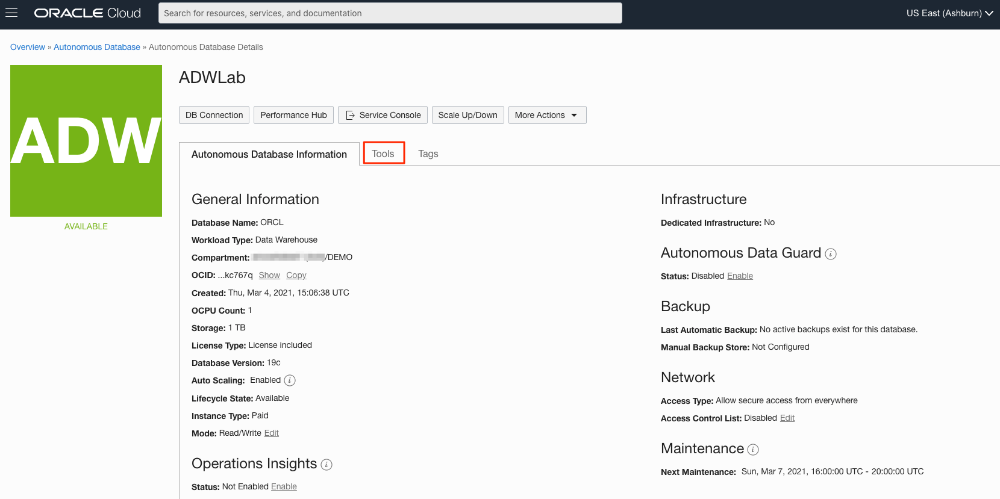
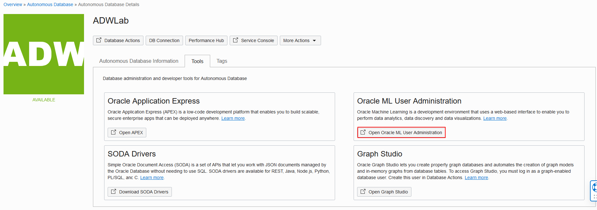
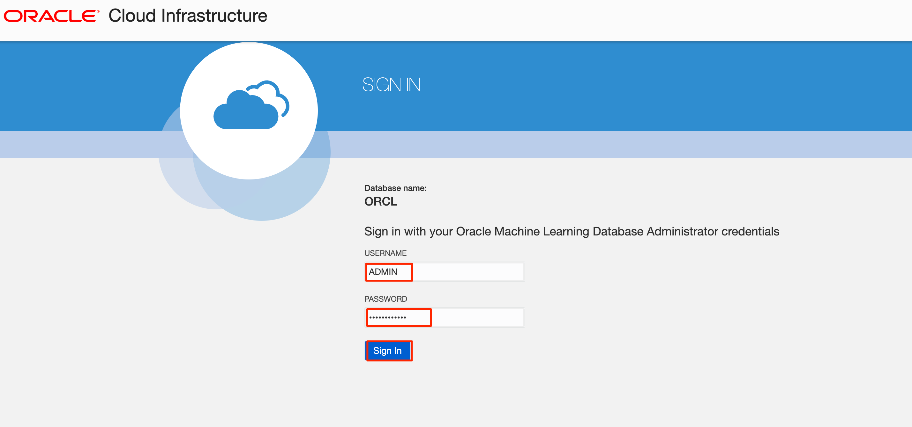
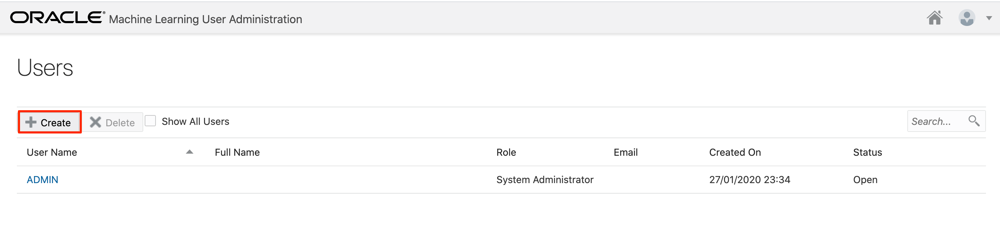
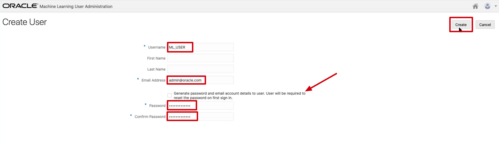
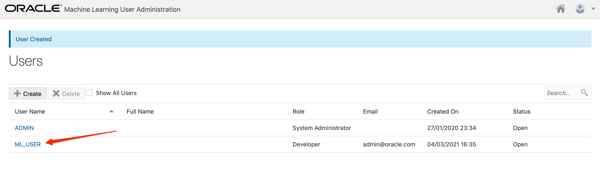
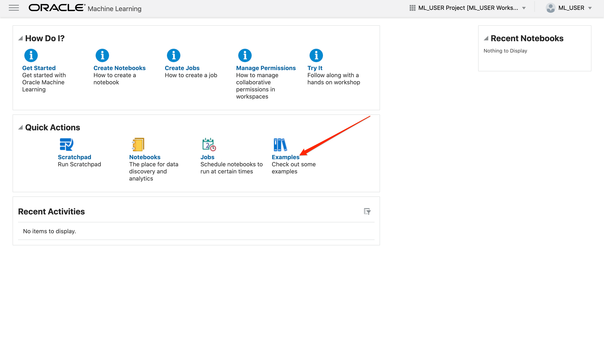
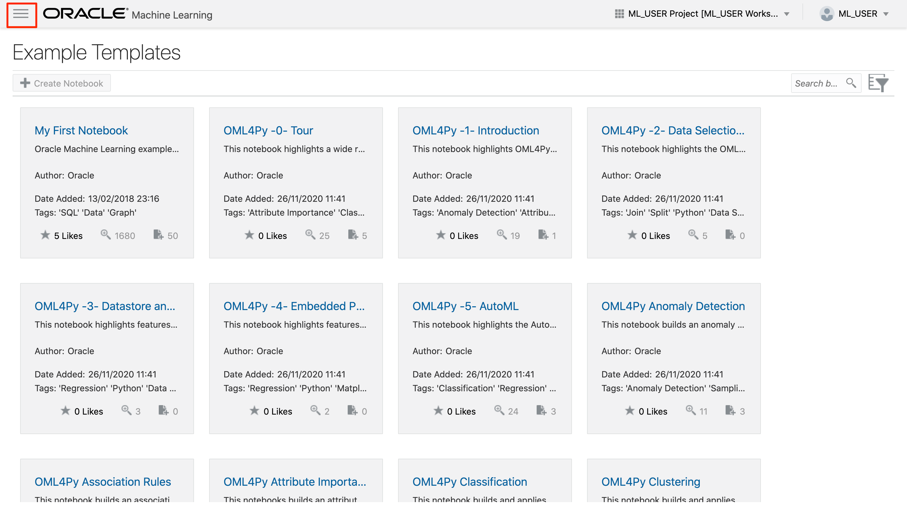

# How can I create a new Machine Learning user in Oracle Autonomous Database?

Duration: 5 minutes

## Create a new Machine Learning user in Oracle Autonomous Database

1.  Click the navigation menu in the upper left, navigate to **Oracle Database**, select **Autonomous Database** and navigate to your ADB instance.

2. From the compartment drop-down menu, select the **Compartment** where your Oracle Autonomous Database resource is provisioned. If there were a long list of databases, you could filter the list by the **State** of the databases and sort by **Workload Type**.

3. From the databases displayed, click **Display Name** of the database you wish to create a new machine learning user and select **Tools** on the Autonomous Database Details page.

    

4.  Select **Open Oracle ML User Administration** under the tools.

    

5. Sign in as **Username - ADMIN** and give the Password you provided when you created your Autonomous database instance.

    

6.  Click **Create** to create a new ML user.

    

7. On the Create User form, provide these details and click **Create** to create a new machine learning user.
    - **Username:** Provide a new machine learning username
    - **Email address:** Provide your e-mail address
    - **Generate password:** Un-check the generate password checkbox
    - **Password:** Enter a password you will remember. You can use the same password you used for the ADMIN account.
    - **Confirm Password:** Re-enter the password for your new the machine learning user

    

8. Notice that your new ML user is created.

    

9. Let's verify if you can access the database as a new machine learning user. You need to log into the database as the new user to do that. In the Machine Learning User Administration, click on the **home icon** on the upper right.

    

10. Enter the username and password you provided when you created the new user and click on **Sign in**. This will launch the Oracle Machine Learning home page. Before you log in, you may wish to bookmark this page.

    

11. Navigate around to get familiar with the ML pages. Click on **Examples** to explore the various ML notebook examples.

    

    

## Learn More

* [Oracle Machine Learning UI](https://docs.oracle.com/en/database/oracle/machine-learning/oml-notebooks/)
* [Interactive Tour - Oracle Machine Learning UI](https://docs.oracle.com/en/cloud/paas/autonomous-database/oml-tour/)
