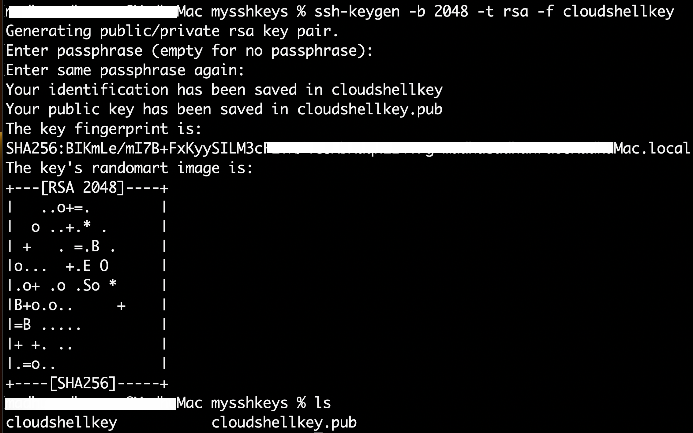
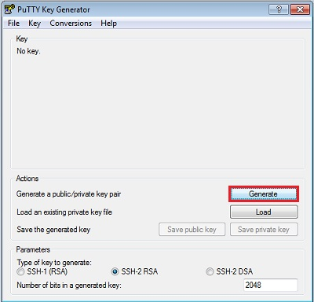
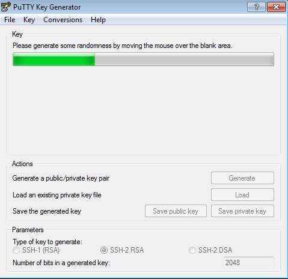
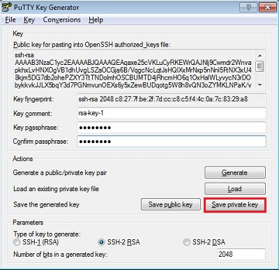
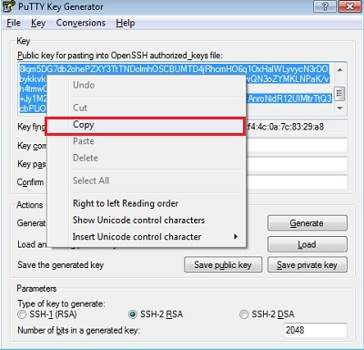
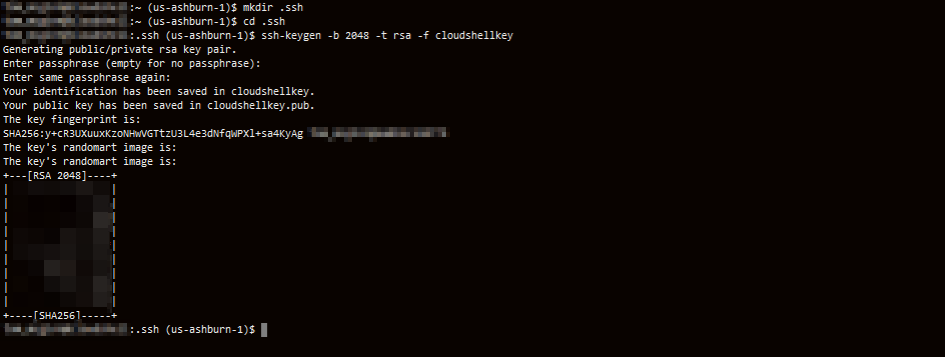
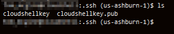
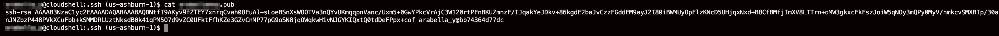
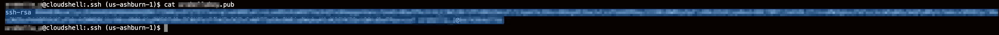

# How do I create SSH Key Pair?

Duration: 5 minutes

## Introduction

The SSH (Secure Shell) protocol is a method for secure remote login from one computer to another. SSH enables secure system administration and file transfers over insecure networks using encryption to secure the connections between endpoints. SSH keys are an important part of securely accessing Oracle Cloud Infrastructure compute instances in the cloud.

If you already have an SSH key pair, you may use that to connect to your environment. We recommend you use the *Oracle Cloud Shell* to interface with the OCI compute instance you will create. Oracle Cloud Shell is browser-based, does not require installation or configuration of anything on your laptop, and works independently of your network setup. However, if you prefer to connect via your laptop, please select an option based on your configuration.

This sprint describes the process to generate an SSH key pair for Oracle Compute Cloud Service instances.
  
## Option1: Linux or macOS

1. Run the ssh-keygen command.
 
    ```
    <copy>
    ssh-keygen -b 2048 -t rsa -f <keyname>  
    </copy>
    ```  

    replace keyname with any name of your choice with out brackets 

     
     
2. The command generates an SSH key pair consisting of a public key and a private key, and saves them in the specified path. The    file name of the public key is created automatically by appending .pub to the name of the private key file. For example, if the file name of the SSH private key is id\_rsa, then the file name of the public key would be id_rsa.pub.
Make a note of the path where you've saved the SSH key pair.

    When you create instances, you must provide the SSH public key. When you log in to an instance, you must specify the corresponding SSH private key and enter the passphrase when prompted.

## Option2: Windows

1. Find puttygen.exe in the PuTTY folder on your computer and double-click it.
2. Accept the default key type, **SSH-2 RSA**, and set the **Number of bits** in a generated key to **2048**, if it is not already set. Then click **Generate**.

     

    Generate SSH key pair on Windows, PuTTY Key Generator dialog box

3. Move your mouse around the blank area to generate randomness. The SSH key pair is generated.
 

     

4. Save your private key. 

    To save the private key in the PuTTY PPK format, click Save private key.
Enter the same name as you used for the key comment so that you know which public key to use this private key with. The private key is saved in PuTTY's Private Key (PPK) format, which is a proprietary format that works only with the PuTTY toolset. You can use this key whenever you use PuTTY for SSH.

    
 
5. Next, save your SSH public key.
To save the public key, in the PuTTY Key Generator, select all of the characters in the Public key for pasting into OpenSSH authorized_keys file: field.

    >**Note:**  Make sure you select all the characters, not just the ones you can see in the narrow window. If there is a scroll bar next to the characters, you aren't seeing all the characters.

     

    Right-click somewhere in the selected text and select Copy from the menu.
Generate SSH key pair on Windows, copy public key

    Open a text editor and paste the characters. Ensure that you paste the text at the first character in the text editor, and don't insert any line breaks.

    Save the key using the same root name that you used for the private key. Add a .pub extension. You can give it any extension you want, but .pub is a useful convention to indicate that this is a public key.
Exit PuTTY Key Generator.

    Make a note of the public and private key names and where they are saved.
When you create instances, you must specify the SSH public key. When you log in to an instance, you must provide the path to the corresponding SSH private key and enter the passphrase when prompted.

## Option3: Cloudshell

Watch the video below for an overview of the Generate SSH Keys Cloud Shell option.
[This video shows an overview of the lab content.](youtube:oq2Hk1Yy9Cg)

The Cloud Shell machine is a small virtual machine running a Bash shell which you access through the OCI Console (Homepage). Cloud Shell comes with a pre-authenticated OCI CLI (Command Line Interface), set to the Console tenancy home page region, as well as up-to-date tools and utilities. To use the Cloud Shell machine, your tenancy administrator must grant the required IAM (Identity and Access Management) policy.

>**Note:**  If you are making a reservation via the LiveLabs Green Button, you will need to choose the option that matches your laptop.  Your tenancy access will be provided AFTER you create your ssh key locally.

1.  To start the Oracle Cloud shell, go to your Cloud console and click the cloud shell icon at the top right of the page.

    

    

    

2.  Once the cloud shell has started, enter the following command. Choose the key name you can remember. This will be the keyname you will use to connect to any compute instances you create. Press Enter twice for no passphrase.

    ````
    <copy>mkdir .ssh</copy>
    ````

    

    ````
    <copy>cd .ssh</copy>
    ````

    ````
    ssh-keygen -b 2048 -t rsa -f <<sshkeyname>>
    ````

    >**Note:** The angle brackets <<>> should not appear in your command.

    

3.  Examine the two files that you just created.

    ````
    <copy>ls</copy>
    ````

    

    >**Note:** in the output that there are two files, a *private key:* ```<<sshkeyname>>``` and a *public key:* ```<<sshkeyname>>.pub```. Keep the private key safe and don't share its content with anyone. The public key will be needed for various activities and can be uploaded to certain systems as well as copied and pasted to facilitate secure communications in the cloud.

4. To list the contents of the public key, use the cat command ```cat <<sshkeyname>>.pub```

    >**Note:** The angle brackets <<>> should not appear in your command.

    

5.  When pasting the key into the compute instance in future labs, make sure that you remove any hard returns that may have been added when copying. *The .pub key should be one line.*

    
 
## Learn More
* [Generating an SSH Key Pair for Oracle Compute Cloud Service Instances] (https://www.oracle.com/webfolder/technetwork/tutorials/obe/cloud/compute-iaas/generating_ssh_key/generate_ssh_key.html)
* [Connecting to your Instance] (https://docs.oracle.com/en-us/iaas/Content/GSG/Tasks/testingconnection.htm)