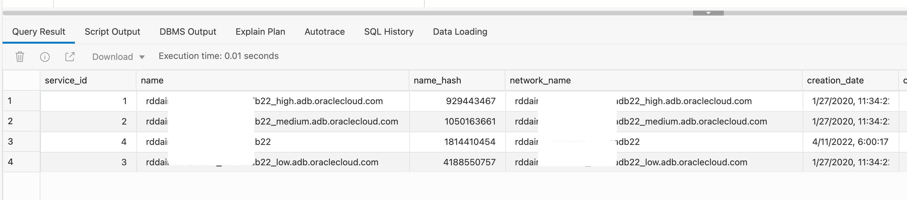

# How do I get service name in Autonomous Database? 
Duration: 10 minutes

SERVICE_NAMES specifies one or more names by which clients can connect to the instance. The instance registers its service names with the listener. When a client requests a service, the listener determines which instances offer the requested service and routes the client to the appropriate instance. V$SERVICES displays information about the services in the database.

## Get Service Name

**Login to SQL Web Developer or SQLPlus and run the following statement:**

```
<copy>
select * from v$services; 
</copy>
```


 
## Learn More
* [V$SERVICES](https://docs.oracle.com/en/database/oracle/oracle-database/19/refrn/V-SERVICES.html)
