# How can I define paragraphs using the md, SQL, PL/SQL, and Python interpreters in Oracle Machine Learning Notebook?

Duration: 10 minutes

## Define paragraphs using the md, SQL, PL/SQL, and Python interpreters in an OML Notebook

1. If you have your ADB ML user sign-in URL bookmarked, navigate to the link, enter the username and password you provided when you created your machine learning user, and click on **Sign in**. This will launch the Oracle Machine Learning home page.

    

    <details>
    <summary>If you do not have your ADB ML user sign-in URL bookmarked, click expand to view the steps to sign in as a machine learning user!</summary>

    1. If you do not have your ADB ML user sign-in URL bookmarked, click the navigation menu in the upper left of the Oracle Cloud Console, navigate to **Oracle Database**, select **Autonomous Database** and navigate to your ADB instance.

    2. From the compartment drop-down menu, select the **Compartment** where your Oracle Autonomous Database resource is provisioned. If there were a long list of databases, you could filter the list by the **State** of the databases and sort by **Workload Type**.

    3. From the databases displayed, click **Display Name** of the database you wish to create a notebook for the machine learning user and click **Service Console**. The Launch Service Console dialog opens. Wait till the Service Console opens.

	    

    4. On the Service Console page, click **Development** on the left pane.

	    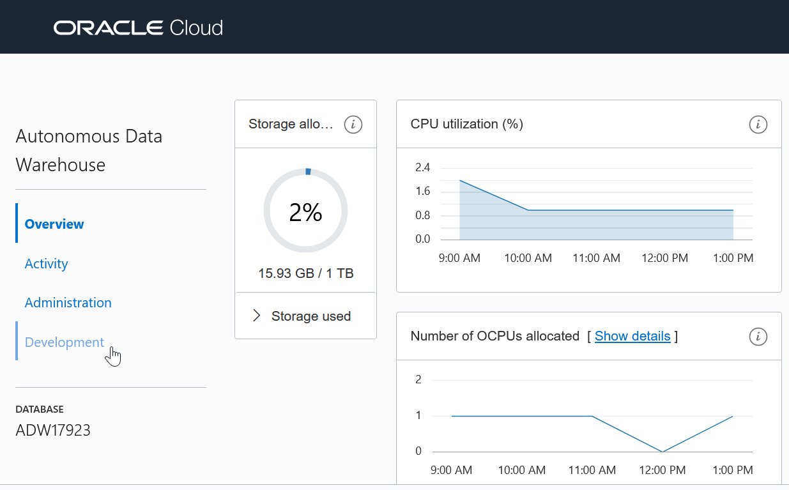

    5. Click **Oracle Machine Learning User Interface.** This opens the Oracle Machine Learning sign-in page.

        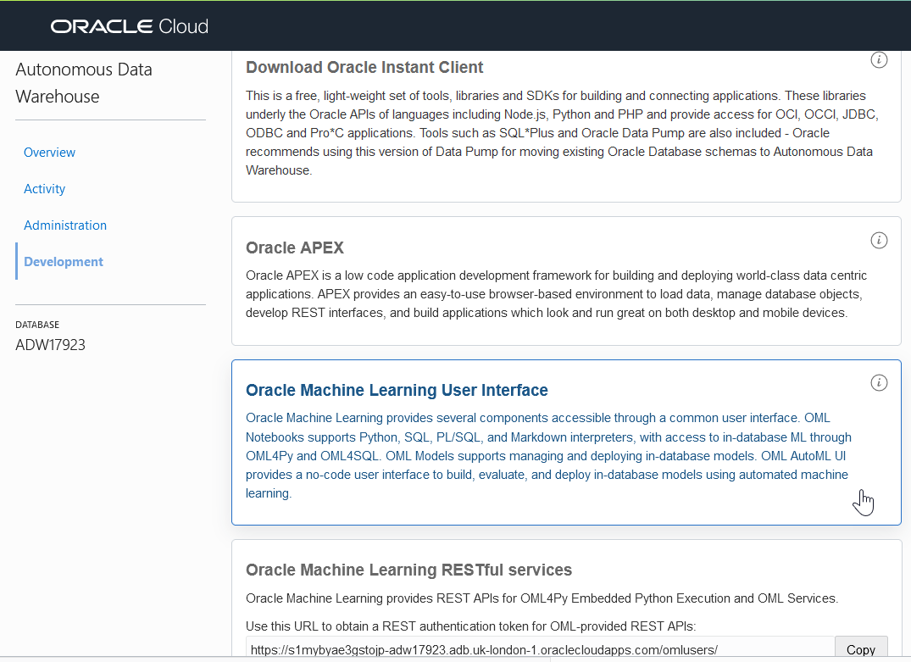

    6. Enter the username and password you provided when you created your machine learning user and click on **Sign in**. This will launch the Oracle Machine Learning home page.

        

    </details>

2.  Click on the upper-left navigation menu and select **Notebooks**.

    

3. From your notebooks displayed on the Notebooks page, click on the notebook you wish to create paragraphs.

    

### Call the Markdown interpreter and generate static HTML from Markdown plain text

To call the Markdown interpreter and generate static HTML from Markdown plain text:

4. In the Test Notebook, type ``%md`` and press Enter.

	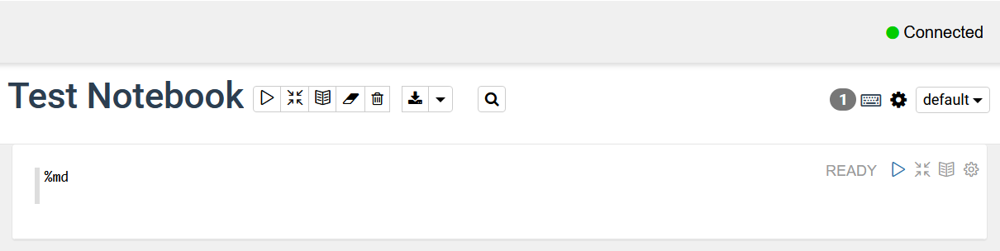

5. Type the following:

	* To generate static html text, type the text `Hello World` inside double quotes and press Enter.
	* To format the text in bold, type the text `Hello World` inside two asterisks pair, and press Enter.
	* To format the text in italics, type the text `Hello World` either inside an asterisk pair or an underscore pair, and click the Run  icon.

	Alternatively, you may copy the code, paste it into the notebook just below `%md`, and click the Run icon  as shown in the screenshot:

		<copy>
		"Hello World"
		**Hello World**
		*Hello World*
		_Hello World_
		</copy>

	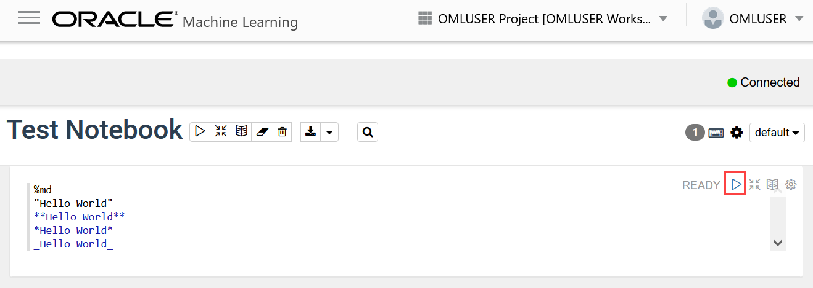

	The output is displayed after running the paragraph, and a new paragraph is automatically created. Also, you can manually create additional paragraphs.

	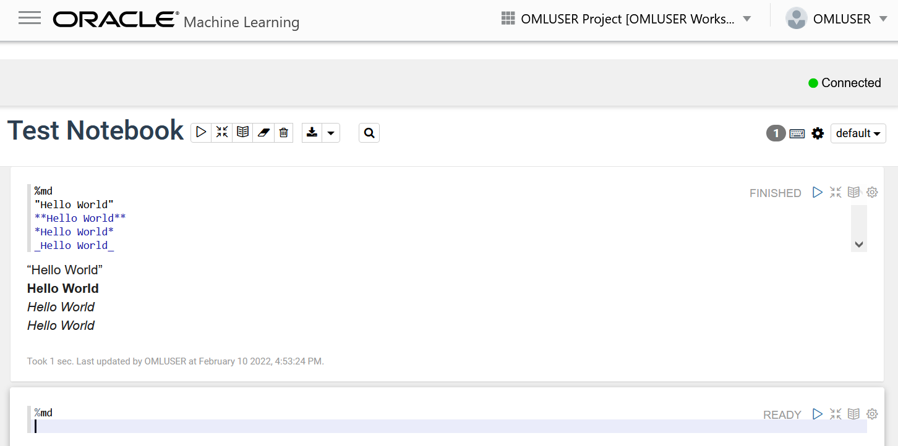

6. To display the text in a bulleted list, prefix * (asterisk) to the text `Hello World`, as shown in the screenshot below.

		<copy>
		* Hello World
		* We welcome you
		</copy>

	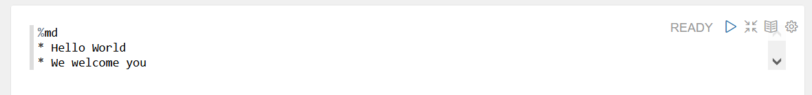

	> **Note:** You are not clicking the Run icon here.

7. Manually create another paragraph just below by hovering your cursor over the paragraph border. This brings up the Add Paragraph option. Click **Add Paragraph** to create a new paragraph, as shown in the screenshot.   

	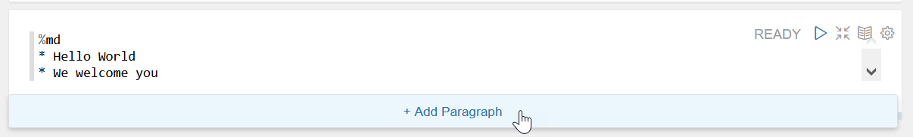

8. In this paragraph you just created, the markdown tag `%md` is already present. Here, you will use Markdown tags to display the text in heading 1 (H1), heading 2 (H2), and heading 23 (H3). For H1, H2, and H3, add one, two, and three hashes before the text `Hello World`, respectively. Or, you may copy the code below and paste it just below the tag `%md`.

		<copy>
		# Hello World
		# Hello World
		### Hello World
		 </copy>

9. Now, scroll up the notebook and click the Run All icon present in the notebook toolbar, as shown in the screenshot here.  

	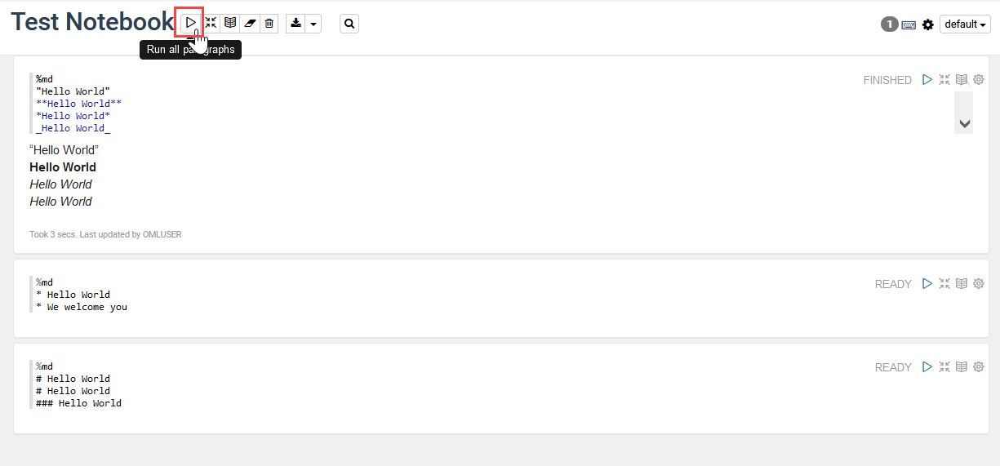

10. Click **OK** in the Run All dialog to confirm.

	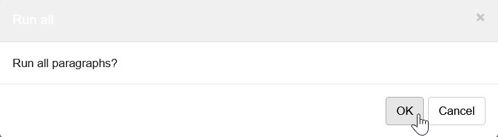

	The two paragraphs run, and the output is displayed in the respective paragraphs, as shown in the screenshot.

	 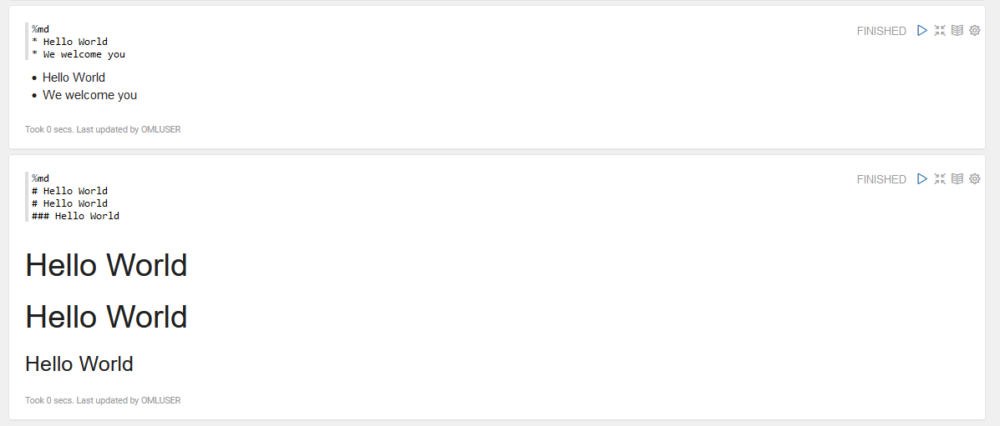

### Call the SQL Interpreter and run SQL Statements

Let’s create another paragraph to call the SQL interpreter and run SQL statements:

11. To create another paragraph, hover your cursor over the paragraph border. This brings up the Add Paragraph option. Click **Add Paragraph** to create a new paragraph.

	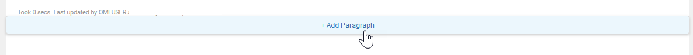

12. Edit the existing paragraph tag, type ``%sql`` to call the SQL interpreter and press Enter.

	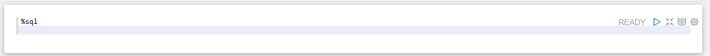

13. Type the following command and click the Run  icon. Alternatively, you can press the Shift+Enter keys to run the paragraph.

	```
	<copy>
	select table_name from user_tables
	</copy>
	```
	 The command returns the table names in a tabular format, as shown in the screenshot:

	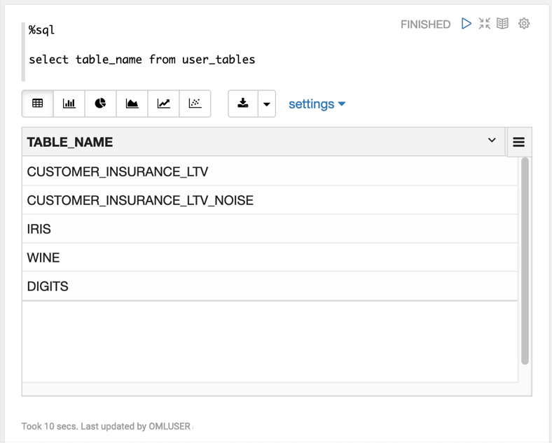

### Call the PL/SQL Interpreter and run PL/SQL Scripts

Create another paragraph to call the PL/SQL interpreter and run PL/SQL scripts:

14. In the new paragraph, type ``%script`` to call the PL/SQL interpreter and press Enter.

	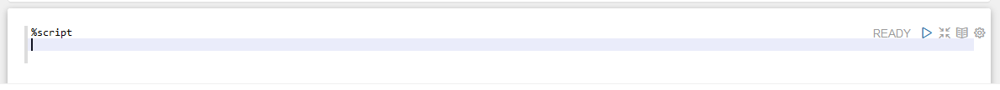

15. Type the following command and click . Alternatively, you can press the Shift+Enter keys to run the paragraph.

		<copy>
		CREATE TABLE small_table
		(
		NAME VARCHAR(200),
		ID1 INTEGER,
		ID2 VARCHAR(200),
		ID3 VARCHAR(200),
		ID4 VARCHAR(200),
		TEXT VARCHAR(200)
		);

		BEGIN
		FOR i IN 1..100 LOOP
		INSERT INTO small_table VALUES ('Name_'||i, i,'ID2_'||i,'ID3_'||i,'ID4_'||i,'TEXT_'||i);
		END LOOP;
		COMMIT;
		END;
		</copy>

	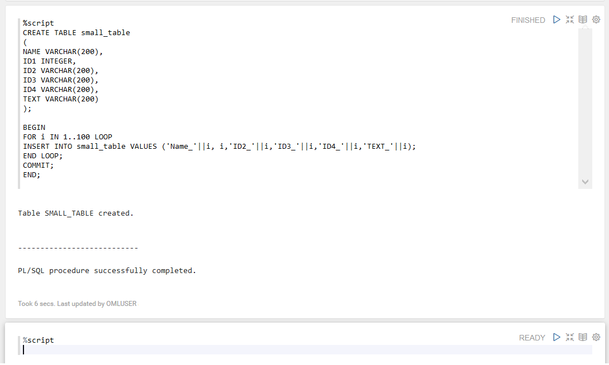

	The PL/SQL script successfully creates the table SMALL_TABLE. The PL/SQL script in this example contains two parts:

	* The first part of the script contains the SQL statement CREATE TABLE to create a table named ``small_table``. It defines the table name, table column, data types, and size. In this example, the column names are ``NAME, ID1, ID2, ID3, ID4, and TEXT``.

	* The second part of the script begins with the keyword ``BEGIN``. It inserts 100 rows into the table ``small_table``.

### Call the Python Interpreter and run Python Statements

Let’s create another paragraph to call the Python interpreter and run Python statements:

16. To call the python interpreter, edit the paragraph tag, type ``%python`` and press Enter.

	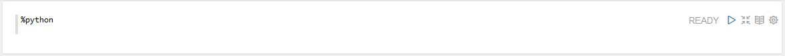

17. Type the following command and click .

	```
	<copy>
	import pandas as pd
	import oml
	DATA = oml.sync(table = "SUPPLEMENTARY_DEMOGRAPHICS", schema = "SH")
	z.show(DATA.head())
	</copy>
	```

	The ``z.show`` command displays the SUPPLEMENTARY_DEMOGRAPHICS table present in the SH schema, as shown in the screenshot here. Use the ``z.show`` command to display Python objects, proxy object content, and to display the desired data in the notebook. You will learn more about ``z.show`` in the lab on Oracle Machine Learning for Python.

	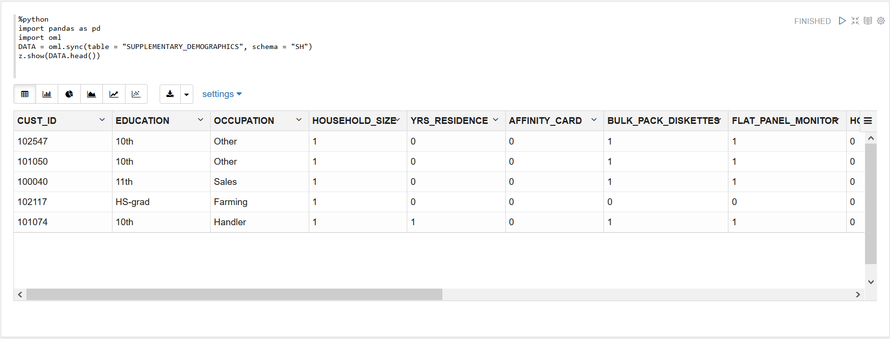

## Learn More

* [Oracle Machine Learning UI](https://docs.oracle.com/en/database/oracle/machine-learning/oml-notebooks/)
* [Interactive Tour - Oracle Machine Learning UI](https://docs.oracle.com/en/cloud/paas/autonomous-database/oml-tour/)