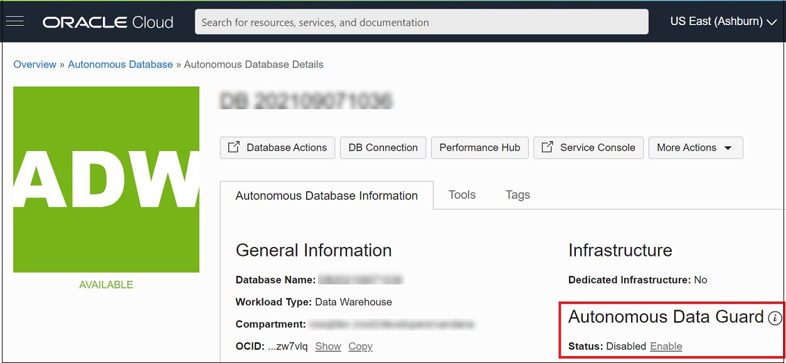

# How do I enable Data Guard for an ADB instance?
Duration: 5 minutes

When you enable Autonomous Data Guard the system creates a standby database that is continuously updated with the changes from the primary database. You can enable Autonomous Data Guard with a standby in the current region, a local standby, or with a standby in a different region, a cross-region standby.

## Enable Autonomous Data Guard

**Note:** Standby databases incur additional costs.
You can enable Autonomous Data Guard when Autonomous Database is available (Lifecycle State shows Available).
1. Open the navigation menu. Click **Oracle Database**. Under Autonomous Database, click Autonomous Data Warehouse, Autonomous JSON Database, or Autonomous Transaction Processing.
2. Choose your **Compartment**.
3. In the list of Autonomous Databases, click the display name of the database you want to administer.
4. On the **Autonomous Database Details** page, under Autonomous Data Guard, click **Enable** in the Status field.
5. In the **Region** field, select a region. Click **Enable Autonomous Data Guard**.

The Autonomous Database Lifecycle State changes to **Updating**. In the Resources area with Autonomous Data Guard selected, the State field shows **Provisioning**. When provisioning completes, on the **Autonomous Database Details** page under Autonomous Data Guard, the **Role** field shows **Primary** with a link **Switchover** that you can click to perform a switchover.   

**Note:** While you enable Autonomous Data Guard the primary database is available for read/write operations. There is no downtime on the primary database.

## Learn More
[Using Standby Databases with ADB for Database Recovery] (https://docs.oracle.com/en/cloud/paas/autonomous-database/adbsa/autonomous-data-guard.html#GUID-2AFA2C06-BBD9-496E-94B9-B3C54EC567D1)
