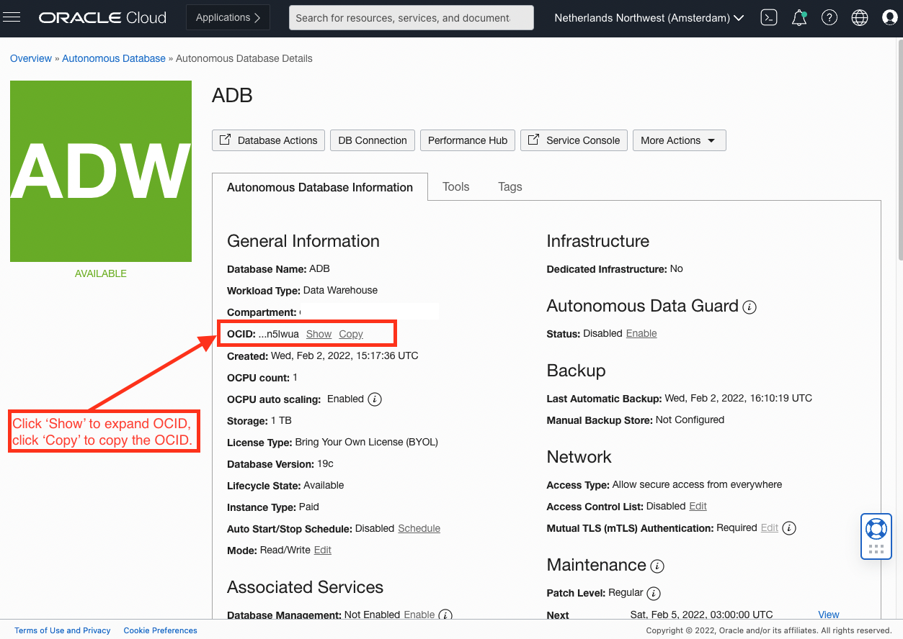

# Where do I find the ADB OCID?
Duration: 1 minute 

## OCID of an Autonomous Database

The OCID of an Autonomous Database can be found under 'General Information' in the Autonomous Database overview screen:

## Learn More

* [Oracle Cloud ID's](https://docs.oracle.com/en-us/iaas/Content/General/Concepts/identifiers.htm)

