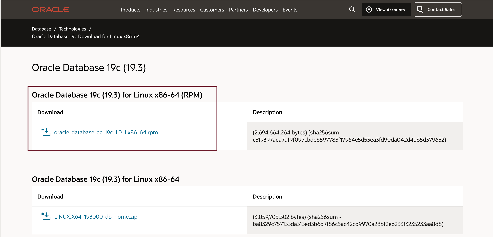
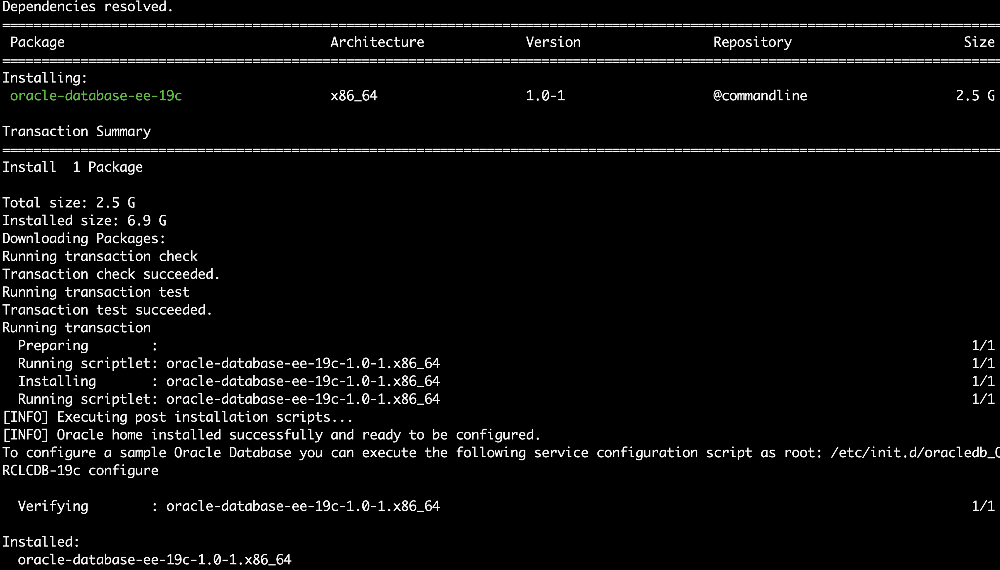

# How do I install Oracle Database 19c in silent mode?

Running RPM Packages to Install Oracle Database
Perform the following steps to install and configure Oracle Database using RPM packages.

Duration: 15 minutes
 
## Download Oracle Database 19c

1. Sign in to the Oracle Database 19c download page, Download the .rpm file required for performing an RPM-based installation to a directory of your choice. For example, download the oracle-database-ee-19c-1.0-1.x86_64.rpm file to the /tmp directory.

      

2. Review and accept license agreement      

      

3. Copy the Download link from the web browser      

      

## SSH into compute instance

1. SSH into your compute instance where database has to be installed and change directory to /tmp folder wget followed by the copied link

       ```
      <copy> 
      cd /tmp
      wget <download url copied in above step>
      </copy>
      ```

      

      Rename the downloaded file to oracle-database-ee-19c-1.0-1.x86_64.rpm?AuthParam=X file into rpm file.

       ```
      <copy> 
      cd /tmp
      $ mv oracle-database-ee-19c-1.0-1.x86_64.rpm\?AuthParam\=1650972-X-654f9e7 oracle-database-ee-19c-1.0-1.x86_64.rpm
      </copy>
      ```
  
## Installing Oracle Database RPM Manually

1. Log in as root.
2. Download and install the Oracle Database Preinstallation RPM:

       ```
      <copy>
      sudo su
      yum -y install oracle-database-preinstall-19c
      </copy>
      ```

3. Install the database software using the yum localinstall command.      

       ```
      <copy>
      cd /tmp
      yum -y localinstall oracle-database-ee-19c-1.0-1.x86_64.rpm
      </copy>
      ```

      Where, oracle-database-ee-19c-1.0-1.x86_64.rpm is the fully qualified name of the Oracle Database RPM.

4. Verify installation success message

      

      
## Creating and configuring an Oracle Database

1. Login as root and to configure a sample Oracle Database instance, run the following service configuration script

       ```
      <copy>
      /etc/init.d/oracledb_ORCLCDB-19c configure
      </copy>
      ```

      > **Note:** You can modify the configuration parameters by editing the /etc/sysconfig/oracledb_ORCLCDB-19c.conf file.

      

   
## Setup password for oracle user 

1. login as root, Set the password for the "oracle" user. (if it has not already been set)

      ```
      <copy> 
      passwd oracle
      </copy>
      ```

## Set Oracle environment

1. Set Oracle environment

      ```
      <copy> 
      cd /home/oracle/
      . oraenv
      ORACLE_SID = [ORCLCDB] ? ORCLCDB 
      </copy>
      ```

      you should be able to see the following message 

      ```
      <copy>  
      The Oracle base remains unchanged with value /opt/oracle
      </copy>
      ```  
   
## Learn More

* [Oracle Machine Learning UI](https://docs.oracle.com/en/database/oracle/machine-learning/oml-notebooks/)
* [Interactive Tour - Oracle Machine Learning UI](https://docs.oracle.com/en/cloud/paas/autonomous-database/oml-tour/)
