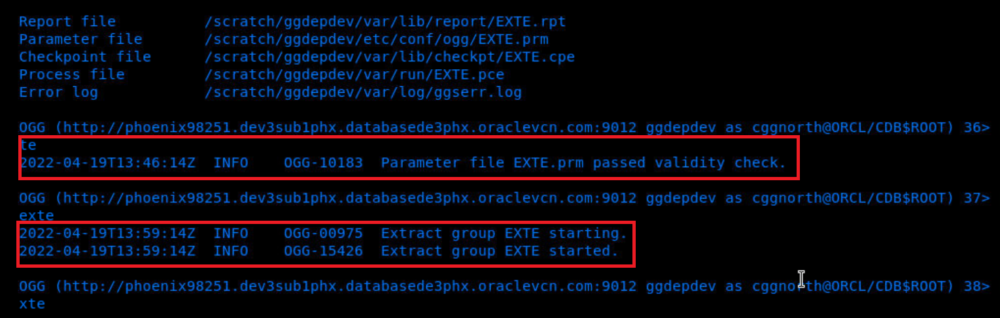

# How do I add an extract process by using the Oracle GoldenGate Admin client?
Duration: 3 minutes

## Add an Extract process

Use `ADD EXTRACT` to create an Extract group/process. 

Learn how to add an Extract group (`exte`), which then captures data from the source database and writes to a trail file (`ea`).

To add an extract process and Exttrail:

1. Ensure that you have the appropriate database privileges to be able to execute the commands in the Admin Client. See **Learn More**.

2. To open the Admin Client, run the following script: 
    ```
    <copy>
        adminclient

    </copy> 

    ```
    
3. Test the database connection by running the following command:
    ```
    <copy>
    DBLOGIN USERIDALIAS ggeast
    </copy>
    ```

4. Add an Extract:
    ```
    <copy>
    ADD EXTRACT exte, TRANLOG, BEGIN NOW
    </copy>
    ```

    **exte** is the name of the Extract that is being created. However, the Extract is yet to start.
5. Configure the Extract parameters in the Extract parameter file (`exte.prm`):
    ```
    <copy>
    EDIT PARAMS exte
    </copy>
    ```
    The Extract parameter file is as follows:
    ```
    <copy>
    EXTRACT exte
    USERIDALIAS cggnorth DOMAIN OracleGoldenGate
    EXTTRAIL east/ea
    SOURCECATALOG pdbeast
    DDL INCLUDE MAPPED
    TABLE hr.*;
    </copy>
    ```

6. Register the Extract:
    ```
    <copy>
    REGISTER EXTRACT exte
    </copy>
    ```

7.  Add the Extract trail file:
    ```
    <copy>
    ADD EXTTRAIL east/ea
    </copy>
    ```

8. Start the Extract:
    ```
    <copy>
    START EXTRACT exte
    </copy>
    ```
  The Extract group **exte** starts.

9. To confirm the Extract has started, run the following command:

    ```
    <copy>
    INFO EXTRACT exte
    </copy>
    ```

The following is a sample Extract output:

  


## Learn More
* [Using the Admin Client](https://docs.oracle.com/en/middleware/goldengate/core/21.1/admin/getting-started-oracle-goldengate-process-interfaces.html#GUID-84B33389-0594-4449-BF1A-A496FB1EDB29)
* [ADD EXTRACT](https://docs.oracle.com/en/middleware/goldengate/core/21.3/gclir/add-extract.html#GUID-D9611110-A8D6-4118-837E-BF1900262666)
* [SOURCEISCATALOG](https://docs.oracle.com/en/middleware/goldengate/core/21.3/reference/sourcecatalog.html#GUID-C2D88643-6839-432D-A7E4-63B874859566)


