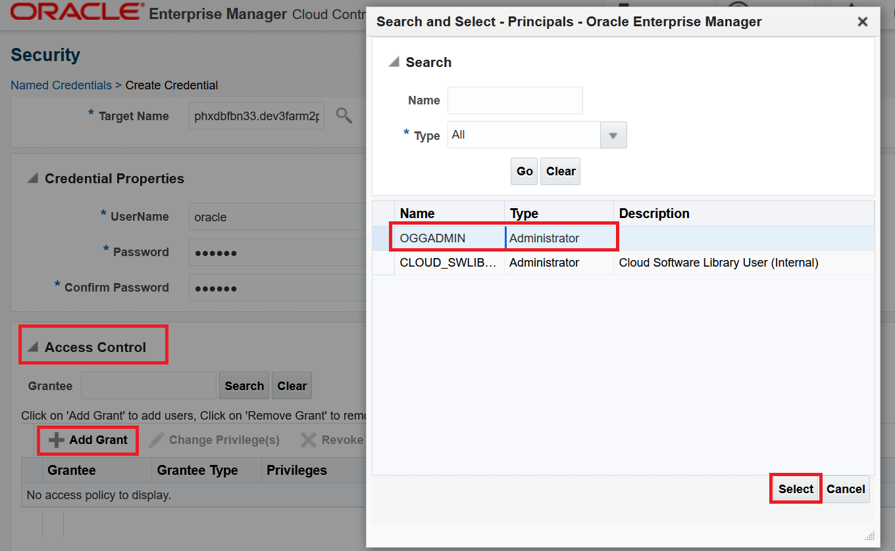
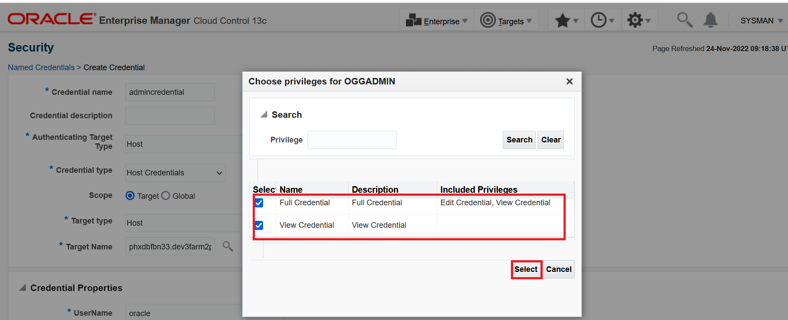

# How do I create OGG admministrator User In OEM Console To Manage OGG Specific Targets?
Duration: 5 minutes

## Create Oracle GoldenGate Administrator User (ogg 'admin' user)

1. Ensure that you have discovered Oracle GoldenGate targets in the Oracle GoldenGate Enterprise Manager Plug-in.

2. Click **Setup**, select **Security**, and then click **Administrators**.

    

3. In the **Administrators** page, click **Create** to add a new Administrator user.

    

4. In the **Create Administrators: Properties** page, enter the Administrator login Name, for example *oggadmin* and Password, and then click **Next** to display the **Create Administrator: Roles** page.

  

5. Select **EM_USER** and **PUBLIC** under **Selected Roles** and click **Next**.

    

6. Select the following credentials that apply to all targets.  These Privileges give the administrator the right to perform particular management actions on a class of targets:

    * Edit any OGG parameter file.
    * Run any OGG command.  
    * View contents of any OGG discard file.
    * View contents of any OGG report file.

    

7.  Under **Target Privileges**, click **Add** to display the **Search and Add: Targets** page.

    

8. In the **Search and Add: Targets** page, select the targets options and click **Select**. Here, a deployment, administrative service, service manager, receiver service, distribution service, performance service, and extract targets are selected:

    

9. Again, under **Target Privileges**, click **Add** to add a Host in the **Search and Add Targets** dialog box. 

10. From the **Target Type** drop-down list, select **Host**, click check box to select the Host, and then click **Select**.

    

11. Select all the targets (except the Host) and click **Grant to Selected**, and then click **Next**.

    

12. Similarly, select the Host and click **Grant to Selected**, select **Operator** privilege as well in addition to the 4 privileges that you selected for the rest of the target types, and click **Continue**.

    

   The selected privileges have been granted:

    
   

12. Click **Review** to view the privileges granted, and then click **Finish**. The Administrator user has been successfully created:

    

13. Click **Setup**, select **Security**, and then click **Named Credentials** to create Named credentials and associate it with the Administrator user.

14. In the **Named Credentials** page, click **Create**.

    

15. In the **Create Credential** page, enter the following details:

        * Credential name: **admincredential**
        * Authentication Target Type: Host
        * Credential type: Host Credentials
        * Target type: Host
        * Target Name: Click **Search** and select the target.

        

16. Specify the Host credentials:

    

17. Under **Access control**, click **Add Grant** and in the **Search** dialog box, select the Administrator user and click **Select** you just created to add grants to the Administrator user:

    

18. Under **Access Control**, select **Grantee** and click **Change Privileges** to add privliges to the selected Administrator user.

    

19. In the **Choose privileges for OGGADMIN** page, select **Edit Credential**, **Full Credential**, and **View Credential**, and click **Select**.

    
    

    Credentials have been added to the selected Administrator user:

    
        
20. Click **Test and Save**.

    

    Credentials have been successfully created and the Administrator user can now monitor the targets.  A **Credential Operation Successful** message is displayed.

    

21. Logout from the current session.

22. Login to the Enterprise Manager Cloud Control, using the new **oggadmin** administrator user credentials.

    
    

23. Click **Targets**, select **GoldenGate** to display the **OGG Home** page, and ensure that all the targets are listed.

24. Click **Setup**, select **Security**, and then click **Preferred Credentials** to display the **Preferred Credentials** page to set the Host Credentials.

25. Select **Oracle GoldenGate Service Manager** and click **Manage Preferred Credentials**.

    

26.	In the **Oracle GoldenGate Service Manager Preferred Credentials** page, under **Target Preferred Credentials**, select **Target Name**, click **Set** to display the **Select Named Credentials** dialog box.

   
    
27. In the **Select Named Credential** dialog box, ensure that the credential name that you created earlier has been populated, verify the UserName and Password, click **Test and Save**.

    
    
    The Named credential association is completed:

    

28. Go to **OGG Home** page and select the target, for example **EXTMA** and check whether the you can restart the process from Administrator user.

   
   
    

## Learn More

* [Discovering an Oracle GoldenGate Enterprise Manager Plug-in Microservices Instance](https://docs.oracle.com/en/middleware/goldengate/emplugin/13.5.2/empug/discovering-oracle-goldengate-targets-ma-instance.html#GUID-A52B6240-189C-4DAB-A017-6358BBB9813B)
* [Discovering an Oracle GoldenGate Enterprise Manager Plug-in Classic Instance](https://docs.oracle.com/en/middleware/goldengate/emplugin/13.5.2/empug/discovering-oracle-goldengate-targets-classic-instance.html#GUID-DD1E8937-3ADE-40FA-9DE2-B01E5CC20D31)
* [New Route to Discovery in Oracle GoldenGate Enterprise Manager Plug-in](https://blogs.oracle.com/dataintegration/post/new-route-to-discovery-in-oracle-goldengate-enterprise-manager-plug-in-134200)
* [Oracle GoldenGate Enterprise Manager Plug-in Documentation](https://docs.oracle.com/en/middleware/goldengate/emplugin/index.html)
